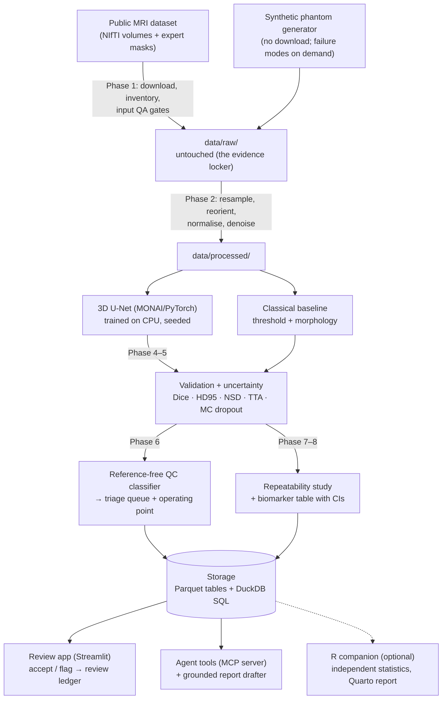

# SegAudit 🧠📐✅

<!-- Cover image goes here once the review app exists (Phase 9):
[](docs/img/cover_segaudit.png) -->

**▶ Review app — coming with Phase 9** · **v0.1.0 (foundation release)**
· 

-76B900)


-informational)

**A segmentation model draws outlines on medical scans and reports "91% accurate
on average". SegAudit answers the question that average hides: *which* of the
outlines are wrong — and it answers it without needing the right answer in hand.
Built from scratch, in public, fully explained.**

> Every term used anywhere in this repo — medical, statistical or technical — is
> defined in plain language in [`docs/00-glossary.md`](docs/00-glossary.md). If a
> word isn't there, that's a documentation bug.
>
> **New here? Start with [`docs/HANDBOOK.md`](docs/HANDBOOK.md)** — the one living
> document that walks the whole journey in order, from day 0 to the finished
> product, linking to everything else at the moment you need it.

---

## Contents

- [What is a segmentation? (start here)](#what-is-a-segmentation-start-here)
- [The problem this project tackles](#the-problem-this-project-tackles)
- [How it works](#how-it-works)
- [The data at a glance](#the-data-at-a-glance)
- [Results, phase by phase](#results-phase-by-phase) — fills in as each phase completes
- [Build log](#build-log) — every phase, linked to its guide, with status
- [**The tutorial, in order**](#the-tutorial-in-order) — the documents that teach every step from a blank laptop
- [Roadmap](#roadmap) — what comes after the foundation, and why each item waits
- [About the data (honesty notes)](#about-the-data-honesty-notes)
- [Repository map](#repository-map) — every file, annotated
- [How to run](#how-to-run) — quick start for Windows, macOS and RHEL 8
- [How I work on this repo (branch model)](#how-i-work-on-this-repo-branch-model)
- [Why the documentation is so detailed](#why-the-documentation-is-so-detailed)
- [License](#license)

## What is a segmentation? (start here)

An MRI scanner takes a 3D picture of the inside of the body, stored as a stack
of thin slices — think of a loaf of bread, sliced. Each slice is a grid of tiny
squares, and stacking the slices turns those squares into tiny cubes called
**voxels** (3D pixels).

A **segmentation** is the outline of one structure drawn on that 3D picture,
voxel by voxel: "these cubes are the hippocampus, those are not". It is the
digital version of colouring inside the lines on every slice of the loaf. Once
a structure is outlined you can *measure* it — count the cubes, multiply by
the cube size, and you have its volume in millilitres. That number is an
**imaging biomarker**: a measurement from a scan that tracks disease. The
hippocampus, a small curled structure deep in the brain that handles memory,
shrinks in several neurological diseases, so its volume is a biomarker people
genuinely care about.

Drawing those outlines by hand takes an expert about an hour per scan. A
**segmentation model** — a program trained on hundreds of hand-drawn examples —
does it in seconds. That is the good news.

## The problem this project tackles

Here is the catch. A segmentation model is evaluated by comparing its outlines
with an expert's on scans it has never seen, using a score called **Dice** (1.0
is a perfect match, 0.0 is no overlap at all). A typical report says *mean Dice
0.91*. That average hides the shape of the distribution: most cases are fine,
and a handful are badly wrong — the model latched onto the wrong structure, or
left half the hippocampus out.

In real use there is no expert outline to compare against — that is the whole
point of automating — so Dice cannot be computed on a new scan at all. The team
has two bad options: a human reviews *every* case, which defeats the
automation, or nobody reviews any, and a broken outline silently becomes a
wrong volume inside a decision about a patient or a study.

SegAudit is a third option. For every new scan it produces:

1. **A segmentation** (the baseline everyone builds), plus **surface-distance
   metrics** alongside Dice on the cases where an expert outline exists, because
   a boundary that is off by two millimetres matters clinically even when the
   overlap score looks fine.
2. **An uncertainty estimate** — how much the model's answer changes when the
   input is nudged (test-time augmentation) and when the model's own internal
   randomness is sampled (Monte Carlo dropout). Confident models agree with
   themselves; struggling ones don't.
3. **A reference-free quality score** — a small, interpretable classifier that
   learns, from uncertainty and shape features alone, to predict "this outline
   is probably wrong" *without seeing the expert outline*. Calibrated against
   held-out Dice, so the score means what it says.
4. **A triage queue with a stated operating point** — "review these 14 of 200;
   the remaining 186 are safe to auto-accept, with a quantified residual risk".
   The output is a decision, not a metric.
5. **A repeatability study** — how much the measured volume moves when the
   same scan is re-acquired with realistic differences (noise, resolution,
   head rotation), reported as the *minimum detectable difference*: the
   smallest change in the biomarker that can be distinguished from measurement
   noise. Without that number nobody can say whether a 5% change means anything.
6. **Agent-callable tools** — the pipeline exposed through the Model Context
   Protocol so an agent can run an audit, query the results and draft a
   quality report grounded strictly in computed numbers.

## How it works

Three words first. The **backend** is the code that does the real work
(reading scans, training, scoring) — the kitchen. The **frontend** is what a
reviewer looks at and clicks — the dining room. **Storage** is where results
are filed so they can be found again — the pantry. Data flows one way, top to
bottom, and no step edits its own input; that single rule is what makes every
result reproducible.



Everything inside the dashed idea of "the pipeline" is reachable through one
Python module, [`src/segaudit/api.py`](src/segaudit/api.py). The command line,
the review app and the agent tools are thin doors onto that one API; none of
them contain logic of their own. That is the design decision that lets the
same core be called by a future web front end or cloud service without a
rewrite — see [`docs/02-architecture.md`](docs/02-architecture.md).

## The data at a glance

| | |
|---|---|
| **Primary dataset** | Task 04 (Hippocampus) of the Medical Segmentation Decathlon: 394 T1-weighted brain MRI volumes with expert outlines of the anterior and posterior hippocampus (263 with public labels), from a research cohort of healthy adults and adults with a psychiatric diagnosis. Licence CC-BY-SA 4.0. Download is a few tens of megabytes. |
| **Why this dataset** | The volumes are tiny (about 35 × 50 × 35 voxels), so a 3D model trains on an ordinary laptop CPU in minutes. The target is also genuinely hard — small, low-contrast, two adjacent labels — so real failure cases exist to detect, which is the entire point. |
| **Synthetic phantom** | A built-in generator produces hippocampus-like ellipsoidal structures in a noisy volume, with masks, and can inject failure modes on demand (missing half, extra blob, wrong-size). Used by the tests, by CI, and by the first walkthrough so nothing needs downloading to see the pipeline run. Always labelled synthetic. |
| **Case-level metadata** | Acquisition-derived fields (spacing, intensity statistics, orientation) are real. Clinical covariates used in the stratification phase are **simulated** and marked as such in every table and figure. |

Full details, fetch instructions and licence notes arrive with Phase 1 in
`docs/04-phase-tutorials/phase-01-data.md`.

## Results, phase by phase

*This section fills in as phases complete. Each entry shows the headline
number, the figure, and the one-paragraph plain-language meaning.*

- **Phase 0 — foundation:** the package installs and its tests pass on
  Windows, macOS and Linux. 

## Build log

| Phase | What it delivers | Guide | Status |
|---|---|---|---|
| 0 | Skeleton: package, config, storage, CLI, tests, CI, docs scaffolding, branch model | [`phase-00-skeleton.md`](docs/04-phase-tutorials/phase-00-skeleton.md) | ✅ v0.1.0 |
| 1 | Data: public dataset download and inventory, synthetic phantom generator, NIfTI/DICOM I/O with geometry preserved, input QA gates, case metadata table, `segaudit sql` read-only console over the result tables | `phase-01-data.md` | 🔜 v0.2 |
| 2 | Preprocessing (resample, reorient, normalise, denoise) and a classical baseline segmentation | `phase-02-preprocessing-baseline.md` | 🔜 v0.2 |
| 3 | 3D U-Net training with MONAI on CPU; patient-level splits; seeded | `phase-03-model.md` | 🔜 v0.2 |
| 4 | Validation: Dice, Hausdorff-95, normalised surface distance; per-case failure analysis | `phase-04-validation.md` | 🔜 v0.3 |
| 5 | Uncertainty: test-time augmentation and Monte Carlo dropout; calibration | `phase-05-uncertainty.md` | 🔜 v0.3 |
| 6 | Reference-free quality-control classifier, triage queue, operating point | `phase-06-quality-control.md` | 🔜 v0.4 |
| 7 | Repeatability study with registration; minimum detectable difference | `phase-07-repeatability.md` | 🔜 v0.5 |
| 7R | R companion (optional): independent R implementation of the Phase 7 statistics over the same Parquet tables, cross-checked against Python; Quarto report | `phase-07r-r-companion.md` | 🔜 v0.5 |
| 8 | Biomarker table with confidence intervals; metadata join; stratification | `phase-08-biomarkers.md` | 🔜 v0.5 |
| 8R | R companion (optional): bootstrap intervals and stratified comparison in R, cross-checked | `phase-08r-r-companion.md` | 🔜 v0.5 |
| 9 | Review app (Streamlit), review ledger, import-external-mask path, 3D Slicer / Napari guide | `phase-09-review-app.md` | 🔜 v0.6 |
| 10 | Agent tools: Model Context Protocol server, grounded report drafter | `phase-10-agent-tools.md` | 🔜 v0.7 |
| 11 | Container image, HPC and GPU paths, release 1.0 | `phase-11-container-release.md` | 🔜 v1.0 |

## The tutorial, in order

Read these in sequence. Each states its prerequisites, its learning goal, every
command with its expected output, and a checkpoint that tells you it worked.

0. [`docs/HANDBOOK.md`](docs/HANDBOOK.md) — **start here**: the living day-0-to-product walkthrough; everything below is linked from it in order, with why.
1. [`docs/00-glossary.md`](docs/00-glossary.md) — every term, in plain language, with an everyday analogy. Keep it open.
2. Set up your workshop from a blank machine — pick your operating system:
   [`docs/01-setup-windows.md`](docs/01-setup-windows.md) ·
   [`docs/01-setup-macos.md`](docs/01-setup-macos.md) ·
   [`docs/01-setup-rhel8.md`](docs/01-setup-rhel8.md)
   (`docs/01b-setup-r.md`, optional — R, RStudio and `renv` for the R companion — arrives with Phase 7.)
3. [`docs/02-architecture.md`](docs/02-architecture.md) — how the pieces fit, what each box does, and why the API-first rule exists.
4. [`docs/03-git-workflow.md`](docs/03-git-workflow.md) — the branch model, the push sequence, and what to do when it goes wrong.
5. [`docs/04-phase-tutorials/`](docs/04-phase-tutorials/) — one guide per build phase, starting with [`phase-00-skeleton.md`](docs/04-phase-tutorials/phase-00-skeleton.md).
6. [`docs/05-roadmap.md`](docs/05-roadmap.md) — what is planned, the approach for each item, and its trigger.
7. [`docs/06-product-and-technology-roadmap.md`](docs/06-product-and-technology-roadmap.md) — from this repository to a hosted product: every technology option evaluated with the same three questions.

## Roadmap

Version 0.1.0 is a **foundation**: the package, its conventions, its tests
and its documentation scaffold. The pipeline phases listed in the build log
land as minor versions 0.2 → 1.0, in that order, each with its tutorial.
Beyond 1.0, the items below are evaluated — not just listed — in
[`docs/06-product-and-technology-roadmap.md`](docs/06-product-and-technology-roadmap.md):

- **Modalities and imports:** CT, PET, ultrasound; auditing masks produced by
  external tools (FreeSurfer, foundation segmentation models) through the
  import path.
- **Product surface:** a multi-user web front end, hosted review, coded
  findings via clinical ontologies.
- **Platform:** a database server, object storage, an orchestrator for
  scheduled re-audits, experiment and model versioning.
- **Operations:** monitoring, cost model, and the regulatory constraints that
  apply the moment real patient data is involved.

Each item carries a verdict (required now / recommended later / optional / not
needed) and the trigger that would change it. Nothing is added to the core
because it is fashionable.

## About the data (honesty notes)

- The primary dataset is a **public research cohort**, not a clinical trial.
  Models trained here demonstrate *workflow competence* — that the pipeline
  does what it claims, reproducibly — not clinical performance.
- The **synthetic phantom** is synthetic, is labelled as such everywhere it
  appears, and exists so the pipeline can be run and tested without a download
  and so failure modes can be manufactured deliberately.
- **Clinical covariates** in the stratification phase are simulated; the
  acquisition-derived metadata is real.
- Training on **CPU** means a compact model. That is a deliberate choice that
  keeps the project reproducible on any laptop; the documented GPU path exists
  for anyone who wants a larger one.
- The quality-control score predicts *disagreement with an expert outline*.
  It cannot know whether the expert was right.
- **Two dependency lanes** exist because of hardware, not choice: Intel Macs
  run the last PyTorch/MONAI built for them (2.2.2 / 1.4.0). Results between
  lanes are expected to match to numerical tolerance, not byte for byte; the
  reproducibility guarantee is *within* a lane.

## Repository map

```
segaudit/
├── README.md                     ← you are here
├── LICENSE                       MIT
├── CHANGELOG.md                  what changed in each version
├── CONTRIBUTING.md               branch model, push sequence, release flow, norms
├── pyproject.toml                package identity, dependencies, pytest + ruff settings
├── requirements-torch-cpu.txt    PyTorch, CPU build — install this FIRST
├── requirements.txt              exact pins for everything else (verified 2026-09-01)
├── requirements-dev.txt          pytest and ruff
├── .gitignore                    keeps data, models, environments and secrets out of Git
├── .github/workflows/ci.yml      lint + tests on Windows, macOS and Linux on every push
├── configs/
│   ├── default.yaml              every path, seed and threshold — never in code
│   └── quick.yaml                tiny synthetic run for tests, CI and first walkthroughs
├── src/segaudit/                 the package ("src layout": must be installed to import)
│   ├── __init__.py               version string
│   ├── api.py                    THE public API — every interface calls these functions
│   ├── config.py                 YAML → typed Config; cross-platform path resolution
│   ├── storage.py                Storage interface + local Parquet/DuckDB implementation
│   ├── envcheck.py               "did the install work?" self-check
│   └── cli.py                    `segaudit info | check-env | config show | init`
├── tests/
│   ├── conftest.py               temporary repo-root fixture (tests never touch real data)
│   ├── test_config.py            loader behaviour and loud failures
│   ├── test_storage.py           round trips, ledger appends, SQL queries, name safety
│   └── test_cli.py               every command runs with the right exit code
├── scripts/
│   ├── check_public_safe.py      pre-push guard: no secrets, data files or personal paths
│   └── freeze_lock.py            record the exact environment into locks/ (see locks/README.md)
├── locks/
│   └── README.md                 per-platform exact environment snapshots — what and why
├── data/
│   ├── README.md                 what lives in raw/ and processed/, and why it isn't committed
│   ├── raw/                      untouched downloads and phantoms (git-ignored)
│   └── processed/                preprocessed volumes (git-ignored)
├── outputs/                      tables, figures, reports (git-ignored)
├── models/                       trained weights (git-ignored)
└── docs/
    ├── HANDBOOK.md               START HERE — the living day-0-to-product walkthrough
    ├── 00-glossary.md            every term with an everyday analogy
    ├── 01-setup-windows.md       blank machine → working environment (PowerShell)
    ├── 01-setup-macos.md         same, for macOS (Terminal)
    ├── 01-setup-rhel8.md         same, for RHEL 8 (bash)
    ├── 02-architecture.md        how the boxes fit; backend/frontend/storage explained
    ├── 03-git-workflow.md        branch model and push sequence, with failure cases
    ├── 04-phase-tutorials/       one guide per phase, in build order
    │   └── phase-00-skeleton.md  (phase-01 … phase-11, plus 7R/8R R companions, arrive with their phases)
    ├── 05-roadmap.md             planned phases and features with approach and trigger
    ├── 06-product-and-technology-roadmap.md   MVP → hosted product, every option evaluated
    └── img/                      figures and screenshots
```

## How to run

Full, blank-machine instructions are in the setup guide for your operating
system (step 2 of the tutorial). The short version, once Git and Python 3.11
are installed:

**macOS / Linux (bash)**

```bash
git clone https://github.com/akannan2987/segaudit.git
cd segaudit
python3.11 -m venv .venv
source .venv/bin/activate
python -m pip install --upgrade pip
python -m pip install -r requirements-torch-cpu.txt      # PyTorch, CPU build, first
python -m pip install -r requirements.txt -r requirements-dev.txt
python -m pip install -e . --no-deps
segaudit check-env                                        # should end with "You are ready."
pytest                                                    # should end with "passed"
```

**Windows (PowerShell)**

```powershell
git clone https://github.com/akannan2987/segaudit.git
cd segaudit
py -3.11 -m venv .venv
.\.venv\Scripts\Activate.ps1
python -m pip install --upgrade pip
python -m pip install -r requirements-torch-cpu.txt
python -m pip install -r requirements.txt -r requirements-dev.txt
python -m pip install -e . --no-deps
segaudit check-env
pytest
```

**A note on Intel Macs.** PyTorch stopped building for Intel-based Macs at
version 2.2.2 (2024). The requirements files carry *environment markers* —
conditions pip evaluates on your machine — so the same commands above install
`torch 2.2.2 + MONAI 1.4.0 + NumPy 1.26` on an Intel Mac and the current
`torch 2.13 + MONAI 1.6 + NumPy 2.4` everywhere else. Nothing to edit. The
pipeline is written against the API surface those two MONAI versions share,
and the Intel-Mac lane is verified on my own machine (CI covers the other
three platforms).

The pipeline commands (`segaudit data`, `segaudit train`, `segaudit audit`,
`segaudit app`) arrive phase by phase; each tutorial adds its own command to
this section.

## How I work on this repo (branch model)

This project uses three branches: **`master`** (the stable, official version),
**`beta`** (a preview of the next release), and **`develop`** (where day-to-day
work happens). The rhythm is: make changes on `develop`, push `develop` up to
all three at once, then bring local `master` back in step. Every phase ends
with exactly this:

```bash
# safety first, before staging anything
ruff check .
pytest
python scripts/check_public_safe.py     # must print "SAFE TO PUSH"

git switch develop
git add -A
git commit -m "clear message describing the change"
git push origin develop develop:beta develop:master
# add --tags only when a release tag was created in this phase

# bring local master in step with the remote master just updated
git switch master
git pull --ff-only origin master
git switch develop
```

Every push is gated by `scripts/check_public_safe.py`, which inspects what Git
tracks and refuses the all-clear if a secret, a data or model file, or a
hard-coded personal path would be published — `.gitignore` is the lock on the
door, this is the guard checking the bag on the way out. It is plain Python,
so it runs identically on Windows, macOS and Linux.

The push line sends local `develop` to remote `develop` and fast-forwards
remote `beta` and `master` to match — three branches kept in lock-step with
one command. The `master` sync-back keeps the local copy consistent with what
was just pushed. `--ff-only` means "update only if it's clean, otherwise stop
and warn." Tags are pushed with `--tags` only when a new version is cut. The
full reasoning and the "if it goes wrong" cases are in
[`docs/03-git-workflow.md`](docs/03-git-workflow.md).

## Why the documentation is so detailed

Documentation quality is a deliberate deliverable here, not an afterthought.
An analysis that can't be reproduced and explained is worth very little — so
this repo is written so that a complete beginner can rebuild it from scratch
and learn every concept along the way. The glossary rule at the top of this
file is part of that contract: every term is defined in plain language, or
it's a bug.

## License

MIT — see [`LICENSE`](LICENSE). The public dataset has its own licence
(CC-BY-SA 4.0), stated where it is used.
