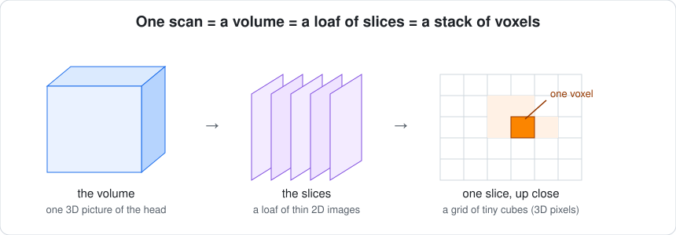
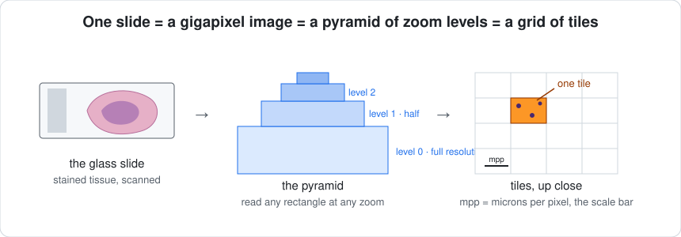
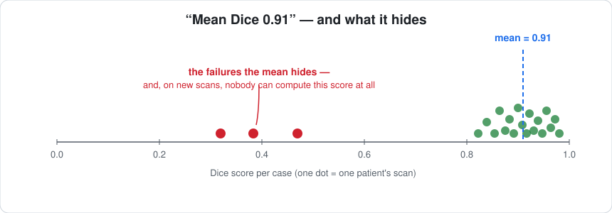
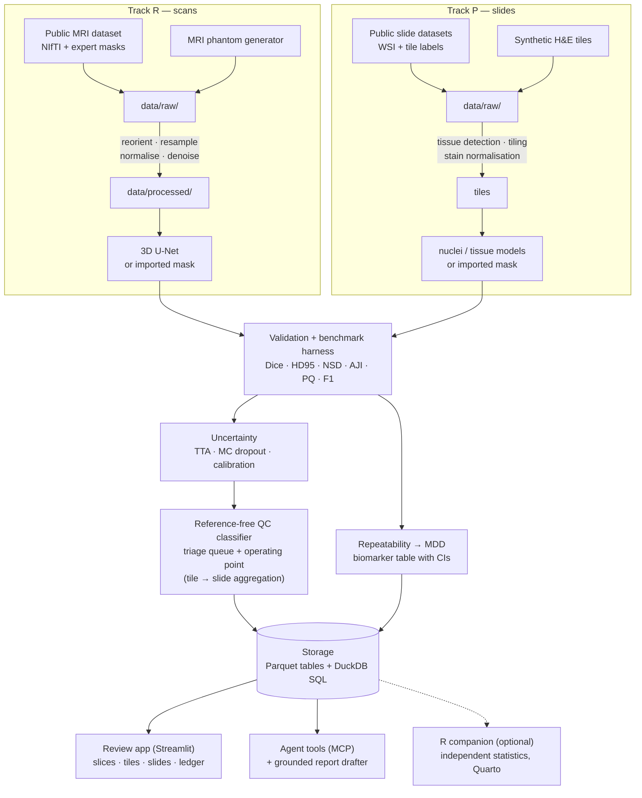

# SegAudit 🧠🔬📐✅

<!-- Cover image goes here once the review app exists (Phase 9):
[](docs/img/cover_segaudit.png) -->

**▶ Review app — coming with Phase 9** · **v0.2.0-alpha.1 (two-track foundation)**
· 

-76B900)


-informational)

**SegAudit tells you which segmentations you can trust — whether the picture is
a brain MRI or a tumour slide — and turns that into a review decision and a
biomarker you can defend.** A model draws outlines on medical images and
reports "91% accurate on average". SegAudit answers the question that average
hides: *which* outlines are wrong — without needing the right answer in hand.
Two input doors (3D scans, 2D slides), one shared audit core. Built from
scratch, in public, fully explained.

> Every term used anywhere in this repo — medical, statistical or technical — is
> defined in plain language in [`docs/00-glossary.md`](docs/00-glossary.md). If a
> word isn't there, that's a documentation bug.
>
> **New here? Start with [`docs/HANDBOOK.md`](docs/HANDBOOK.md)** — the one living
> document that walks the whole journey in order, from day 0 to the finished
> product, linking to everything else at the moment you need it.

---

## Contents

- [What is a segmentation? (start here)](#what-is-a-segmentation-start-here)
- [The problem this project tackles](#the-problem-this-project-tackles)
- [Two tracks, one core](#two-tracks-one-core)
- [How it works](#how-it-works)
- [The data at a glance](#the-data-at-a-glance)
- [Results, phase by phase](#results-phase-by-phase) — fills in as each phase completes
- [Build log](#build-log) — every phase on both tracks, linked to its guide, with status
- [**The tutorial, in order**](#the-tutorial-in-order) — the documents that teach every step from a blank laptop
- [Roadmap](#roadmap) — what comes next, and why each item waits
- [About the data (honesty notes)](#about-the-data-honesty-notes)
- [Repository map](#repository-map) — every file, annotated
- [How to run](#how-to-run) — quick start for Windows, macOS and RHEL 8
- [How I work on this repo (branch model)](#how-i-work-on-this-repo-branch-model)
- [Why the documentation is so detailed](#why-the-documentation-is-so-detailed)
- [License](#license)

## What is a segmentation? (start here)

Two kinds of medical picture appear in this project. They look nothing alike,
and the same idea applies to both.

**A scan.** An MRI scanner takes a 3D picture of the inside of the body, stored
as a stack of thin slices — think of a loaf of bread, sliced. Each slice is a
grid of tiny squares; stacking the slices turns those squares into tiny cubes
called **voxels** (3D pixels).



**A slide.** A pathologist's glass slide holds a sliver of tissue, stained so
that cell nuclei turn blue-purple and everything else pink (the classic *H&E*
stain). A scanner photographs it at microscope resolution: a single
**whole-slide image** can be 100 000 pixels across. It is stored as a pyramid
of zoom levels, and software works on small square **tiles** cut from it.



A **segmentation** is the outline of a structure drawn on such a picture,
pixel by pixel: "these voxels are the hippocampus"; "these pixels are one
nucleus, those belong to tumour tissue". It is the digital version of
colouring inside the lines. Once a structure is outlined you can *measure* it —
a hippocampal volume in millilitres, a count of immune cells per square
millimetre of tumour. Such a number is an **imaging biomarker**: a measurement
from an image that tracks disease, and that decisions rest on.

Drawing those outlines by hand takes an expert about an hour per scan, and is
impossible at the scale of a slide with a million nuclei. A **segmentation
model** — a program trained on hand-drawn examples — does it in seconds. That
is the good news.

## The problem this project tackles

A segmentation model is evaluated by comparing its outlines with an expert's,
using a score such as **Dice** (1.0 is a perfect match, 0.0 no overlap) or, for
nuclei, **Panoptic Quality**. A typical report says *mean Dice 0.91*. That
average hides the shape of the distribution: most cases are fine, and a
handful are badly wrong.



On slides the same thing happens at two scales: individual tiles fail — a
fold, a pen mark, an out-of-focus patch, a stain batch the model never saw —
and whole slides drift when the scanner, the lab or the magnification changes.

In real use there is no expert outline to compare against — that is the whole
point of automating — so the score cannot be computed on new data at all. The
team has two bad options: a human reviews *every* case, which defeats the
automation, or nobody reviews any, and a broken outline silently becomes a
wrong number inside a decision: a treatment-response call from a hippocampal
volume, a cohort comparison built on tumour-infiltrating-lymphocyte density.

SegAudit is a third option. For every new scan or slide it produces:

1. **A segmentation** (the baseline everyone builds) — or it **imports one**
   made by any other tool — plus proper validation where an expert outline
   exists: overlap *and* boundary metrics, per case, not just a mean.
2. **An uncertainty estimate** — how much the model's answer changes when the
   input is nudged (test-time augmentation) and when its own randomness is
   sampled (Monte Carlo dropout). Confident models agree with themselves.
3. **A reference-free quality score** — a small, interpretable classifier that
   learns, from uncertainty and shape features alone (and, on slides, from
   foundation-model embeddings), to predict "this outline is probably wrong"
   *without seeing the expert outline*. Calibrated, so the score means what it
   says.
4. **A triage queue with a stated operating point** — "review these 14 of 200;
   the remaining 186 are safe to auto-accept, with a quantified residual
   risk". On slides, tile decisions aggregate to one decision per slide.
5. **A repeatability study** — how much the measured biomarker moves when the
   same picture is re-acquired with realistic differences (noise, resolution,
   rotation; stain, scanner, magnification), reported as the *minimum
   detectable difference*: the smallest change that can be distinguished from
   measurement noise.
6. **Agent-callable tools** — the pipeline exposed through the Model Context
   Protocol so an agent can run an audit, query the results and draft a
   quality report grounded strictly in computed numbers.

## Two tracks, one core


Everything that depends on *what kind of picture it is* lives in a **track**:
reading files with the right geometry (voxel spacing for scans, microns per
pixel for slides), the synthetic test data, preprocessing, the segmentation
models. Everything that works on *any* segmentation — the audit itself — is
written **once** and lives outside both tracks. The rule that keeps it honest:
**a shared component counts as finished only when it is demonstrated on both
tracks.** A quality-control method that transfers from brain MRI to tumour
slides is a method; one that works on only one is a trick.

| | Track R — radiology | Track P — pathology |
|---|---|---|
| Picture | 3D volumes: MRI now, CT/PET on the roadmap | 2D gigapixel slides: H&E, IHC, multiplex immunofluorescence, spatial transcriptomics aligned to H&E |
| Geometry that must not be lost | voxel spacing, orientation, affine | microns per pixel, magnification, pyramid level |
| Unit of work | one case (scan) | tile (what a model sees) → slide (what a reviewer decides) |
| Example biomarkers | hippocampal volume | TIL density, Ki-67 index, tumour–stroma ratio, tumour–immune interaction |
| Track-specific extras | registration, 3D U-Net | stain handling, nuclei instance models, foundation-model embeddings, cell graphs, spatial statistics, multimodal pairing |
| Code | `src/segaudit/radiology/` | `src/segaudit/pathology/` |

## How it works

Three words first. The **backend** is the code that does the real work
(reading images, training, scoring) — the kitchen. The **frontend** is what a
reviewer looks at and clicks — the dining room. **Storage** is where results
are filed so they can be found again — the pantry. Data flows one way, top to
bottom, and no step edits its own input; that single rule is what makes every
result reproducible.



Everything reachable through one Python module,
[`src/segaudit/api.py`](src/segaudit/api.py): the command line, the review app
and the agent tools are thin doors onto that one API; none contain logic of
their own. Every function takes a configuration that names its **track**, and
only the track-specific parts look at it. That design lets the same core be
called by a future web front end or cloud service without a rewrite — see
[`docs/02-architecture.md`](docs/02-architecture.md).

## The data at a glance

| Track | Use | Dataset | Licence | Status |
|---|---|---|---|---|
| R | Segmentation, validation, UQ, QC, repeatability | **Medical Segmentation Decathlon Task 04 — Hippocampus**: 394 T1-weighted brain MRI volumes with expert outlines (263 with public labels), a research cohort of healthy adults and adults with a psychiatric diagnosis. Tiny volumes (≈35 × 50 × 35 voxels), so a 3D model trains on a laptop CPU in minutes; a genuinely hard target, so real failures exist to detect | CC-BY-SA 4.0 | Phase 1 |
| R | Tests, CI, first walkthrough | **MRI phantom** — hippocampus-like ellipsoids in a noisy volume, failure modes on demand | synthetic | Phase 1 |
| P | Tissue semantic segmentation | **BCSS** — 151 breast-cancer regions from TCGA at 0.25 µm/px, 5 tissue classes | CC0 1.0 | Phase P1 |
| P | Nuclei instance segmentation + classification | **PanNuke** — 256-px tiles, 19 tissue types, ~47 k nuclei, 5 classes | CC BY-NC-SA 4.0 — **non-commercial** | Phase P1 |
| P | Nuclei, licence-clean alternative | **NuCLS** — 222 k nucleus annotations on the same TCGA images | CC0 1.0 | Phase P1 |
| P | IHC ↔ multiplex IF pairs | **DeepLIIF** — co-registered Ki-67 IHC and mIF tiles | assumed non-commercial until verified in P7 | Phase P7 |
| P | H&E ↔ spatial transcriptomics | **10x Visium human breast cancer (FFPE)** — H&E + spot expression | CC BY 4.0 | Phase P9 |
| P | End-to-end whole-slide demo | **One CAMELYON16 slide** (sentinel lymph node, H&E) | CC0 | Phase P1 |
| P | Tests, CI, first walkthrough | **Synthetic H&E tiles** — nuclei with instance and phenotype labels, three spatial patterns, failure modes and artefacts on demand, assembled into synthetic pyramidal slides | synthetic | ✅ built |

Sizes, download steps and licence notes are stated in each data phase's
tutorial. Non-commercial datasets are labelled wherever they are used, and
models trained on them inherit the label.

## Results, phase by phase

*This section fills in as phases complete. Each entry shows the headline
number, the figure, and the one-paragraph plain-language meaning — for both
tracks side by side once both have results.*

- **Phase 0 — foundation:** the package installs and its tests pass on
  Windows, macOS and Linux. 
- **Phase 0P — two-track foundation:** a synthetic pyramidal slide is written
  and read back through two independent slide readers (OpenSlide and
  tiffslide) with identical geometry — 4 levels, 0.5 µm/px, 20× — on all three
  operating systems; 73 tests pass.

## Build log

Two tracks, interleaved so that every release advances both. R phases keep
their numbers; P phases are new; S phases are shared and count only when
demonstrated on both tracks.

| Ver. | Phase | Track | What it delivers | Guide | Status |
|---|---|---|---|---|---|
| 0.1.0 | 0 | S | Skeleton: package, config, storage, CLI, tests, CI, docs scaffolding, branch model | [`phase-00-skeleton.md`](docs/04-phase-tutorials/phase-00-skeleton.md) | ✅ |
| 0.2 | 0P | S | Two-track foundation: `track` setting, table schemas, `radiology/` + `pathology/`, whole-slide reader (OpenSlide + tiffslide), synthetic H&E tiles, `data phantom` / `slide info` | [`phase-0p-two-track-foundation.md`](docs/04-phase-tutorials/phase-0p-two-track-foundation.md) | ✅ v0.2.0-alpha.1 |
| 0.2 | 1 | R | Data: MSD download + inventory, MRI phantom, NIfTI/DICOM I/O with geometry, input QA gates, `segaudit sql` | `phase-01-data.md` | 🔨 code landed |
| 0.2 | P1 | P | Data: public slide datasets + licence notes, WSI/tile I/O with mpp, tissue detection + tiling, slide-level artefact QC, QA gates, SQL over slide tables | `phase-p1-data.md` | 🔜 |
| 0.2 | 2 | R | Preprocessing (reorient, resample, normalise, denoise) + classical baseline | `phase-02-preprocessing-baseline.md` | 🔜 |
| 0.2 | P2 | P | Stain deconvolution / normalisation / augmentation + classical nuclei and tissue baselines | `phase-p2-stain-baselines.md` | 🔜 |
| 0.2 | 3 | R | 3D U-Net on CPU, patient-level splits, seeded | `phase-03-model.md` | 🔜 |
| 0.2 | P3 | P | Nuclei instance/detection model + tissue model on tiles; import path with a pretrained public model | `phase-p3-models.md` | 🔜 → tag v0.2.0 |
| 0.3 | 4 | R | Validation: Dice, HD95, NSD, per-case failure analysis | `phase-04-validation.md` | 🔜 |
| 0.3 | P4 | S | **Benchmark harness** (classical vs trained vs imported, leaderboard in DuckDB) + pathology metrics (AJI, PQ, detection F1) — benchmarks both tracks | `phase-p4-validation-benchmark.md` | 🔜 |
| 0.3 | 5 | R | Uncertainty: TTA + MC dropout, calibration | `phase-05-uncertainty.md` | 🔜 → v0.3.0 |
| 0.4 | 6 | R | Reference-free QC classifier, triage queue, operating point | `phase-06-quality-control.md` | 🔜 |
| 0.4 | P5 | S | QC on pathology from the same code path: stain-jitter TTA, shape features, tile → slide aggregation | `phase-p5-quality-control.md` | 🔜 |
| 0.4 | P6 | P | Representation learning: pathology foundation-model embeddings (Hibou-B) + fallbacks, linear probe / k-NN, embedding distance as a QC signal | `phase-p6-representation.md` | 🔜 → v0.4.0 |
| 0.5 | 7 / 7R | R | Repeatability with registration; minimum detectable difference (+ R companion) | `phase-07-repeatability.md` | 🔜 |
| 0.5 | P10 | P | Repeatability on slides (reuses 7): stain, scanner, magnification, grid offset → MDD | `phase-p10-repeatability.md` | 🔜 |
| 0.5 | 8 / 8R | R | Biomarker table with CIs, metadata join, stratification (+ R companion) | `phase-08-biomarkers.md` | 🔜 |
| 0.5 | P7 | P | Cell phenotyping, cell graphs, pure-PyTorch message passing (+ PyTorch Geometric lane) | `phase-p7-cell-graphs.md` | 🔜 |
| 0.5 | P8 | P | Spatial statistics (Ripley's K, neighbourhoods) + pathology biomarkers into the shared table | `phase-p8-spatial-biomarkers.md` | 🔜 → v0.5.0 |
| 0.6 | 9 | S | Review app: slice views **and** slide/tile views, review ledger, import path; 3D Slicer, Napari **and QuPath** guides | `phase-09-review-app.md` | 🔜 |
| 0.6 | P9 | P | Multimodal: H&E ↔ IHC/mIF, H&E ↔ Visium, joint embedding, failure cases shown | `phase-p9-multimodal.md` | 🔜 → v0.6.0 |
| 0.7 | 10 | S | Agent tools (MCP), track-neutral; grounded report drafter for both | `phase-10-agent-tools.md` | 🔜 → v0.7.0 |
| 1.0 | 11 | S | Container (Docker/Podman) shipping both tracks; HPC and GPU paths | `phase-11-container-release.md` | 🔜 |
| 1.0 | P11 | P | Technical report benchmarking the QC layer across both tracks, `CITATION.cff`, poster one-pager | `phase-p11-technical-report.md` | 🔜 → v1.0.0 |

## The tutorial, in order

Read these in sequence. Each states its prerequisites, its learning goal, every
command with its expected output, and a checkpoint that tells you it worked.

0. [`docs/HANDBOOK.md`](docs/HANDBOOK.md) — **start here**: the living day-0-to-product walkthrough; everything below is linked from it in order, with why.
1. [`docs/00-glossary.md`](docs/00-glossary.md) — every term, in plain language, with an everyday analogy. Keep it open.
2. Set up your workshop from a blank machine — pick your operating system:
   [`docs/01-setup-windows.md`](docs/01-setup-windows.md) ·
   [`docs/01-setup-macos.md`](docs/01-setup-macos.md) ·
   [`docs/01-setup-rhel8.md`](docs/01-setup-rhel8.md)
   (`docs/01b-setup-r.md`, optional — R, RStudio and `renv` for the R companion — arrives with Phase 7.)
3. [`docs/02-architecture.md`](docs/02-architecture.md) — how the pieces fit, what each box does, the two tracks and the six design rules.
4. [`docs/03-git-workflow.md`](docs/03-git-workflow.md) — the branch model, the push sequence, and what to do when it goes wrong.
5. [`docs/04-phase-tutorials/`](docs/04-phase-tutorials/) — one guide per build phase, starting with [`phase-00-skeleton.md`](docs/04-phase-tutorials/phase-00-skeleton.md) and [`phase-0p-two-track-foundation.md`](docs/04-phase-tutorials/phase-0p-two-track-foundation.md).
6. [`docs/05-roadmap.md`](docs/05-roadmap.md) — the interleaved two-track plan, the approach for each item, and its trigger.
7. [`docs/06-product-and-technology-roadmap.md`](docs/06-product-and-technology-roadmap.md) — from this repository to a hosted product: every technology option evaluated with the same three questions, for volumes and for slides.

## Roadmap

Version 0.1.0 was the foundation; 0.2.0-alpha.1 opened the second door. The
phases in the build log land as minor versions 0.2 → 1.0, each advancing both
tracks, each with its tutorial. Beyond the pipeline, the items below are
evaluated — not just listed — in
[`docs/06-product-and-technology-roadmap.md`](docs/06-product-and-technology-roadmap.md):

- **Modalities and imports:** CT, PET, ultrasound; auditing masks produced by
  external tools (FreeSurfer, StarDist/Cellpose, foundation segmentation
  models) through the import path.
- **Product surface:** a multi-user web front end, a deep-zoom slide viewer,
  hosted review, coded findings via clinical, cell and tissue ontologies.
- **Platform:** a database server, object storage, a WSI tiling service,
  DICOM-WSI and OMERO, an orchestrator, experiment and model versioning,
  spatial-omics platforms.
- **Operations:** monitoring, a GPU inference service for foundation models,
  cost model, and the regulatory constraints that apply the moment real
  patient data is involved.

Each item carries a verdict (required now / recommended later / optional / not
needed) and the trigger that would change it. Nothing is added to the core
because it is fashionable.

## About the data (honesty notes)

- The public datasets are **research cohorts**, not clinical trials or
  drug-discovery studies. Models trained here demonstrate *workflow
  competence* — that the pipeline does what it claims, reproducibly — not
  clinical performance.
- The **MRI phantom** and the **synthetic H&E tiles** are synthetic, are
  labelled as such everywhere they appear, and exist so the pipeline can be
  run and tested without a download and so failure modes can be manufactured
  deliberately.
- **Clinical covariates** in the stratification phases are simulated; the
  acquisition-derived metadata is real.
- **Non-commercial datasets** (PanNuke; DeepLIIF assumed) are flagged wherever
  used; a licence-clean alternative is provided for nuclei (NuCLS).
- Training on **CPU** means compact models and tiles, not whole slides. That
  is a deliberate choice that keeps the project reproducible on any laptop;
  documented GPU paths exist for anyone who wants more.
- **Two dependency lanes** exist because of hardware, not choice: Intel Macs
  run the last PyTorch/MONAI built for them (2.2.2 / 1.4.0). Results between
  lanes match to numerical tolerance, not byte for byte; the reproducibility
  guarantee is *within* a lane.
- The quality-control score predicts *disagreement with an expert outline*.
  It cannot know whether the expert was right.

## Repository map

```
segaudit/
├── README.md                     ← you are here
├── LICENSE                       MIT
├── CHANGELOG.md                  what changed in each version, per track
├── CONTRIBUTING.md               branch model, push sequence, release flow, norms, two-track self-check
├── pyproject.toml                package identity, dependencies, pytest + ruff settings
├── requirements-torch-cpu.txt    PyTorch, CPU build — install this FIRST
├── requirements.txt              exact pins for everything else (both tracks; verified per platform)
├── requirements-dev.txt          pytest and ruff
├── .gitignore                    keeps data, models, environments, snapshots and secrets out of Git
├── .github/workflows/ci.yml      lint + tests + both slide readers on Windows, macOS and Linux
├── configs/
│   ├── default.yaml              every path, seed and threshold — track: radiology
│   ├── quick.yaml                tiny synthetic radiology run for tests and CI
│   └── quick-pathology.yaml      tiny synthetic pathology run for tests and CI
├── src/segaudit/                 the package ("src layout": must be installed to import)
│   ├── __init__.py               version string
│   ├── api.py                    THE public API — every interface calls these functions; track-neutral
│   ├── config.py                 YAML → typed Config; `track`; cross-platform path resolution
│   ├── schemas.py                the column names both tracks agree on (cases/slides/tiles/cells + shared tables)
│   ├── storage.py                Storage interface + local Parquet/DuckDB implementation
│   ├── envcheck.py               "did the install work?" self-check, incl. slide readers
│   ├── cli.py                    `segaudit info | check-env | config show | init | schemas | data … | sql | slide info`
│   ├── radiology/                Track R
│   │   ├── io_nifti.py           NIfTI I/O with geometry; volumes in ml
│   │   ├── phantom_volume.py     synthetic MRI: two-label structure, failure modes, artefacts
│   │   ├── qa.py                 input QA gates (refuse malformed scans and masks)
│   │   ├── dataset.py            checksummed, resumable download; inventory → cases + qa_issues
│   │   └── dicom.py              DICOM series → NIfTI with a de-identified summary
│   └── pathology/                Track P
│       ├── io_wsi.py             one SlideReader interface, OpenSlide + tiffslide backends, pyramid writer
│       └── phantom_tiles.py      synthetic H&E tiles: patterns, failure modes, artefacts, tables, slides
├── tests/                        102 checks on temporary folders; synthetic data only
├── scripts/
│   ├── check_public_safe.py      pre-push guard: no secrets, data files or personal paths
│   ├── freeze_lock.py            record the exact environment into locks/
│   └── make_repo_snapshot.py     one Markdown file of every Git-tracked text file
├── queries/                      documented multi-line SQL for `segaudit sql -f` (see queries/README.md)
├── locks/                        per-platform exact environment snapshots (see locks/README.md)
├── data/                         raw/ and processed/ — regenerated, never committed (see data/README.md)
├── outputs/  models/             tables, figures, weights — git-ignored
└── docs/
    ├── HANDBOOK.md               START HERE — the living day-0-to-product walkthrough, both tracks
    ├── 00-glossary.md            every term with an everyday analogy (§15: slides and stains)
    ├── 01-setup-{windows,macos,rhel8}.md   blank machine → working environment, incl. the slide reader
    ├── 02-architecture.md        two doors, one core; the six design rules
    ├── 03-git-workflow.md        branch model and push sequence, with failure cases
    ├── 04-phase-tutorials/       one guide per phase, in build order (phase-00, phase-0p, …)
    ├── 05-roadmap.md             the interleaved two-track plan with approach and trigger
    ├── 06-product-and-technology-roadmap.md   MVP → hosted product, for volumes and slides
    └── img/                      figures (fig_*.svg), in pairs: a volume and a slide
```

## How to run

Full, blank-machine instructions are in the setup guide for your operating
system (step 2 of the tutorial). The short version, once Git and Python 3.11
are installed:

**macOS / Linux (bash)**

```bash
git clone https://github.com/akannan2987/segaudit.git
cd segaudit
python3.11 -m venv .venv
source .venv/bin/activate
python -m pip install --upgrade pip
python -m pip install -r requirements-torch-cpu.txt      # PyTorch, CPU build, first
python -m pip install -r requirements.txt -r requirements-dev.txt
python -m pip install -e . --no-deps
segaudit check-env                                        # should end with "You are ready."
pytest                                                    # should end with "73 passed"
```

**Windows (PowerShell)**

```powershell
git clone https://github.com/akannan2987/segaudit.git
cd segaudit
py -3.11 -m venv .venv
.\.venv\Scripts\Activate.ps1
python -m pip install --upgrade pip
python -m pip install -r requirements-torch-cpu.txt
python -m pip install -r requirements.txt -r requirements-dev.txt
python -m pip install -e . --no-deps
segaudit check-env
pytest
```

**Then, the two doors in two minutes:**

```bash
segaudit data phantom -c configs/quick-pathology.yaml                                  # synthetic tiles + slides + tables
segaudit slide info data/raw/synthetic_tiles/slides/synth_000.tif --backend openslide  # 2 levels, mpp 0.5, 20x
segaudit slide info data/raw/synthetic_tiles/slides/synth_000.tif --backend tiffslide  # identical
segaudit schemas cells                                                                  # what a cell row contains
segaudit data phantom -c configs/quick.yaml                                            # radiology: synthetic MRI volumes
segaudit data inventory -c configs/quick.yaml                                          # cases + qa_issues tables
segaudit sql -c configs/quick.yaml -f queries/volumes_by_case.sql                      # hippocampal volumes in ml
```

**A note on Intel Macs.** PyTorch stopped building for Intel-based Macs at
version 2.2.2 (2024). The requirements files carry *environment markers* —
conditions pip evaluates on your machine — so the same commands above install
`torch 2.2.2 + MONAI 1.4.0 + NumPy 1.26` on an Intel Mac and the current
versions everywhere else. The slide reader ships as a universal binary and
needs nothing special. Nothing to edit.

The real dataset: `segaudit data download -c configs/default.yaml` (≈27 MB,
checksummed, resumable) then `segaudit data inventory -c configs/default.yaml`.
The remaining pipeline commands (`train`, `audit`, `app`) arrive phase by
phase; each tutorial adds its own command to this section.

## How I work on this repo (branch model)

This project uses three branches: **`master`** (the stable, official version),
**`beta`** (a preview of the next release), and **`develop`** (where day-to-day
work happens). The rhythm is: make changes on `develop`, push `develop` up to
all three at once, then bring local `master` back in step. Every phase ends
with exactly this:

```bash
# safety first, before staging anything
ruff check .
pytest
python scripts/check_public_safe.py     # must print "SAFE TO PUSH"

git switch develop
git add -A
git commit -m "clear message describing the change"
git push origin develop develop:beta develop:master
# add --tags only when a release tag was created in this phase

# bring local master in step with the remote master just updated
git switch master
git pull --ff-only origin master
git switch develop
```

Every push is gated by `scripts/check_public_safe.py`, which inspects what Git
tracks and refuses the all-clear if a secret, a data or model file, or a
hard-coded personal path would be published — `.gitignore` is the lock on the
door, this is the guard checking the bag on the way out. It is plain Python,
so it runs identically on Windows, macOS and Linux.

The push line sends local `develop` to remote `develop` and fast-forwards
remote `beta` and `master` to match — three branches kept in lock-step with
one command. The `master` sync-back keeps the local copy consistent with what
was just pushed. `--ff-only` means "update only if it's clean, otherwise stop
and warn." Tags are pushed with `--tags` only when a new version is cut. The
full reasoning and the "if it goes wrong" cases are in
[`docs/03-git-workflow.md`](docs/03-git-workflow.md).

## Why the documentation is so detailed

Documentation quality is a deliberate deliverable here, not an afterthought.
An analysis that can't be reproduced and explained is worth very little — so
this repo is written so that a complete beginner can rebuild it from scratch
and learn every concept along the way; and so that a radiologist can follow
the pathology track and a pathologist the radiology track. The glossary rule
at the top of this file is part of that contract: every term is defined in
plain language, or it's a bug.

## License

MIT — see [`LICENSE`](LICENSE). The public datasets carry their own licences,
stated where each is used; non-commercial ones are flagged.
