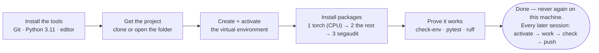

[← README](../README.md) · [All docs in order](../README.md#the-tutorial-in-order) · [Glossary](00-glossary.md)

# 01 · Setup on macOS — from a blank Mac to a working workshop

**Prerequisites:** a Mac (Intel or Apple silicon) running macOS 12 or newer, an administrator password, an internet connection, and about 45 minutes. No prior knowledge of anything.
**Learning goal:** after this page you will have every tool SegAudit needs installed, understand what each one is for, and be able to open the project and prove that it works — the same proof the automated tests use.
**Checkpoint:** `segaudit check-env` ends with `All required packages import. You are ready.`, `pytest` ends with `29 passed`, and `ruff check .` prints `All checks passed!`.

This page was written by running every command on a real Intel MacBook Pro (macOS 15) and pasting what appeared. Where Apple-silicon Macs differ, it says so.

---

## Contents

1. [Before you type anything: what you are about to install, and why](#1-before-you-type-anything)
2. [Open the Terminal](#2-open-the-terminal)
3. [Install Git](#3-install-git)
4. [Install Python 3.11](#4-install-python-311)
5. [Install Visual Studio Code](#5-install-visual-studio-code)
6. [Get the project](#6-get-the-project)
7. [Create the virtual environment](#7-create-the-virtual-environment)
8. [Install the packages — three commands, in order](#8-install-the-packages)
9. [Prove it works](#9-prove-it-works)
10. [The daily loop (everything after today)](#10-the-daily-loop)
11. [Troubleshooting](#11-troubleshooting)
12. [Checkpoint](#12-checkpoint)

---

## 1. Before you type anything

You will install five things. Here is what each one is, in one line, with the everyday version.

| Tool | What it is | Everyday version |
|---|---|---|
| **Terminal** | A window where you type commands to the computer | Talking to the computer in sentences instead of clicks |
| **Git** | A save-game system for code: every meaningful change becomes a snapshot you can return to | A photo album of the project's history |
| **Python 3.11** | The programming language SegAudit is written in | The language the recipe is written in |
| **VS Code** | A text editor built for code, with a built-in terminal | A workbench with good lighting |
| **A virtual environment** | A private, sealed set of Python packages for this project only | A separate toolbox per project, so tools never go missing into another project |


The whole journey of this page, as one picture:



And the single most important idea on this page, drawn:


Nothing you install here will change how your Mac behaves for anything else. Everything project-specific lives inside one folder that you can delete to undo it all.

**A convention for this page.** Lines starting with `$` are commands you type (don't type the `$`). Lines without it are what the computer prints back. `<you>` means "your own username" — never type the angle brackets.

## 2. Open the Terminal

1. Press `⌘ + Space`, type `Terminal`, press Return.
2. A window opens showing a line ending in `$` or `%`. That is the *prompt*: the computer is waiting for you.

**Why:** everything in SegAudit is run from the terminal. Clicking is not reproducible; typed commands are, which is why every command in this project is written down.

Check which *shell* (the program interpreting your commands) you have:

```
$ echo $SHELL
/bin/zsh
```

Newer Macs answer `/bin/zsh`, older ones `/bin/bash`. Both work identically for everything on this page.

**If you use conda** (Anaconda/Miniconda) from another project, deactivate it first so it does not interfere:

```
$ conda deactivate
```

If that prints `conda: command not found`, you don't have it; carry on.

## 3. Install Git

Check whether it is already there — it often is:

```
$ git --version
git version 2.39.3 (Apple Git-145)
```

Any version 2.23 or newer is fine (SegAudit uses `git switch`, added in 2.23).

If instead a dialog appears saying *"The git command requires the command line developer tools"*, click **Install**, wait for the download (a few minutes), then run `git --version` again.

Tell Git who you are — this name and email are stamped on every snapshot you save:

```
$ git config --global user.name "Your Name"
$ git config --global user.email "you@example.com"
```

**Why:** Git is how the project's history is recorded and how it reaches GitHub. Without it you could still run the code, but you could not save or share your work properly.

## 4. Install Python 3.11

macOS ships with a Python, but it is not the one we want: it is an old version and Apple reserves it for the system. We install our own, from the official source, and refer to it by its exact name `python3.11` so there is never any doubt which one is running.

1. Open https://www.python.org/downloads/macos/ in a browser.
2. Under **Python 3.11.x**, download the **macOS 64-bit universal2 installer** (works on Intel and Apple silicon).
3. Open the downloaded `.pkg` and click through with the defaults.
4. **Important, once:** when the installer finishes it opens a folder in Finder. Double-click **`Install Certificates.command`**. This lets Python download packages securely; skipping it causes the `SSL: CERTIFICATE_VERIFY_FAILED` error in troubleshooting.
5. Close and reopen the Terminal (so it notices the new program), then verify:

```
$ python3.11 --version
Python 3.11.3
```

Any 3.11.x is fine. If you see `command not found`, see troubleshooting T3.

**Why 3.11 and not the newest?** Every package SegAudit uses ships pre-built files ("wheels") for 3.11 on every platform we support, including Intel Macs. That is not yet true of the very latest Python. Boring is reliable.

## 5. Install Visual Studio Code

1. Open https://code.visualstudio.com/, click **Download for Mac**, unzip, and drag *Visual Studio Code* into **Applications**.
2. Open it. Press `⌘ + Shift + X` (Extensions), search **Python**, install the one published by Microsoft.
3. Optional but handy: `⌘ + Shift + P`, type `shell command`, choose **Install 'code' command in PATH**. Now typing `code .` in any folder opens it in VS Code.

**Why:** you *can* edit files in any editor, but VS Code shows Python errors as you type, has a terminal built in, and understands Git — so the whole loop (edit, run, commit) happens in one window.

## 6. Get the project

Two situations. Pick yours.

**A. You are a reader who wants to run SegAudit.** Clone it:

```
$ mkdir -p ~/projects
$ cd ~/projects
$ git clone https://github.com/akannan2987/segaudit.git
Cloning into 'segaudit'...
$ cd segaudit
```

**B. You are the author (or a contributor) with the repository already on disk.** Just go there:

```
$ cd ~/Documents/Work/projects/segaudit
```

Either way, confirm you are in the right place:

```
$ pwd
/Users/<you>/projects/segaudit
$ ls
CHANGELOG.md     LICENSE     configs     pyproject.toml    requirements.txt   src
CONTRIBUTING.md  README.md   data        requirements-dev.txt   scripts     tests
```

**Why `pwd`?** Every later command assumes you are standing in the project folder. `pwd` ("print working directory") shows where you are.

Open the folder in VS Code (`code .`) if you installed the command; the terminal inside VS Code (`View → Terminal`) works exactly like the Terminal app and starts in the right folder.

## 7. Create the virtual environment

```
$ python3.11 -m venv .venv
```

Nothing is printed on success. A hidden folder `.venv` now exists containing a private copy of Python.

Activate it:

```
$ source .venv/bin/activate
(.venv)
```

The prompt now starts with `(.venv)`. That tag means: *for this terminal window, `python` and `pip` refer to the private copy.* You must activate every time you open a new terminal — it is one line, and section 10 repeats it.

Confirm the switch took:

```
$ which python
/Users/<you>/projects/segaudit/.venv/bin/python
```

If it shows any other path, activation did not work — see troubleshooting T5.

**Why a virtual environment at all?** Two projects on the same Mac may need different versions of the same package. Installing everything globally means the second project breaks the first. A venv is a sealed toolbox per project. It is also what makes "delete `.venv` and start again" a complete, safe reset.

## 8. Install the packages

Three commands, in this order. The order matters and the reason is explained after each.

**8a. Upgrade pip itself.** The venv starts with an old pip; new pip understands newer package files.

```
$ python -m pip install --upgrade pip
Successfully installed pip-26.2.1
```

**8b. PyTorch, from its CPU index, first.**

```
$ python -m pip install -r requirements-torch-cpu.txt
Looking in indexes: https://download.pytorch.org/whl/cpu
```

Then one of two things, depending on your Mac:

*Intel Mac* — you will see:
```
Ignoring torch: markers 'sys_platform != "darwin" or platform_machine != "x86_64"' don't match your environment
Collecting torch==2.2.2
  Downloading torch-2.2.2-cp311-none-macosx_10_9_x86_64.whl (151.0 MB)
...
Successfully installed ... torch-2.2.2 ...
```

*Apple-silicon Mac* — you will see `Ignoring torch: markers ... ` for the *other* line, then `Collecting torch==2.13.0`.

The `Ignoring torch: markers ... don't match` line is **not an error**. The file contains two torch lines, each with a condition; pip prints that it skipped the one that does not apply to your machine. This is how one file serves both kinds of Mac — the full story is troubleshooting T1.

**Why a separate file and a separate index?** PyTorch's default download on Linux is the multi-gigabyte graphics-card build. Its CPU index serves a build a tenth the size that is all SegAudit needs. Installing it *first* means the next command finds PyTorch already present and does not go looking for it elsewhere.

**8c. Everything else.**

```
$ python -m pip install -r requirements.txt -r requirements-dev.txt
Ignoring numpy: markers ... don't match your environment      ← Intel Mac only; normal
Ignoring monai: markers ... don't match your environment      ← Intel Mac only; normal
Collecting numpy==1.26.4 ...
Collecting pandas==3.0.5 ...
...
Successfully installed PyYAML-6.0.3 SimpleITK-2.5.6 ... monai-1.4.0 ... numpy-1.26.4 ... scikit-learn-1.9.0
```

(On Apple silicon: `numpy-2.4.6` and `monai-1.6.0`.) This downloads about 250 MB and takes two to five minutes.

**8d. SegAudit itself, as an editable install.**

```
$ python -m pip install -e . --no-deps
Obtaining file:///Users/<you>/projects/segaudit
  ...
Successfully built segaudit
Successfully installed segaudit-0.1.0
```

`-e` means *editable*: rather than copying the code into the venv, pip places a signpost pointing at `src/segaudit`, so any edit you make is live immediately. `--no-deps` means "do not re-resolve dependencies" — we just installed the exact pinned ones and do not want pip second-guessing them.

## 9. Prove it works

Three commands. Each is also what the automated tests on GitHub run, so if these pass here, the project is in the same state as the published one.

**9a. The environment check.**

```
$ segaudit check-env
SegAudit environment check
===========================

python      3.11.3
executable  /Users/<you>/projects/segaudit/.venv/bin/python3
platform    macOS-15.7.4-x86_64-i386-64bit
machine     x86_64
cpu_count   16

package       status   version     first needed
-------------------------------------------------------
numpy         ok       1.26.4      Phase 0
pandas        ok       3.0.5       Phase 0
pyarrow       ok       25.0.1      Phase 0
duckdb        ok       1.5.5       Phase 0
PyYAML        ok       6.0.3       Phase 0
nibabel       ok       5.4.2       Phase 1
SimpleITK     ok       2.5.6       Phase 1
pydicom       ok       3.0.2       Phase 1
scikit-image  ok       0.26.0      Phase 2
scikit-learn  ok       1.9.0       Phase 6
torch         ok       2.2.2       Phase 3
monai         ok       1.4.0       Phase 3
pytest        ok       9.1.1       Phase 0 (dev)
ruff          ok       0.16.5      Phase 0 (dev)

All required packages import. You are ready.
```

Read it once: it tells you which phase first needs each package, so a missing one only matters when you reach that phase. On Apple silicon the `machine` line reads `arm64` and torch/monai/numpy show the newer versions.

**9b. The tests.**

```
$ pytest
.............................                                    [100%]
29 passed in 10.73s
```

Twenty-nine dots, twenty-nine small automated checks of the configuration loader, the storage layer and the command line, each passing. The time varies by machine.

**9c. The linter.**

```
$ ruff check .
All checks passed!
```

**9d. Three more commands worth seeing once**, so the names are familiar:

```
$ segaudit --version
segaudit 0.1.0

$ segaudit config show -c configs/quick.yaml
{
  "source_file": "/Users/<you>/projects/segaudit/configs/quick.yaml",
  "root": "/Users/<you>/projects/segaudit",
  "project_name": "segaudit",
  "run_label": "quick",
  "seed": 7,
  ...
}

$ segaudit init -c configs/quick.yaml
Created:
  /Users/<you>/projects/segaudit/outputs/quick
  /Users/<you>/projects/segaudit/models/quick
```

`config show` prints the settings file with every relative path turned into an absolute one for *your* machine — that translation is the reason the same config works on Windows and Linux too. `init` creates the folders those paths name.

## 10. The daily loop

Setup is done once. Every later session is this, and nothing more:

```
$ cd ~/projects/segaudit
$ source .venv/bin/activate
$ git switch develop
$ git pull --ff-only origin develop
# ... edit code or docs ...
$ ruff check .
$ pytest
$ python scripts/check_public_safe.py        # must print SAFE TO PUSH
# ... then the push sequence in docs/03-git-workflow.md ...
```

When you are finished for the day, `deactivate` leaves the venv (or just close the window).

## 11. Troubleshooting

Each entry: what you see → what it means → what to do.

**T1. `No matching distribution found for torch==2.13.0` — and the version list stops at `2.2.2`.**
*Means:* you are on an Intel Mac, and PyTorch stopped publishing Intel-Mac builds at 2.2.2 (in 2024). *Do:* nothing if you have the current requirements files — they contain a second line, `torch==2.2.2; sys_platform == "darwin" and platform_machine == "x86_64"`, that pip picks automatically on Intel. If you see this error, you have an old copy of the file: `git pull --ff-only origin develop` and re-run step 8b. Consequences, stated honestly: Intel Macs run `torch 2.2.2 + MONAI 1.4.0 + NumPy 1.26.4`; everything else runs the current versions; results agree to numerical tolerance, not byte for byte, across the two.

**T2. `numpy==2.5.2 ... Requires-Python >=3.12` / `No matching distribution found for numpy`.**
*Means:* a requirements pin that needs a newer Python than 3.11. This happened once, on 2026-09-01, and was fixed by re-resolving every pin against Python 3.11 on all four platforms. *Do:* `git pull --ff-only origin develop`, then re-run step 8c. If it recurs after a future change, the fix is always in the pins, never in your Python.

**T3. `python3.11: command not found` after installing.**
*Means:* the Terminal window is older than the install and has not noticed the new program. *Do:* close every Terminal window, open a new one, try again. If still missing, the installer did not run — repeat step 4.

**T4. `pip: command not found` or `pip` installs into the wrong place.**
*Means:* the venv is not active, or you typed `pip` outside it. *Do:* always use `python -m pip ...` with the venv active, exactly as written on this page. `python -m pip` guarantees the pip belonging to the `python` in front of it.

**T5. Prompt does not show `(.venv)` after `source .venv/bin/activate`.**
*Means:* you are not in the project folder, or the venv was not created. *Do:* `pwd` to check the folder; `ls -a` should list `.venv`; if not, repeat step 7.

**T6. `SSL: CERTIFICATE_VERIFY_FAILED` during any pip install.**
*Means:* step 4's `Install Certificates.command` was skipped. *Do:* Finder → Applications → Python 3.11 → double-click **Install Certificates.command**, then retry.

**T7. `error: externally-managed-environment`.**
*Means:* you are installing into the Mac's own Python instead of the venv. *Do:* activate the venv (step 7) and use `python -m pip`.

**T8. `Ignoring torch: markers ... don't match your environment`.**
*Means:* nothing is wrong. pip is reporting that it skipped the requirements line meant for the other kind of Mac. Carry on.

**T9. `zsh: permission denied` running a script.**
*Means:* you typed the script's path as if it were a command. *Do:* prefix with `python`, e.g. `python scripts/check_public_safe.py`.

**T10. `pytest` says `no tests ran` or `command not found`.**
*Means:* the dev tools were not installed (step 8c) or the venv is inactive. *Do:* check for `(.venv)`, re-run `python -m pip install -r requirements-dev.txt`.

**T11. conda's `(base)` appears in the prompt alongside `(.venv)`.**
*Means:* conda auto-activates in new terminals and can shadow the venv's Python. *Do:* `conda deactivate` first, then `source .venv/bin/activate`. To stop conda auto-activating permanently: `conda config --set auto_activate_base false`.

**T12. Everything is broken and you want to start over.**
*Do:* `deactivate`, then `rm -rf .venv`, then repeat from step 7. The venv is the only thing that changes on your machine; deleting it is a complete reset. Your code and Git history are untouched.

## 12. Checkpoint

You are done with setup when, with `(.venv)` showing:

- `segaudit check-env` ends with **`All required packages import. You are ready.`**
- `pytest` ends with **`29 passed`**
- `ruff check .` prints **`All checks passed!`**

You will never repeat this page on this Mac. From here, the daily loop in section 10 is all you need.

Next: [`02-architecture.md`](02-architecture.md) — how the pieces fit together.
