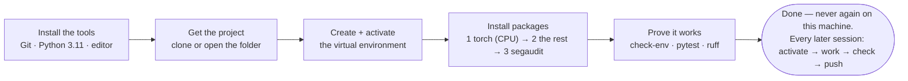
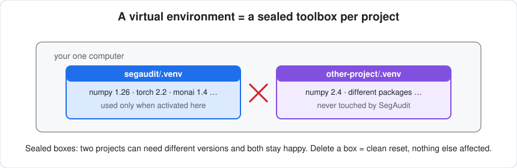

[← README](../README.md) · [All docs in order](../README.md#the-tutorial-in-order) · [Glossary](00-glossary.md)

# 01 · Setup on RHEL 8 — from a fresh Linux VM to a working workshop

**Prerequisites:** a machine or virtual machine running Red Hat Enterprise Linux 8 (or a binary-compatible rebuild such as Rocky Linux 8 or AlmaLinux 8), a login, an internet connection (or an internal package mirror), and about 45 minutes. Root (`sudo`) access is needed for two `dnf` commands; if you do not have it, section 4 shows what to ask an administrator for and how to proceed without it. No prior knowledge of anything.
**Learning goal:** after this page you will have every tool SegAudit needs installed, understand what each one is for, and be able to open the project and prove that it works — the same proof the automated tests use.
**Checkpoint:** `segaudit check-env` ends with `All required packages import. You are ready.`, `pytest` ends with `29 passed`, and `ruff check .` prints `All checks passed!`.

RHEL 8 is common on institutional servers and VMs, often accessed over SSH with no graphical desktop. This page assumes a terminal only; VS Code is optional and covered as a remote editor.

---

## Contents

1. [Before you type anything: what you are about to install, and why](#1-before-you-type-anything)
2. [Open a terminal](#2-open-a-terminal)
3. [Install Git](#3-install-git)
4. [Install Python 3.11](#4-install-python-311)
5. [Editor: VS Code over SSH (optional)](#5-editor-vs-code-over-ssh-optional)
6. [Get the project](#6-get-the-project)
7. [Create the virtual environment](#7-create-the-virtual-environment)
8. [Install the packages — three commands, in order](#8-install-the-packages)
9. [Prove it works](#9-prove-it-works)
10. [The daily loop (everything after today)](#10-the-daily-loop)
11. [Troubleshooting](#11-troubleshooting)
12. [Checkpoint](#12-checkpoint)

---

## 1. Before you type anything

You will install four things (an editor is optional on a server). Here is what each one is, in one line, with the everyday version.

| Tool | What it is | Everyday version |
|---|---|---|
| **bash (the terminal)** | A window where you type commands to the computer | Talking to the computer in sentences instead of clicks |
| **Git** | A save-game system for code: every meaningful change becomes a snapshot you can return to | A photo album of the project's history |
| **Python 3.11** | The programming language SegAudit is written in | The language the recipe is written in |
| **A virtual environment** | A private, sealed set of Python packages for this project only | A separate toolbox per project, so tools never go missing into another project |


The whole journey of this page, as one picture:



And the single most important idea on this page, drawn:



Nothing you install here changes the system Python or anything other users depend on. Everything project-specific lives inside one folder in your home directory.

**A convention for this page.** Lines starting with `$` are commands you type (don't type the `$`). Lines without it are what the computer prints back. `<you>` means "your own username" — never type the angle brackets.

**The one RHEL-specific fact to remember:** on RHEL 8, `python3` is Python **3.6**, which is far too old and belongs to the operating system. SegAudit always uses the explicitly named `python3.11`. Never type plain `python3` for this project outside the venv.

## 2. Open a terminal

On a desktop: Activities → *Terminal*. On a VM: connect with SSH from your own machine:

```
$ ssh <you>@<vm-hostname>
```

Either way you land at a prompt like `[<you>@hostname ~]$`. Confirm the operating system:

```
$ cat /etc/redhat-release
Red Hat Enterprise Linux release 8.10 (Ootpa)
```

Any 8.x is fine (Rocky/Alma print their own names).

## 3. Install Git

```
$ git --version
git version 2.43.5
```

If that prints a version 2.23 or newer, skip to the config lines. If it prints `command not found` or an older version:

```
$ sudo dnf install -y git
```

RHEL 8's standard repository ships Git 2.43 at the time of writing; anything ≥ 2.23 works (SegAudit uses `git switch`, added in 2.23).

Tell Git who you are — this name and email are stamped on every snapshot you save:

```
$ git config --global user.name "Your Name"
$ git config --global user.email "you@example.com"
```

**Why:** Git is how the project's history is recorded and how it reaches GitHub.

## 4. Install Python 3.11

RHEL 8 offers Python 3.11 as an *AppStream module* — a supported, side-by-side install that does not touch the system's 3.6:

```
$ sudo dnf install -y python3.11 python3.11-pip
```

Verify:

```
$ python3.11 --version
Python 3.11.9
$ python3 --version
Python 3.6.8          ← the system one; ignore it from now on
```

Any 3.11.x is fine.

**No `sudo`?** Ask your administrator to run exactly `dnf install python3.11 python3.11-pip git`. If they have already done so, `python3.11 --version` works and you need nothing else. If that is impossible, two fallbacks that need no root: (a) `module avail python` on HPC-style systems, then `module load python/3.11`; or (b) a user-space build via `conda`/`micromamba` — supported, but outside this page; the venv steps below still apply once `python3.11` exists.

**Why 3.11 and not the newest?** Every package SegAudit uses ships pre-built files ("wheels") for 3.11 on Linux x86_64; RHEL 8's C library (glibc 2.28) is old enough that some newer wheels would refuse to install. 3.11 is the sweet spot of "modern" and "everything just works".

## 5. Editor: VS Code over SSH (optional)

On a server you can edit with `nano` or `vim`. For a full editor, install VS Code on your *own* laptop (see the macOS or Windows guide) and add the **Remote – SSH** extension: `Ctrl/⌘ + Shift + X`, search *Remote - SSH*, install, then `Ctrl/⌘ + Shift + P` → *Remote-SSH: Connect to Host* → `<you>@<vm-hostname>`. VS Code then edits files on the VM as if they were local, with an integrated terminal running on the VM.

## 6. Get the project

Two situations. Pick yours.

**A. You are a reader who wants to run SegAudit.** Clone it:

```
$ mkdir -p ~/projects
$ cd ~/projects
$ git clone https://github.com/akannan2987/segaudit.git
Cloning into 'segaudit'...
$ cd segaudit
```

**B. You are the author (or a contributor) with the repository already on disk.** Just go there:

```
$ cd ~/projects/segaudit
```

Either way, confirm you are in the right place:

```
$ pwd
/home/<you>/projects/segaudit
$ ls
CHANGELOG.md     LICENSE     configs     pyproject.toml    requirements.txt   src
CONTRIBUTING.md  README.md   data        requirements-dev.txt   scripts     tests
```

## 7. Create the virtual environment

```
$ python3.11 -m venv .venv
```

Nothing is printed on success. A hidden folder `.venv` now exists containing a private copy of Python 3.11.

Activate it:

```
$ source .venv/bin/activate
(.venv) $
```

The prompt now starts with `(.venv)`. That tag means: *for this shell, `python` and `pip` refer to the private copy — 3.11, not the system's 3.6.* You must activate every time you log in — it is one line, and section 10 repeats it.

Confirm:

```
(.venv) $ which python
/home/<you>/projects/segaudit/.venv/bin/python
(.venv) $ python --version
Python 3.11.9
```

If `python --version` shows 3.6, activation did not work — see troubleshooting T5.

**Why a virtual environment at all?** On a shared server this is not optional: you may not install into the system Python, and other users' projects must not be affected by yours. A venv is a sealed toolbox in your home directory.

## 8. Install the packages

Three commands, in this order. The order matters and the reason is explained after each.

**8a. Upgrade pip itself.**

```
(.venv) $ python -m pip install --upgrade pip
Successfully installed pip-26.2.1
```

**8b. PyTorch, from its CPU index, first.**

```
(.venv) $ python -m pip install -r requirements-torch-cpu.txt
Looking in indexes: https://download.pytorch.org/whl/cpu
Ignoring torch: markers 'sys_platform == "darwin" and platform_machine == "x86_64"' don't match your environment
Collecting torch==2.13.0
  Downloading torch-2.13.0+cpu-cp311-cp311-manylinux_2_28_x86_64.whl (180 MB)
...
Successfully installed ... torch-2.13.0+cpu ...
```

The `Ignoring torch: markers ...` line is **not an error**: pip reports that it skipped the requirements line meant for Intel Macs.

**Why this matters most on Linux:** a plain `pip install torch` on Linux downloads the graphics-card build — several gigabytes of CUDA libraries you cannot use on a VM without a GPU, and enough to fill a small disk. The CPU index serves a build a tenth the size. Installing it *first* means the next command finds PyTorch present and never goes looking for the big one.

**8c. Everything else.**

```
(.venv) $ python -m pip install -r requirements.txt -r requirements-dev.txt
Ignoring numpy: markers ... don't match your environment      ← normal (the Intel-Mac line)
Ignoring monai: markers ... don't match your environment      ← normal
Collecting numpy==2.4.6 ...
...
Successfully installed PyYAML-6.0.3 SimpleITK-2.5.6 ... monai-1.6.0 ... numpy-2.4.6 ... scikit-learn-1.9.0
```

About 250 MB; two to five minutes.

**8d. SegAudit itself, as an editable install.**

```
(.venv) $ python -m pip install -e . --no-deps
Obtaining file:///home/<you>/projects/segaudit
  ...
Successfully installed segaudit-0.1.0
```

`-e` means *editable*: pip places a signpost pointing at `src/segaudit` instead of copying it, so any edit is live immediately. `--no-deps` means "do not re-resolve dependencies" — we just installed the exact pinned ones.

## 9. Prove it works

**9a. The environment check.**

```
(.venv) $ segaudit check-env
SegAudit environment check
===========================

python      3.11.9
executable  /home/<you>/projects/segaudit/.venv/bin/python3
platform    Linux-4.18.0-553.el8_10.x86_64-x86_64-with-glibc2.28
machine     x86_64
cpu_count   4

package       status   version     first needed
-------------------------------------------------------
numpy         ok       2.4.6       Phase 0
pandas        ok       3.0.5       Phase 0
pyarrow       ok       25.0.1      Phase 0
duckdb        ok       1.5.5       Phase 0
PyYAML        ok       6.0.3       Phase 0
nibabel       ok       5.4.2       Phase 1
SimpleITK     ok       2.5.6       Phase 1
pydicom       ok       3.0.2       Phase 1
scikit-image  ok       0.26.0      Phase 2
scikit-learn  ok       1.9.0       Phase 6
torch         ok       2.13.0+cpu  Phase 3
monai         ok       1.6.0       Phase 3
pytest        ok       9.1.1       Phase 0 (dev)
ruff          ok       0.16.5      Phase 0 (dev)

All required packages import. You are ready.
```

The `glibc2.28` in the platform line is RHEL 8's C library — the reason the 3.11 pins were chosen to include `manylinux_2_28` wheels.

**9b. The tests.**

```
(.venv) $ pytest
.............................                                    [100%]
29 passed in 8.91s
```

**9c. The linter.**

```
(.venv) $ ruff check .
All checks passed!
```

**9d. Three more commands worth seeing once:**

```
(.venv) $ segaudit --version
segaudit 0.1.0

(.venv) $ segaudit config show -c configs/quick.yaml
{
  "source_file": "/home/<you>/projects/segaudit/configs/quick.yaml",
  "root": "/home/<you>/projects/segaudit",
  ...
}

(.venv) $ segaudit init -c configs/quick.yaml
Created:
  /home/<you>/projects/segaudit/outputs/quick
  /home/<you>/projects/segaudit/models/quick
```

## 10. The daily loop

Setup is done once. Every later session is this, and nothing more:

```
$ cd ~/projects/segaudit
$ source .venv/bin/activate
(.venv) $ git switch develop
(.venv) $ git pull --ff-only origin develop
# ... edit code or docs ...
(.venv) $ ruff check .
(.venv) $ pytest
(.venv) $ python scripts/check_public_safe.py        # must print SAFE TO PUSH
# ... then the push sequence in docs/03-git-workflow.md ...
```

`deactivate` leaves the venv; logging out does the same.

## 11. Troubleshooting

Each entry: what you see → what it means → what to do.

**T1. `python3.11: command not found`.**
*Means:* the AppStream module is not installed. *Do:* `sudo dnf install -y python3.11 python3.11-pip`, or ask an administrator (section 4).

**T2. `sudo: <you> is not in the sudoers file`.**
*Means:* you have no root on this VM. *Do:* section 4's "No `sudo`?" paragraph — ask for the one `dnf` command, or use `module load`.

**T3. `python --version` shows `3.6.8` inside the venv.**
*Means:* the venv was created with the system Python by mistake (`python3 -m venv` instead of `python3.11 -m venv`). *Do:* `deactivate`, `rm -rf .venv`, repeat step 7 with `python3.11` exactly.

**T4. `No matching distribution found for torch` / `Could not fetch URL https://download.pytorch.org`.**
*Means:* the VM cannot reach the PyTorch index — typical behind an institutional proxy or on an air-gapped network. *Do:* set the proxy for this shell, `export HTTPS_PROXY=http://proxy.example.com:8080`, and retry. If the index is blocked by policy, download the wheel on a machine that can reach it (`pip download torch==2.13.0 --index-url https://download.pytorch.org/whl/cpu --platform manylinux_2_28_x86_64 --python-version 3.11 --only-binary=:all: -d wheels/`), copy `wheels/` to the VM, and `python -m pip install wheels/torch-*.whl`.

**T5. Prompt does not show `(.venv)`.**
*Means:* you are not in the project folder or the venv was not created. *Do:* `pwd`; `ls -a` should list `.venv`; if not, repeat step 7.

**T6. `error: ... is not a supported wheel on this platform` / pip starts compiling something for minutes.**
*Means:* pip found no pre-built wheel for RHEL 8's glibc 2.28 and is trying to build from source, which usually fails for lack of compilers. *Do:* this should not happen with the pinned versions on Python 3.11; if it does, note the package name and check `python --version` is 3.11 (T3). Do not install compilers to "fix" it — report it instead; the correct fix is a pin change.

**T7. `SSL: CERTIFICATE_VERIFY_FAILED` on an institutional network.**
*Means:* a corporate proxy intercepts HTTPS with its own certificate. *Do:* ask IT for the CA certificate file and run `python -m pip config set global.cert /path/to/ca.pem`.

**T8. `Ignoring torch: markers ... don't match your environment`.**
*Means:* nothing is wrong. Carry on.

**T9. `git: 'switch' is not a git command`.**
*Means:* Git older than 2.23. Older RHEL 8 point releases shipped 2.18 in the base repository; current AppStream ships a newer one. *Do:* `sudo dnf install -y git` to update, then `git --version`. As a stopgap, `git checkout develop` does what `git switch develop` does.

**T10. Disk full during install.**
*Means:* almost always the CUDA torch build was fetched from PyPI by a command not on this page. *Do:* `python -m pip uninstall -y torch` and any packages starting `nvidia-`, `python -m pip cache purge`, then step 8b exactly as written.

**T11. SELinux or home-directory quota errors.**
*Means:* institutional restrictions. *Do:* create the project under a path with quota headroom (`df -h ~`), and prefer `/home/<you>` over network mounts (`/nfs/...`) for the venv — package installs on NFS are slow and occasionally fail.

**T12. Everything is broken and you want to start over.**
*Do:* `deactivate`, `rm -rf .venv`, repeat from step 7. The venv is the only thing that changes; deleting it is a complete reset. Your code and Git history are untouched.

## 12. Checkpoint

You are done with setup when, with `(.venv)` showing:

- `segaudit check-env` ends with **`All required packages import. You are ready.`**
- `pytest` ends with **`29 passed`**
- `ruff check .` prints **`All checks passed!`**

You will never repeat this page on this VM. From here, the daily loop in section 10 is all you need.

Next: [`02-architecture.md`](02-architecture.md) — how the pieces fit together.
