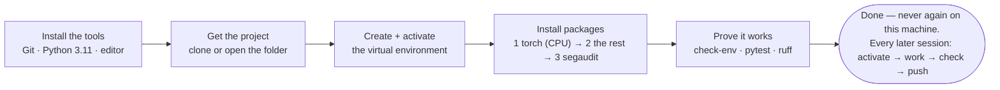

[← README](../README.md) · [All docs in order](../README.md#the-tutorial-in-order) · [Glossary](00-glossary.md)

# 01 · Setup on Windows — from a blank PC to a working workshop

**Prerequisites:** a PC running Windows 10 or 11 (64-bit), the ability to install programs (administrator rights, or an IT-approved software centre), an internet connection, and about 45 minutes. No prior knowledge of anything.
**Learning goal:** after this page you will have every tool SegAudit needs installed, understand what each one is for, and be able to open the project and prove that it works — the same proof the automated tests use.
**Checkpoint:** `segaudit check-env` ends with `All required packages import. You are ready.`, `pytest` ends with `29 passed`, and `ruff check .` prints `All checks passed!`.

Everything on this page uses **PowerShell**, the modern Windows command line. If you have used the older *Command Prompt* (`cmd.exe`), PowerShell looks similar but is not identical; use PowerShell as written.

---

## Contents

1. [Before you type anything: what you are about to install, and why](#1-before-you-type-anything)
2. [Open PowerShell](#2-open-powershell)
3. [Install Git](#3-install-git)
4. [Install Python 3.11](#4-install-python-311)
5. [Install Visual Studio Code](#5-install-visual-studio-code)
6. [Get the project](#6-get-the-project)
7. [Create the virtual environment](#7-create-the-virtual-environment)
8. [Install the packages — three commands, in order](#8-install-the-packages)
9. [Prove it works](#9-prove-it-works)
10. [The daily loop (everything after today)](#10-the-daily-loop)
11. [Troubleshooting](#11-troubleshooting)
12. [Checkpoint](#12-checkpoint)

---

## 1. Before you type anything

You will install five things. Here is what each one is, in one line, with the everyday version.

| Tool | What it is | Everyday version |
|---|---|---|
| **PowerShell** | A window where you type commands to the computer | Talking to the computer in sentences instead of clicks |
| **Git** | A save-game system for code: every meaningful change becomes a snapshot you can return to | A photo album of the project's history |
| **Python 3.11** | The programming language SegAudit is written in | The language the recipe is written in |
| **VS Code** | A text editor built for code, with a built-in terminal | A workbench with good lighting |
| **A virtual environment** | A private, sealed set of Python packages for this project only | A separate toolbox per project, so tools never go missing into another project |


The whole journey of this page, as one picture:



And the single most important idea on this page, drawn:


Nothing you install here will change how Windows behaves for anything else. Everything project-specific lives inside one folder that you can delete to undo it all.

**A convention for this page.** Lines starting with `PS>` are commands you type (don't type the `PS>`). Lines without it are what the computer prints back. `<you>` means "your own Windows username" — never type the angle brackets. Windows paths use backslashes (`C:\Users\<you>\projects`); SegAudit's own code never cares, because it uses Python's `pathlib`, which translates.

## 2. Open PowerShell

1. Press the Windows key, type `PowerShell`, press Enter. (Windows 11 may open *Terminal* with a PowerShell tab — same thing.)
2. A window opens with a line like `PS C:\Users\<you>>`. That is the *prompt*: the computer is waiting for you.

**One-time permission.** Windows blocks scripts by default, which would block activating the virtual environment later. Allow scripts you created yourself, for your own account only:

```
PS> Set-ExecutionPolicy -Scope CurrentUser RemoteSigned
```

Answer `Y` if asked. This is safe: it affects only your user and still blocks unsigned scripts downloaded from the internet.

**Why:** everything in SegAudit is run from the command line. Clicking is not reproducible; typed commands are, which is why every command in this project is written down.

## 3. Install Git

1. Open https://git-scm.com/download/win and download the **64-bit Git for Windows Setup**.
2. Run it. Accept every default — the defaults are correct for this project. (Pay attention to one screen: "Adjusting your PATH environment" — keep the recommended **Git from the command line and also from 3rd-party software**.)
3. Close PowerShell, open a new one (so it notices the new program), and verify:

```
PS> git --version
git version 2.47.1.windows.1
```

Any version 2.23 or newer is fine (SegAudit uses `git switch`, added in 2.23).

Tell Git who you are — this name and email are stamped on every snapshot you save:

```
PS> git config --global user.name "Your Name"
PS> git config --global user.email "you@example.com"
```

**Line endings, once.** Windows and macOS/Linux end text lines differently. Tell Git to store files the Unix way and leave your working copy as Windows likes it, so files do not show as "changed" on every machine:

```
PS> git config --global core.autocrlf true
```

**Why:** Git is how the project's history is recorded and how it reaches GitHub. Without it you could still run the code, but you could not save or share your work properly.

## 4. Install Python 3.11

1. Open https://www.python.org/downloads/windows/ and under **Python 3.11.x** download the **Windows installer (64-bit)**.
2. Run it. On the very first screen **tick "Add python.exe to PATH"** before clicking *Install Now*. This one checkbox is the cause of most Windows Python problems when missed.
3. Close PowerShell, open a new one, and verify:

```
PS> py -3.11 --version
Python 3.11.9
```

`py` is the *Python launcher* for Windows: `py -3.11` means "run version 3.11 specifically", which matters if other Pythons are installed. Any 3.11.x is fine.

**Why 3.11 and not the newest?** Every package SegAudit uses ships pre-built files ("wheels") for 3.11 on every platform we support. That is not yet true of the very latest Python. Boring is reliable.

**Do not** install Python from the Microsoft Store for this project; it sandboxes files in ways that confuse editable installs.

## 5. Install Visual Studio Code

1. Open https://code.visualstudio.com/, click **Download for Windows**, run the installer with defaults. Tick **"Add to PATH"** if offered.
2. Open it. Press `Ctrl + Shift + X` (Extensions), search **Python**, install the one published by Microsoft.

**Why:** you *can* edit files in any editor, but VS Code shows Python errors as you type, has a terminal built in, and understands Git — so the whole loop (edit, run, commit) happens in one window. Its built-in terminal defaults to PowerShell, so every command on this page works there unchanged.

## 6. Get the project

Two situations. Pick yours.

**A. You are a reader who wants to run SegAudit.** Clone it:

```
PS> mkdir $HOME\projects
PS> cd $HOME\projects
PS> git clone https://github.com/akannan2987/segaudit.git
Cloning into 'segaudit'...
PS> cd segaudit
```

**B. You are the author (or a contributor) with the repository already on disk.** Just go there:

```
PS> cd C:\Users\<you>\projects\segaudit
```

Either way, confirm you are in the right place:

```
PS> pwd
Path
----
C:\Users\<you>\projects\segaudit

PS> ls
    Directory: C:\Users\<you>\projects\segaudit
Mode   Name
----   ----
d----  configs
d----  data
d----  scripts
d----  src
d----  tests
-a---  CHANGELOG.md
-a---  CONTRIBUTING.md
-a---  LICENSE
-a---  pyproject.toml
-a---  README.md
-a---  requirements-dev.txt
-a---  requirements-torch-cpu.txt
-a---  requirements.txt
```

**Why `pwd`?** Every later command assumes you are standing in the project folder.

Open the folder in VS Code: `code .` — then `View → Terminal` gives you a PowerShell already in the right folder.

## 7. Create the virtual environment

```
PS> py -3.11 -m venv .venv
```

Nothing is printed on success. A folder `.venv` now exists containing a private copy of Python.

Activate it:

```
PS> .\.venv\Scripts\Activate.ps1
(.venv) PS>
```

The prompt now starts with `(.venv)`. That tag means: *for this window, `python` and `pip` refer to the private copy.* You must activate every time you open a new PowerShell — it is one line, and section 10 repeats it.

Confirm the switch took:

```
(.venv) PS> Get-Command python | Select-Object Source
Source
------
C:\Users\<you>\projects\segaudit\.venv\Scripts\python.exe
```

If it shows any other path, activation did not work — see troubleshooting T5.

**Why a virtual environment at all?** Two projects on the same PC may need different versions of the same package. Installing everything globally means the second project breaks the first. A venv is a sealed toolbox per project. It is also what makes "delete `.venv` and start again" a complete, safe reset.

## 8. Install the packages

Three commands, in this order. The order matters and the reason is explained after each.

**8a. Upgrade pip itself.** The venv starts with an old pip; new pip understands newer package files.

```
(.venv) PS> python -m pip install --upgrade pip
Successfully installed pip-26.2.1
```

**8b. PyTorch, from its CPU index, first.**

```
(.venv) PS> python -m pip install -r requirements-torch-cpu.txt
Looking in indexes: https://download.pytorch.org/whl/cpu
Ignoring torch: markers 'sys_platform == "darwin" and platform_machine == "x86_64"' don't match your environment
Collecting torch==2.13.0
  Downloading torch-2.13.0+cpu-cp311-cp311-win_amd64.whl (200 MB)
...
Successfully installed ... torch-2.13.0+cpu ...
```

The `Ignoring torch: markers ...` line is **not an error**: the file has two torch lines, one for Intel Macs and one for everything else; pip reports that it skipped the Intel-Mac one. Windows always gets the current version.

**Why a separate file and a separate index?** PyTorch's default download on some platforms is the multi-gigabyte graphics-card build. Its CPU index serves a build a tenth the size that is all SegAudit needs. Installing it *first* means the next command finds PyTorch already present.

**8c. Everything else.**

```
(.venv) PS> python -m pip install -r requirements.txt -r requirements-dev.txt
Ignoring numpy: markers ... don't match your environment      ← normal (the Intel-Mac line)
Ignoring monai: markers ... don't match your environment      ← normal
Collecting numpy==2.4.6 ...
Collecting pandas==3.0.5 ...
...
Successfully installed PyYAML-6.0.3 SimpleITK-2.5.6 ... monai-1.6.0 ... numpy-2.4.6 ... scikit-learn-1.9.0
```

This downloads about 250 MB and takes two to five minutes.

**8d. SegAudit itself, as an editable install.**

```
(.venv) PS> python -m pip install -e . --no-deps
Obtaining file:///C:/Users/<you>/projects/segaudit
  ...
Successfully installed segaudit-0.1.0
```

`-e` means *editable*: pip places a signpost pointing at `src\segaudit` instead of copying it, so any edit is live immediately. `--no-deps` means "do not re-resolve dependencies" — we just installed the exact pinned ones.

## 9. Prove it works

Three commands. Each is also what the automated tests on GitHub run on a Windows machine, so if these pass here, the project is in the same state as the published one.

**9a. The environment check.**

```
(.venv) PS> segaudit check-env
SegAudit environment check
===========================

python      3.11.9
executable  C:\Users\<you>\projects\segaudit\.venv\Scripts\python.exe
platform    Windows-11-10.0.26100-SP0
machine     AMD64
cpu_count   8

package       status   version     first needed
-------------------------------------------------------
numpy         ok       2.4.6       Phase 0
pandas        ok       3.0.5       Phase 0
pyarrow       ok       25.0.1      Phase 0
duckdb        ok       1.5.5       Phase 0
PyYAML        ok       6.0.3       Phase 0
nibabel       ok       5.4.2       Phase 1
SimpleITK     ok       2.5.6       Phase 1
pydicom       ok       3.0.2       Phase 1
scikit-image  ok       0.26.0      Phase 2
scikit-learn  ok       1.9.0       Phase 6
torch         ok       2.13.0+cpu  Phase 3
monai         ok       1.6.0       Phase 3
pytest        ok       9.1.1       Phase 0 (dev)
ruff          ok       0.16.5      Phase 0 (dev)

All required packages import. You are ready.
```

**9b. The tests.**

```
(.venv) PS> pytest
.............................                                    [100%]
29 passed in 12.40s
```

**9c. The linter.**

```
(.venv) PS> ruff check .
All checks passed!
```

**9d. Three more commands worth seeing once:**

```
(.venv) PS> segaudit --version
segaudit 0.1.0

(.venv) PS> segaudit config show -c configs\quick.yaml
{
  "source_file": "C:\\Users\\<you>\\projects\\segaudit\\configs\\quick.yaml",
  "root": "C:\\Users\\<you>\\projects\\segaudit",
  "project_name": "segaudit",
  "run_label": "quick",
  "seed": 7,
  ...
}

(.venv) PS> segaudit init -c configs\quick.yaml
Created:
  C:\Users\<you>\projects\segaudit\outputs\quick
  C:\Users\<you>\projects\segaudit\models\quick
```

Notice the config file says `outputs/quick` with a forward slash and `config show` prints `outputs\quick` with backslashes. That translation happens in `src\segaudit\config.py` and is why the same settings file works on macOS and Linux unchanged. (Either slash works when *you* type a path in PowerShell.)

## 10. The daily loop

Setup is done once. Every later session is this, and nothing more:

```
PS> cd $HOME\projects\segaudit
PS> .\.venv\Scripts\Activate.ps1
(.venv) PS> git switch develop
(.venv) PS> git pull --ff-only origin develop
# ... edit code or docs ...
(.venv) PS> ruff check .
(.venv) PS> pytest
(.venv) PS> python scripts\check_public_safe.py        # must print SAFE TO PUSH
# ... then the push sequence in docs\03-git-workflow.md ...
```

When you are finished, `deactivate` leaves the venv (or close the window).

## 11. Troubleshooting

Each entry: what you see → what it means → what to do.

**T1. `Activate.ps1 cannot be loaded because running scripts is disabled on this system`.**
*Means:* the one-time permission in section 2 was skipped. *Do:* `Set-ExecutionPolicy -Scope CurrentUser RemoteSigned`, answer `Y`, retry.

**T2. `py : The term 'py' is not recognized`.**
*Means:* Python is not installed, or the installer was run without "Add python.exe to PATH". *Do:* re-run the installer, choose *Modify*, and ensure the launcher and PATH options are ticked; then open a new PowerShell.

**T3. `python` opens the Microsoft Store.**
*Means:* Windows has a placeholder `python` that redirects to the Store when no real Python is on PATH. *Do:* activate the venv (step 7) — inside it, `python` is the venv's copy. To silence the placeholder permanently: Settings → Apps → Advanced app settings → App execution aliases → turn off both *python* entries.

**T4. `No matching distribution found for torch`.**
*Means:* the PyTorch CPU index was unreachable (corporate proxy or firewall). *Do:* check that https://download.pytorch.org/whl/cpu opens in a browser. Behind a proxy, set it for pip: `$env:HTTPS_PROXY="http://proxy.example.com:8080"` then retry. If the index is blocked entirely, `python -m pip install torch==2.13.0` from PyPI works on Windows too (the PyPI Windows build is already CPU-only).

**T5. Prompt does not show `(.venv)` after activating.**
*Means:* you are not in the project folder, or the venv was not created. *Do:* `pwd` to check; `ls -Force` should list `.venv`; if not, repeat step 7.

**T6. `pip: The term 'pip' is not recognized`.**
*Means:* the venv is inactive. *Do:* always use `python -m pip ...` with `(.venv)` showing, exactly as written on this page.

**T7. `Ignoring torch: markers ... don't match your environment`.**
*Means:* nothing is wrong. pip skipped the requirements line meant for Intel Macs. Carry on.

**T8. `pytest` or `ruff` or `segaudit` "is not recognized".**
*Means:* the venv is inactive, or step 8c/8d was skipped. *Do:* activate, then re-run steps 8c and 8d.

**T9. Long path errors (`[WinError 206]` or "filename too long") during install.**
*Means:* Windows' 260-character path limit. *Do:* enable long paths once: open PowerShell **as Administrator** and run `New-ItemProperty -Path "HKLM:\SYSTEM\CurrentControlSet\Control\FileSystem" -Name "LongPathsEnabled" -Value 1 -PropertyType DWORD -Force`, then reboot. Or keep the project close to the drive root (e.g. `C:\projects\segaudit`).

**T10. Files show as modified in Git immediately after cloning.**
*Means:* line-ending mismatch. *Do:* `git config --global core.autocrlf true` (section 3), then `git checkout -- .` to refresh the working copy.

**T11. Antivirus makes `pytest` or installs painfully slow.**
*Means:* real-time scanning of thousands of small Python files. *Do:* ask IT to exclude the `.venv` folder from scanning, or accept the slowness — correctness is unaffected.

**T12. Everything is broken and you want to start over.**
*Do:* `deactivate`, then `Remove-Item -Recurse -Force .venv`, then repeat from step 7. The venv is the only thing that changes on your machine; deleting it is a complete reset. Your code and Git history are untouched.

## 12. Checkpoint

You are done with setup when, with `(.venv)` showing:

- `segaudit check-env` ends with **`All required packages import. You are ready.`**
- `pytest` ends with **`29 passed`**
- `ruff check .` prints **`All checks passed!`**

You will never repeat this page on this PC. From here, the daily loop in section 10 is all you need.

Next: [`02-architecture.md`](02-architecture.md) — how the pieces fit together.
