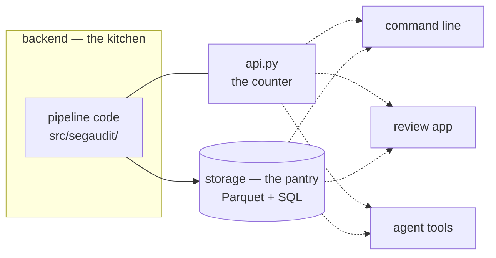
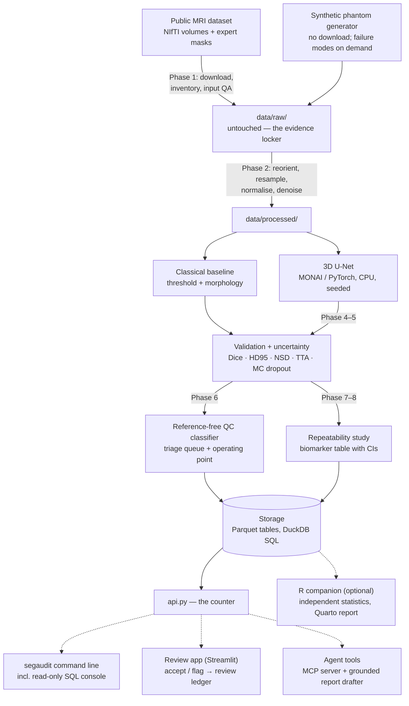
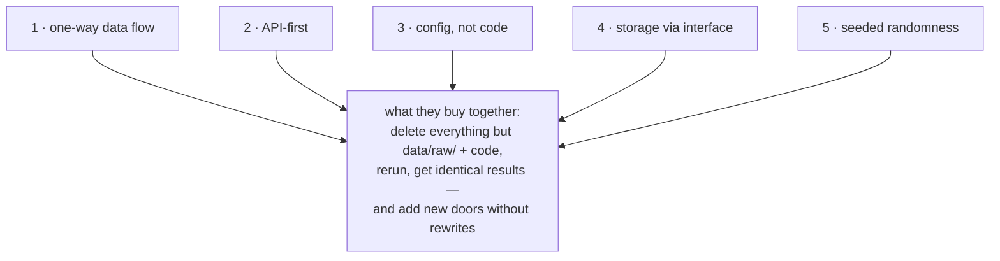

[← README](../README.md) · [All docs in order](../README.md#the-tutorial-in-order) · [Glossary](00-glossary.md)

# 02 · Architecture, explained from scratch

**Prerequisites:** none to read; the setup guide for your OS to run the commands in section 8.
**Learning goal:** after this page you can explain what every part of SegAudit does, why it exists, how data flows from a downloaded scan to a reviewed decision, and why the code is arranged the way it is — even if you have never built software before.
**Checkpoint:** you can explain, in your own words, the difference between a *backend*, a *frontend* and *storage*; name the boxes in the diagram; and state the five design rules and what each one buys.

---

## Contents

1. [What SegAudit is, in one honest sentence](#1-what-segaudit-is-in-one-honest-sentence)
2. [The three words you must know first](#2-the-three-words-you-must-know-first)
3. [The diagram](#3-the-diagram)
4. [What each box does, and why it exists](#4-what-each-box-does-and-why-it-exists)
5. [The five design rules](#5-the-five-design-rules)
6. [The code as it stands today](#6-the-code-as-it-stands-today)
7. [How future doors plug into the same vault](#7-how-future-doors-plug-into-the-same-vault)
8. [See the architecture with your own hands](#8-see-the-architecture-with-your-own-hands)
9. [Where each phase lives](#9-where-each-phase-lives)
10. [Checkpoint](#10-checkpoint)

---

## 1. What SegAudit is, in one honest sentence

SegAudit takes a 3D brain scan, outlines a small structure on it automatically, and then — the part that matters — works out *how much to trust that outline* without being told the right answer, so that a human only has to check the outlines most likely to be wrong.

That's it. Everything below is *how*, one plain step at a time.

If you know nothing about medicine or software, here is the everyday version:

> A factory has a machine that stamps out parts. Nearly all are fine; a few are warped. Checking every part by hand would be as slow as making them by hand — but shipping warped parts is worse. SegAudit is the inspector who, without a reference part in hand, looks at each one and says: "these fourteen look suspicious, pull them; the rest are fine." Then it keeps a ledger of what was pulled and why.

## 2. The three words you must know first

Almost every confusing software conversation becomes clear once you know these three words. We use a restaurant as the running analogy, because it maps perfectly.

**Backend — "the kitchen."** Everything that happens behind the scenes: preparing, cooking, plating. Customers never enter the kitchen. In software, the backend is the code that does the real work — reading scans, training the model, computing scores. In SegAudit, the backend is the whole pipeline in `src/segaudit/`.

**Frontend — "the dining room."** The part a person sits in and interacts with: the menu, the table, the plate. In software, it is the screen someone looks at and clicks. In SegAudit, the frontend is the **review app** (Phase 9): a reviewer scrolls the triage queue, looks at slices, and clicks accept or flag.

**Storage — "the pantry."** Where finished things are put so they can be found again quickly and precisely. In SegAudit, storage is a folder of **Parquet** tables (a compact, typed table format) that can be questioned in **SQL** through **DuckDB** — think of SQL as a very polite, very literal way of saying "bring me the ten cases with the lowest quality score."

The three words, and the counter between them, as one picture:



One more, because it appears constantly:

**API — "the counter between kitchen and dining room."** The fixed set of things you can ask the kitchen for. In SegAudit it is one Python file, `src/segaudit/api.py`. The command line, the review app and (later) the agent tools all order through that counter. None of them cook.

## 3. The diagram

GitHub renders this automatically. Data flows top to bottom; dashed boxes are the doors people and programs use.



## 4. What each box does, and why it exists

**Public MRI dataset (the source).** 394 brain scans with expert-drawn outlines of the hippocampus, published for research under a licence that lets anyone use them. Why this one: the scans are tiny, so everything runs on a laptop; and the target is genuinely hard, so real failures exist to detect. *A practice exam with the answer key attached.*

**Synthetic phantom generator.** A program that draws hippocampus-like blobs into a noisy volume and writes the matching mask. Why it exists: the tests and the first walkthrough must run with no download, and we need failure modes *on demand* — "make this case with half the structure missing" — to prove the quality-control layer catches them. Always labelled synthetic. *A crash-test dummy.*

**`data/raw/` (the evidence locker).** Exactly what was downloaded or generated. Never edited by code. Why: if a number is ever questioned, we must be able to walk it back to an untouched source. This is **provenance**, and in regulated analytics it is non-negotiable. *The sealed evidence bag.*

**`data/processed/`.** The same scans after preprocessing: reoriented to one axis convention, resampled to one voxel size, brightness normalised, optionally denoised. Why a separate folder: preprocessing is a set of decisions, and decisions must be visible and reversible. Delete this folder, rerun, and it comes back identical. *The washed and chopped ingredients, kept apart from the raw ones.*

**Classical baseline.** Thresholding plus shape clean-up — the simplest segmentation that could work. Why: a deep model that cannot beat this has not earned its complexity, and the baseline's failures are easy to understand, which helps interpret the model's. *Timing yourself on foot before judging the bicycle.*

**3D U-Net.** The neural network that draws the outline. Trained on CPU with a fixed seed, on a patient-level split, so the score on unseen cases is honest. Why MONAI: it keeps scan and mask in step through every transform, which is exactly where hand-written code goes silently wrong.

**Validation + uncertainty.** Two jobs in one box. *Validation* scores the model against the expert masks it has never seen, with overlap (Dice) *and* surface metrics (HD95, NSD), per case — not just an average. *Uncertainty* asks the model the same question many times (test-time augmentation, Monte Carlo dropout) and measures how much it disagrees with itself. Why together: the uncertainty numbers are the raw material the next box learns from.

**Reference-free QC classifier.** A small, interpretable model that learns, from uncertainty and shape features alone, to predict "this outline is probably wrong" — *without seeing the expert mask*. Calibrated, then turned into a triage queue with a chosen operating point: "review these N; auto-accept the rest, with this residual risk." Why this is the heart of the project: in real use nobody has drawn the answer, so this is the only kind of QC that can exist.

**Repeatability study + biomarker table.** Re-acquires each scan in simulation (noise, resolution, head rotation with re-registration), re-measures the volume, and reports the smallest change distinguishable from noise — the *minimum detectable difference*. Produces the final biomarker table with confidence intervals and a QC flag per case. Why: a measurement without a repeatability figure cannot support a decision.

**Storage.** Every table the pipeline produces — metrics, uncertainty, QC scores, biomarkers, review decisions, run records — as Parquet files behind one interface, queryable in SQL. Why one interface: so the pipeline never knows *where* tables live, and swapping in a database server later is one new class, not a rewrite.

**`api.py` — the counter.** Every capability as a plain Python function. Why one place: if logic lived in the command line, the app would copy it; if in the app, a service could not reuse it. One vault, many doors.

**The doors.** *Command line* — for you, today, including a read-only SQL console. *Review app* — for a reviewer, Phase 9. *Agent tools* — for a program, Phase 10: an MCP server that lets an agent run an audit, query the ledger and draft a report grounded in computed numbers. *R companion* — optional, Phases 7 and 8: independent implementations of the statistics reading the very same Parquet tables, so two languages checking each other's arithmetic becomes a validation step.

## 5. The five design rules

Each rule is a sentence, an analogy, and what it buys.



**1. Data flows one way, and no step edits its own input.** Top to bottom in the diagram; `raw/` feeds `processed/`, never the reverse. *A recipe where you never put chopped onions back in the onion bag.* **Buys:** delete everything except `data/raw/` and the code, rerun, get identical results. That property — reproducibility — is the baseline expectation in regulated analytics.

**2. Every capability is a function in `api.py`; doors contain no logic.** *One kitchen, many counters.* **Buys:** a future web front end, cloud service or agent calls the same functions the command line calls today, with no rewrite.

**3. No path, seed, threshold or size lives in code — only in `configs/*.yaml`.** *The recipe card, not scribbles on the pan.* **Buys:** the same pipeline runs on a laptop, a server or a cloud machine by swapping one file; and every run records which file it used.

**4. Tables are written and read only through the `Storage` interface.** *Hand paperwork to the filing clerk; never open the cabinet yourself.* **Buys:** Parquet today, a database server tomorrow, without touching the pipeline. Also: read-only SQL for humans and agents, enforced in one place.

**5. Anything random takes its seed from the config; same config + same code = same tables.** *Shuffling the deck the same way twice.* **Buys:** two people on two machines get the same numbers (within a dependency lane), so a disagreement is always a real bug, never "randomness".

## 6. The code as it stands today

Phase 0 built the foundations only. Here is every file in `src/segaudit/` and what it is for; open each alongside this page.

| File | Job | Read it for |
|---|---|---|
| `__init__.py` | Holds the version string and a one-paragraph statement of purpose | How a package announces itself |
| `config.py` | Reads a YAML file, checks the essentials are present, turns relative paths into absolute ones for your operating system | Why paths in the YAML use forward slashes and still work on Windows |
| `storage.py` | The `Storage` interface and its one implementation, `LocalParquetStorage`, plus `open_storage(cfg)` | How an *interface* lets the backend change without the pipeline noticing; how `query()` makes SQL read-only |
| `envcheck.py` | Imports every dependency and reports versions and which phase needs it | Why "missing" is only alarming from that phase on |
| `api.py` | Four functions today: `version`, `load`, `storage_for`, `initialise_workspace` | Rule 2 made concrete — later phases add functions here and nowhere else |
| `cli.py` | `segaudit info / check-env / config show / init` — each a few lines calling `api` | What "a thin door" looks like in practice |

And the files around the code:

| File | Job |
|---|---|
| `configs/default.yaml`, `configs/quick.yaml` | The real run and the two-minute synthetic run. Later phases add their sections here |
| `tests/` | 29 checks that the three modules keep their promises; run on a temporary folder so real data is never touched |
| `scripts/check_public_safe.py` | Refuses the push if a secret, a data file or a personal path would be published |
| `.github/workflows/ci.yml` | Runs lint, environment check, tests and the safety script on Windows, macOS and Linux for every push |

## 7. How future doors plug into the same vault

Nothing below exists yet; this is the shape they will take, so you can see why today's rules matter.

- **A web front end** (evaluated in `06-product-and-technology-roadmap.md`) would call `api.audit_case(...)` over a thin web layer. It would not import `storage.py` directly; it would ask the API.
- **A hosted service** would run the same `api` functions on a server with a different `Storage` class (a database) selected in the config — rule 3 and rule 4 together.
- **The MCP server** (Phase 10) is literally a list of `api` functions with input/output schemas attached. Nothing to invent.
- **The R companion** never calls Python; it reads the Parquet files that rule 4 guarantees exist in a known place, with known column types.

## 8. See the architecture with your own hands

Ten minutes, with the venv active, in the project folder. This exercises rules 3 and 4 before any real data exists.

**8a. Watch the config become absolute paths for your machine.**

```
$ segaudit config show -c configs/quick.yaml
```

Compare the `paths` block with `configs/quick.yaml`: `outputs/quick` became a full path in your operating system's style. That is `config.py` doing rule 3.

**8b. Put a table into storage and question it with SQL — including a multi-line query.**

Start Python:

```
$ python
```

Type (or paste) the following; lines starting with `>>>` are the prompt:

```python
>>> import pandas as pd
>>> from segaudit import api
>>> cfg = api.load("configs/quick.yaml")
>>> store = api.storage_for(cfg)
>>> store.write_table("demo_cases", pd.DataFrame({
...     "case_id": ["c01", "c02", "c03", "c04"],
...     "dice":    [0.91, 0.42, 0.88, 0.79],
...     "flagged": [False, True, False, True],
... }))
>>> store.list_tables()
['demo_cases']
>>> store.query("""
...     SELECT case_id, dice
...     FROM demo_cases
...     WHERE flagged
...     ORDER BY dice ASC
... """)
  case_id  dice
0     c02  0.42
1     c04  0.79
>>> store.query("DELETE FROM demo_cases")
Traceback (most recent call last):
  ...
duckdb.BinderException: Binder Error: Can only delete from base table
>>> exit()
```

What you just saw: a table written through the interface (rule 4), found again by name, questioned with a multi-line SQL statement, and protected from being modified by SQL. The file itself is `outputs/quick/tables/demo_cases.parquet`; you can delete it, and nothing else in the project knows or cares.

**8c. Clean up.**

```
$ rm outputs/quick/tables/demo_cases.parquet        # Windows: del outputs\quick\tables\demo_cases.parquet
```

## 9. Where each phase lives

| Phase | Guide | Layer of the diagram |
|---|---|---|
| 0 | `04-phase-tutorials/phase-00-skeleton.md` | Foundations: api, config, storage, CLI, tests, CI |
| 1 | `phase-01-data.md` | Source → `data/raw/`, phantom, input QA, SQL console |
| 2 | `phase-02-preprocessing-baseline.md` | `data/processed/`, classical baseline |
| 3 | `phase-03-model.md` | 3D U-Net |
| 4 | `phase-04-validation.md` | Validation |
| 5 | `phase-05-uncertainty.md` | Uncertainty |
| 6 | `phase-06-quality-control.md` | QC classifier, triage |
| 7 | `phase-07-repeatability.md` (+ R twin) | Repeatability, minimum detectable difference |
| 8 | `phase-08-biomarkers.md` (+ R twin) | Biomarker table, stratification |
| 9 | `phase-09-review-app.md` | Review app door |
| 10 | `phase-10-agent-tools.md` | Agent tools door |
| 11 | `phase-11-container-release.md` | Container, HPC/GPU paths, 1.0 |

## 10. Checkpoint

You can say, without looking: the kitchen is `src/segaudit/`, the counter is `api.py`, the pantry is Parquet-plus-DuckDB behind `Storage`, the doors are the command line, the review app, the agent tools and the R companion; data flows one way; every setting is in YAML; every table goes through the interface; every random thing is seeded. If any of those is fuzzy, reread the matching part of section 4 or 5 — then move on to [`03-git-workflow.md`](03-git-workflow.md).
