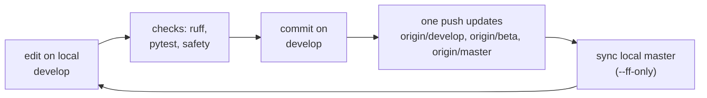

[← README](../README.md) · [All docs in order](../README.md#the-tutorial-in-order) · [Glossary](00-glossary.md)

# 03 · Git workflow — the branch model and the push sequence, explained

**Prerequisites:** the setup guide for your OS (Git installed, project cloned, `(.venv)` active).
**Learning goal:** after this page you understand what Git is for, why this repository has three branches, exactly what each line of the per-phase push sequence does, and what to do in every common "it went wrong" situation.
**Checkpoint:** `git branch -vv` shows `develop` and `master` at the same commit, both tracking their `origin/` twin, and you can explain every line of the push sequence in section 4 in your own words.

---

## Contents

1. [What Git is, and the four words you need](#1-what-git-is-and-the-four-words-you-need)
2. [The three-branch model](#2-the-three-branch-model)
3. [Before every commit: the three checks](#3-before-every-commit-the-three-checks)
4. [The push sequence, line by line](#4-the-push-sequence-line-by-line)
5. [Commit messages](#5-commit-messages)
6. [Releases and tags](#6-releases-and-tags)
7. [Reading the CI page](#7-reading-the-ci-page)
8. [When it goes wrong](#8-when-it-goes-wrong)
9. [Platform notes](#9-platform-notes)
10. [Checkpoint](#10-checkpoint)

---

## 1. What Git is, and the four words you need

**Git** is a save-game system for a folder. Every time you decide the folder is in a state worth keeping, you take a snapshot with a message. You can go back to any snapshot, compare two, or see who changed what and when. The folder plus its snapshots is a **repository**.

Four words cover almost everything:

- **Commit** — one snapshot, with a message. *A save point.*
- **Branch** — a named line of commits. You can have several lines that share a past and differ in their present. *Parallel drafts of the same document.*
- **Remote (`origin`)** — the copy of the repository on GitHub. Your laptop has one copy; GitHub has another; `origin` is your laptop's name for GitHub's. *The shared drive, as seen from your desk.*
- **Push / pull** — send your new commits to `origin` / fetch its new commits to you.

And one more that the push sequence relies on:

- **Fast-forward** — updating a branch by simply moving its label to a newer commit that already contains it. No merging, no new commit. `--ff-only` means "do this or do nothing, never improvise". *Turning to a later page in the same book — never gluing in pages from another book.*

## 2. The three-branch model

SegAudit has three long-lived branches, all on GitHub, all kept at the same commit between releases:

```
master   ── stable, official. What a stranger should clone. Never edited directly.
beta     ── a preview of the next release. Never edited directly.
develop  ── where all work happens. The only branch you commit on.
```

The rhythm, every time:



**Why three branches when one person is working?** Because the habit costs nothing, and the moment a second person appears — or a release has to be patched while new work is half-done — the structure is already there: `master` stays clean, `beta` can hold a release preview, `develop` absorbs the mess. Also: `master` is what the README badge and any reader see, so it should never contain a half-finished phase.

**Why `master` and not `main`?** Convention of this author's repositories; the name is arbitrary and the model is what matters.

**You do not need a local `beta`.** You never work on it. The push line in section 4 updates `origin/beta` directly from `develop`. (`git branch -vv` showing only `develop` and `master` locally is the expected state.)

## 3. Before every commit: the three checks

In this order, in the project folder, with `(.venv)` showing. These are the same checks CI runs, so passing them here means the push will go green.

```bash
ruff check .                              # 1. lint: "All checks passed!"
pytest                                    # 2. tests: "N passed"
python scripts/check_public_safe.py       # 3. safety: "SAFE TO PUSH"
```

The third one inspects everything Git *tracks* and refuses the all-clear if a secret, a data or model file, or a hard-coded personal path would be published. `.gitignore` is the lock on the door; this script is the guard checking the bag on the way out. It is plain Python, so it runs identically on Windows, macOS and Linux.

A useful fourth look, before staging, is simply:

```bash
git status
```

It lists what changed. If you see a file you did not expect — a `.venv/`, a `.parquet`, a scan — stop and read section 8, entry E4.

## 4. The push sequence, line by line

Every phase, and every meaningful change, ends with exactly this block. Copy it as-is; only the message changes.

```bash
git switch develop
git add -A
git commit -m "<phase-specific message>"
git push origin develop develop:beta develop:master
# add --tags only when a release tag was created in this phase
git switch master
git pull --ff-only origin master
git switch develop
```

What each line does, and what you should see:

**`git switch develop`** — make sure you are on the working branch. If you already are, Git says `Already on 'develop'`. If you had uncommitted changes, they come with you (Git lists them as `M`), which is fine.

**`git add -A`** — *stage* every change: new files, edited files, deleted files. Staging means "include this in the next snapshot". Prints nothing on success.

**`git commit -m "..."`** — take the snapshot. Prints a summary like `[develop 6c0e42d] phase 0: ... 6 files changed, 1515 insertions(+)`. The seven-character code (`6c0e42d`) is the commit's ID.

**`git push origin develop develop:beta develop:master`** — one command, three updates: local `develop` → remote `develop`; local `develop` → remote `beta`; local `develop` → remote `master`. The `a:b` form means "push my `a` to their `b`". Because `beta` and `master` only ever move this way, the updates are always fast-forwards. You see three lines like `8a335bc..6c0e42d  develop -> master`.

**`# add --tags only when a release tag was created`** — a reminder, not a command. Tags (section 6) are not pushed unless you ask.

**`git switch master`** — your local `master` is now *behind* the remote one you just updated. Git says exactly that: `Your branch is behind 'origin/master' by 1 commit, and can be fast-forwarded.`

**`git pull --ff-only origin master`** — bring local `master` up to date, but only by fast-forwarding. Prints `Fast-forward` and the file list. If it prints anything else, stop — section 8, entry E1.

**`git switch develop`** — back to work. `Your branch is up to date with 'origin/develop'.`

Then check GitHub → Actions: three green runs (one per branch, each on three operating systems). Section 7 explains the page.

## 5. Commit messages

The message is the one line a future reader (often you) sees when scanning history. Rules:

- Imperative mood: "add", "fix", "document" — as if completing "this commit will…".
- Under 72 characters on the first line.
- Prefix with the phase while one is in progress: `phase 1: ...`. Use `docs:` for documentation-only, `fix:` for corrections, `release:` for version bumps.

Examples from this repository:

```
phase 0: repository skeleton, configuration, storage layer, CLI, tests, CI
phase 0: glossary, setup guides for Windows, macOS and RHEL 8, envcheck metadata versions
docs: architecture, git workflow, phase 0 tutorial
```

## 6. Releases and tags

A **tag** is a permanent name for one commit: `v0.1.0`. A release is a tag plus a changelog entry. Cut one when a phase is complete and its tutorial is written. The full procedure is in `CONTRIBUTING.md`, section 5; the short version:

1. On `develop`, in `CHANGELOG.md`, rename `[Unreleased]` to `[0.1.0] — 2026-09-01` and add a fresh empty `[Unreleased]` above it.
2. Set the version in `pyproject.toml` and `src/segaudit/__init__.py` — the only two places it lives.
3. Run the three checks.
4. `git commit -m "release: v0.1.0"`.
5. `git tag -a v0.1.0 -m "SegAudit v0.1.0 — foundation release"`.
6. The push sequence, with `--tags` added to the push line:
   `git push origin develop develop:beta develop:master --tags`
7. On GitHub → Releases → *Draft a new release* → choose the tag → paste the changelog section → Publish.

Version meaning: `0.Y.0` while phases are landing (one minor per phase); `1.0.0` when the full pipeline runs end to end; patch versions for fixes and documentation.

## 7. Reading the CI page

GitHub → **Actions** tab. Each push produces one row per branch, named after the commit message, with the branch in a blue pill. A green tick means every job on every operating system passed. Click a row to see the three jobs (`ubuntu-latest`, `windows-latest`, `macos-latest`); click a job to see each step's output — the same commands as section 3, plus the install.

Rows titled *Dependency Graph … by dependabot* are GitHub reading the requirements files. Not something you triggered; harmless.

## 8. When it goes wrong

**E1. `git pull --ff-only` says `fatal: Not possible to fast-forward, aborting.`**
*Means:* local `master` has a commit that remote `master` does not — someone (probably you, by accident) committed on `master`. *Do:* `git log master --oneline -3` to see what it is. If it is work you want, move it: `git switch develop && git cherry-pick <id>`, then `git switch master && git reset --hard origin/master`. If it is nothing, just `git reset --hard origin/master`. Then continue the sequence.

**E2. `git push` is rejected: `! [rejected] ... (fetch first)` or `non-fast-forward`.**
*Means:* `origin/develop` has commits you do not have — you pushed from another machine, or a pull request was merged. *Do:* `git pull --ff-only origin develop`; if that also refuses, `git pull --rebase origin develop` (replays your commits on top of theirs), resolve any conflict (E6), then push again.

**E3. You committed on the wrong branch (e.g. on `master`).**
*Do:* note the commit ID from `git log --oneline -1`, then `git switch develop`, `git cherry-pick <id>`, `git switch master`, `git reset --hard origin/master`, `git switch develop`. The commit now lives on `develop` only.

**E4. `git status` shows a file that must not be committed (`.venv/`, a `.parquet`, a scan, a `.env`).**
*Means:* `.gitignore` does not cover it, or it was tracked before the rule existed. *Do (not yet committed):* add a matching line to `.gitignore`, then `git status` again — it disappears. *Do (already committed but not pushed):* `git rm -r --cached <path>` (stops tracking without deleting the file), add the `.gitignore` line, `git commit --amend --no-edit`. *Do (already pushed):* same, then a new commit and the push sequence; the file remains in history, so if it was a secret, rotate the secret — history is public.

**E5. You want to undo the last commit but keep the changes.**
*Do:* `git reset --soft HEAD~1`. The files are back to "staged"; fix and commit again. Only do this if the commit was *not* pushed yet; if it was, make a new commit instead.

**E6. A merge conflict.**
*Means:* two changes touched the same lines. Git writes both versions into the file between `<<<<<<<`, `=======`, `>>>>>>>` markers. *Do:* open the file, keep the right lines, delete the markers, `git add <file>`, then `git rebase --continue` (or `git commit` if merging). VS Code shows conflict blocks with clickable "accept" buttons.

**E7. CI is red on one operating system only.**
*Means:* a platform difference — a path with a backslash, a line-ending assumption, a package without a wheel. *Do:* open the failed job, read the first red step, reproduce with the same command locally if you can. Windows-only failures are usually paths; fix with `pathlib`, never string concatenation.

**E8. `git switch` says `error: Your local changes would be overwritten`.**
*Means:* uncommitted edits clash with the branch you are switching to. *Do:* commit them on the current branch, or `git stash` (park them), switch, then `git stash pop` (unpark).

**E9. The safety script prints `NOT SAFE`.**
*Do:* read each line — it names the file and the reason. Personal paths in docs: replace with `<you>`. Data file tracked: E4. Secret: remove it, never commit secrets, put them in `.env` (ignored) if a later phase needs one.

**E10. `Ignoring ... markers don't match` during install, after a pull.**
Not Git at all — see the setup guide's troubleshooting; it is normal.

## 9. Platform notes

- **Line endings.** Windows uses `\r\n`, macOS/Linux `\n`. The Windows guide sets `core.autocrlf true` once so files do not show as modified on other machines. If a whole file shows as changed with no visible edit, that is the cause.
- **Case-insensitive file systems** (default on macOS and Windows) will happily let you rename `Readme.md` to `README.md` without Git noticing. Use `git mv` for renames.
- **Paths in docs.** Write `<you>` for usernames; the safety script treats any `<placeholder>` line as documentation and lets it through.
- The commands on this page are identical in bash, zsh and PowerShell.

## 10. Checkpoint

```
$ git branch -vv
* develop  6c0e42d [origin/develop] ...
  master   6c0e42d [origin/master]  ...
```

Same commit on both, both tracking `origin`. And you can say what `develop:beta` in the push line means without looking.

Next: [`04-phase-tutorials/phase-00-skeleton.md`](04-phase-tutorials/phase-00-skeleton.md) — what Phase 0 built and how to prove it.
