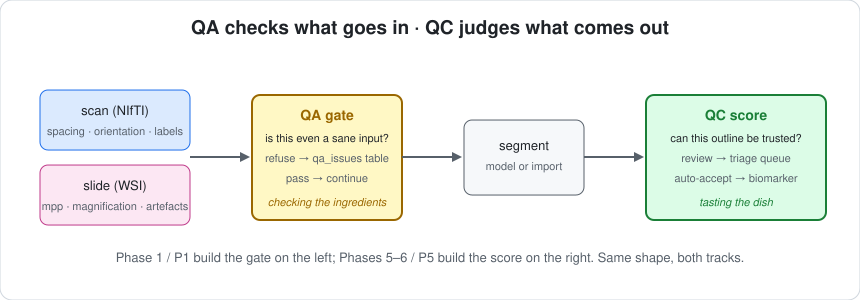
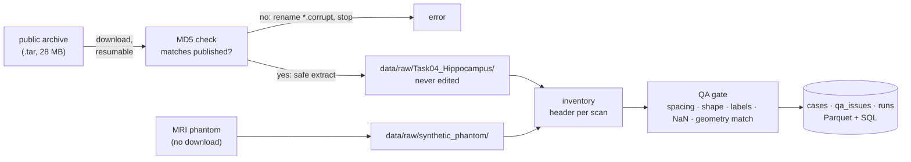

[← README](../../README.md) · [Handbook](../HANDBOOK.md) · [Glossary](../00-glossary.md) · [← Phase 0P](phase-0p-two-track-foundation.md) · [Architecture](../02-architecture.md)

# Phase 1 · Data, Track R — real scans in, with their geometry, through a gate

**Prerequisites:** the setup guide for your OS completed, `phase-00-skeleton.md` and `phase-0p-two-track-foundation.md` done, and about 30 MB of disk plus an internet connection for section 4 (everything else runs without one).
**Learning goal:** after this phase you understand what a NIfTI file carries beyond its pixels and why that decides every volume measurement; how a public dataset is fetched *verifiably* and stored as evidence; what input quality assurance is and how it differs from quality control; how the synthetic MRI phantom manufactures failures on purpose; how a DICOM series from a scanner becomes one volume; and how to question any of it with SQL — by running all of it.
**Checkpoint:** the public hippocampus dataset is downloaded with a matching checksum and inventoried into 260 cases with zero QA errors; the phantom inventories without errors; a deliberately broken mask is caught by the QA gate; a demo DICOM series converts with its spacing intact; the four query files run; and the git block at the end has been pushed with three green CI runs.
**Time:** about two and a half hours. Natural stopping points after sections 5 and 7.

---

## Contents

1. [Why this phase exists](#1-why-this-phase-exists)
2. [What was built — the map](#2-what-was-built--the-map)
3. [Walk 1: what a scan file really contains](#3-walk-1-what-a-scan-file-really-contains)
4. [Walk 2: download the public dataset — verifiably](#4-walk-2-download-the-public-dataset--verifiably)
5. [Walk 3: inventory and the QA gate](#5-walk-3-inventory-and-the-qa-gate)
6. [Walk 4: the phantom, and breaking things on purpose](#6-walk-4-the-phantom-and-breaking-things-on-purpose)
7. [Walk 5: the SQL console and the queries folder](#7-walk-5-the-sql-console-and-the-queries-folder)
8. [Walk 6: from a scanner — DICOM to NIfTI](#8-walk-6-from-a-scanner--dicom-to-nifti)
9. [Walk 7: the runs ledger](#9-walk-7-the-runs-ledger)
10. [What could go wrong](#10-what-could-go-wrong)
11. [What you learned](#11-what-you-learned)
12. [Commit and push](#12-commit-and-push)

---

## 1. Why this phase exists

Every later number in Track R — Dice scores, uncertainty, volumes in millilitres, the minimum detectable difference — rests on three things this phase gets right once:

- **Geometry.** A scan's voxel size and orientation live in its header. Read them wrong and a hippocampus of 3 ml becomes 24 ml (a 2 mm voxel counted as 1 mm) or a mirror image of itself. So there is exactly one reader, and it never hands out a volume without its affine.
- **Provenance.** The public dataset is fetched once, checked byte for byte against a published checksum, and stored untouched in `data/raw/`. If a result is ever questioned, it can be walked back to a file whose fingerprint matches the maintainers'.
- **Gating.** Before any model sees a scan, a set of plain checks refuses inputs that cannot be right — a mask with a label the task does not define, an image full of NaNs — and records every finding in a table. Silent garbage in, confident garbage out, is the failure this prevents.



*Everyday version:* receiving a delivery. Check the seal (checksum), unpack it into the store room (extract, never edit), then walk the shelves with a clipboard writing down what is there and what looks damaged (inventory + QA). Only then does cooking start.



## 2. What was built — the map

```
src/segaudit/radiology/
├── io_nifti.py          ~ Volume (frozen), load_image/load_mask/save_volume, read_header, volume_ml
├── phantom_volume.py    + synthetic T1-like volumes: two-label structure, 5 mask failure modes, 4 artefacts
├── qa.py                + input QA gates; limits from the `qa` config section
├── dataset.py           + checksummed, resumable, idempotent download; safe extract; inventory
└── dicom.py             + DICOM series → NIfTI; demo series writer
src/segaudit/api.py      ~ download_dataset, build_inventory, query, convert_dicom_series, write_demo_dicom_series, record_run
src/segaudit/cli.py      ~ data download | inventory | convert-dicom | demo-dicom; sql
queries/                 + README + four documented statements
configs/default.yaml     ~ data.msd (url, md5, archive, dirname) and qa sections
```

## 3. Walk 1: what a scan file really contains

A NIfTI file (`.nii.gz`) holds two things: a 3D block of numbers, and a **header** with a 4×4 matrix called the **affine**. The affine says how big each voxel is in millimetres, which anatomical direction each stored axis points to, and where the volume sits in the scanner's coordinate system.

Open `src/segaudit/radiology/io_nifti.py`. The whole design is one frozen dataclass, `Volume`, with the geometry derived from the affine on demand — `spacing_mm`, `orientation`, `voxel_volume_mm3`, `volume_ml`. Frozen means no downstream code can "fix" the affine in passing; the same protection `SlideInfo` gives slides.

**Exercise 3a — a volume in millilitres, by hand and by code.** Generate the phantom first (it takes seconds), then:

```
$ segaudit data phantom -c configs/quick.yaml
Synthetic dataset written for track 'radiology':
  root        /Users/<you>/projects/segaudit/data/raw/synthetic_phantom
  n_cases     6
  shape       (32, 40, 32)
  spacing_mm  (1.0, 1.0, 1.0)
Next: `segaudit data inventory` with the same config to build the cases table.

$ python
>>> from segaudit.radiology import io_nifti
>>> m = io_nifti.load_mask("data/raw/synthetic_phantom/labelsTr/phantom_001.nii.gz")
>>> m.shape, m.spacing_mm, m.orientation
((32, 40, 32), (1.0, 1.0, 1.0), 'RAS')
>>> int((m.data == 1).sum()), m.voxel_volume_mm3
(865, 1.0)
>>> m.volume_ml(1)
0.865
>>> exit()
```

865 voxels × 1 mm³ = 865 mm³ = 0.865 ml. Now the point: change nothing but the spacing and the *same* voxels give a different answer.

```python
>>> import numpy as np
>>> from segaudit.radiology.io_nifti import Volume, affine_from_spacing
>>> big = Volume(m.data, affine_from_spacing((2.0, 2.0, 2.0)), m.path)
>>> big.volume_ml(1)
6.92
```

Eight times the volume from eight times the voxel volume. The affine is not metadata; it is the measurement.

**Header-only reads.** `read_header` returns shape, spacing and orientation without loading the voxels — the inventory walks 260 files with it in seconds.

## 4. Walk 2: download the public dataset — verifiably

**The dataset.** Medical Segmentation Decathlon, Task 04 (Hippocampus): T1-weighted brain MRI from a research cohort, 260 training volumes with expert masks (label 1 anterior, 2 posterior) and 130 test volumes without masks, licence CC-BY-SA 4.0, 28 MB. Its URL and the MD5 checksum the MONAI project publishes for the same file are in `configs/default.yaml` under `data.msd` — configuration, not code, so a mirror change is a one-line edit.

**A checksum** is a fingerprint of a file's bytes: change one byte and the fingerprint changes completely. Comparing the downloaded file's MD5 with the published one proves the download is complete and untampered. *Everyday version:* the seal on a parcel.

```
$ segaudit data download -c configs/default.yaml
  downloading     28.4 MB 100.0%
Dataset ready:
  root         /Users/<you>/projects/segaudit/data/raw/Task04_Hippocampus
  skipped      False
  archive_md5  9d24dba78a72977dbd1d2e110310f31b
  members      668
```

668 archive members: 260 labelled training images, their 260 masks, 130 unlabelled test images, `dataset.json`, and the macOS `._` resource-fork files the archive was packed with — the inventory skips those (walk 3).

Run it again: nothing is fetched, `skipped True`, `reason already extracted`. That is **idempotence** — a command safe to repeat — and it is why a tutorial can say "run this" without "unless you already did".

**What the code guards against**, in `src/segaudit/radiology/dataset.py`: a partial download resumes from where it stopped (HTTP Range); a checksum mismatch renames the file `*.corrupt` and stops with a message rather than extracting rubbish; archive members whose names would land outside `data/raw/` (`../../something`) are refused before anything is written — Python 3.11 has no built-in check for that, so it is spelled out; and HTTPS verification uses the `certifi` root-certificate bundle, because a fresh python.org install on macOS ships with none (see "what could go wrong").

## 5. Walk 3: inventory and the QA gate

**Inventory** walks `imagesTr/`, reads each header, loads each image and mask once for statistics and checks, and writes two tables: `cases` (one row per scan: geometry, intensity statistics, label volumes, QA counts) and `qa_issues` (one row per finding). Every case is recorded even if it fails QA — nothing is silently dropped; later phases exclude failures by joining on `qa_issues`.

```
$ segaudit data inventory -c configs/default.yaml
Inventory written:
  root           /Users/<you>/projects/segaudit/data/raw/Task04_Hippocampus
  source         msd_task04_hippocampus
  n_cases        260
  n_with_labels  260
  n_qa_errors    0
  n_qa_warnings  33
  dataset_name   Hippocampus
  tables         ['cases', 'qa_issues']
```

**The gate.** Open `src/segaudit/radiology/qa.py`. Every check is a pure function returning a list of `Issue(check, severity, message)`; `error` refuses, `warning` records and continues. Limits come from the `qa` section of the config so they are visible and adjustable. Image checks: 3D, shape range, spacing range, finite values, not constant, intensity range (warning), invertible affine. Mask checks: allowed labels, minimum foreground, same shape and affine as the image.

**Those 33 warnings.** Only one check emits warnings — `intensity_range`, when voxel values exceed `qa.intensity_max` (100 000). This dataset stores raw scanner units, and 33 of its 260 volumes have brighter voxels than that. Nothing is wrong with them; the warning says "check scaling", and Phase 2's intensity normalisation makes the scale irrelevant. See them:

```
$ segaudit sql -c configs/default.yaml "SELECT check, severity, COUNT(*) AS n FROM qa_issues GROUP BY check, severity"
          check severity   n
intensity_range  warning  33
```

**Exercise 5a — the overview query, on real data.**

```
$ segaudit sql -c configs/default.yaml -f queries/cases_overview.sql
                source  cases  with_labels  qa_failed  min_spacing_mm  max_spacing_mm orientation_min orientation_max
msd_task04_hippocampus    260          260          0             1.0             1.0             RAS             RAS
```

One line says what would otherwise take an afternoon to establish: all 260 scans are 1 mm isotropic, all stored RAS, all labelled, none refused. The phantom, inventoried with `configs/quick.yaml`, gives the same shape of line for `synthetic_phantom` with 6 cases.

**Exercise 5b — real volumes.** `segaudit sql -c configs/default.yaml -f queries/volumes_by_case.sql` prints 260 rows. Expectation to check against: totals in the low millilitres (a human hippocampus is a few millilitres), anterior larger than posterior for most cases, no zeros. If a total were 0 or 50, either the mask or the spacing would be wrong — which is exactly what the gate and this query exist to expose.

## 6. Walk 4: the phantom, and breaking things on purpose

**The phantom** (`radiology/phantom_volume.py`) draws a T1-like volume: a bright brain ellipsoid on a dark background, inside it a two-part structure (anterior and posterior ellipsoids abutting along the front–back axis) at deliberately *low* contrast, a smooth intensity gradient across the field (scanner shading), and Rician-like noise. It writes the real dataset's layout, so the inventory treats both alike. Seeded: the same config gives the same voxels forever, on every platform (compare your 0.865 ml for `phantom_001` with the number printed in this page — they match).

**Failure modes.** The quality-control layer (Phases 5–6) has to catch wrong masks, so wrong masks must be manufactured with known truth:

```
$ python
>>> import numpy as np
>>> from segaudit.radiology import phantom_volume as pv
>>> img, mask, aff = pv.make_case(5); rng = np.random.default_rng(0)
>>> fg = int((mask > 0).sum())
>>> for mode in pv.MASK_FAILURE_MODES:
...     out = pv.corrupt_mask(mask, mode, rng)
...     labels = sorted(int(v) for v in np.unique(out) if v)
...     print(f"{mode:<13} labels {labels}   voxels {fg} -> {int((out > 0).sum())}")
...
missing_part  labels [1]   voxels 778 -> 482
undersized    labels [1, 2]   voxels 778 -> 161
oversized     labels [1, 2]   voxels 778 -> 1783
extra_blob    labels [1, 2]   voxels 778 -> 933
empty         labels []   voxels 778 -> 0
>>> exit()
```

(Seeded, so these exact numbers reproduce; the *direction* of each change is the point.) Each mode moves a different measurable feature: a dropped label, a shrunken or grown volume, an invented structure, nothing at all. Image artefacts (`noise`, `bias`, `motion`, `low_resolution`) do the same for the image side.

**Exercise 6a — the gate catches a broken mask.**

```
$ python
>>> from segaudit.radiology import io_nifti, qa
>>> p = "data/raw/synthetic_phantom/labelsTr/phantom_001.nii.gz"
>>> m = io_nifti.load_mask(p); bad = m.data.copy(); bad[0, 0, 0] = 9
>>> io_nifti.save_volume(p, bad, m.affine)
>>> exit()
$ segaudit data inventory -c configs/quick.yaml
Inventory written:
  ...
  n_cases        6
  n_qa_errors    1
  ...
  1 case(s) failed input QA — see: segaudit sql "SELECT * FROM qa_issues WHERE severity='error'"
$ segaudit sql -c configs/quick.yaml -f queries/qa_failures.sql
    case_id  check severity                                         message orientation  spacing_x_mm
phantom_001 labels    error mask contains labels [9]; allowed [0, 1, 2]         RAS           1.0
```

The case is still in `cases` (with `qa_errors = 1`), the reason is in `qa_issues`, and the message is a sentence. Restore the phantom: `segaudit data phantom -c configs/quick.yaml` rewrites it (idempotent, seeded), then inventory again → 0 errors.

## 7. Walk 5: the SQL console and the queries folder

`segaudit sql` is a door onto the storage layer, in three shapes:

- **One statement:** `segaudit sql -c configs/quick.yaml "SELECT COUNT(*) FROM cases"`.
- **A file:** `segaudit sql -c configs/quick.yaml -f queries/volumes_by_case.sql`, optionally `--csv out.csv` to save the result.
- **Interactive:** `segaudit sql -c configs/quick.yaml` opens a prompt; statements may span lines and end with `;`; `quit` leaves.

It is **read-only by construction**: tables are registered as views, so `DELETE FROM cases` fails inside the database engine with a "can only delete from base table" error — not because of a rule in our code someone could forget. Try it; exit code 7.

`queries/` holds named, documented, multi-line statements (`README.md` there lists them). The convention: the first comment lines say what question the file answers and which tables it needs. Phase P1 adds the slide-track queries beside these; the shared tables (`runs` today; `case_metrics`, `qc_scores` later) are queried identically on both tracks.

## 8. Walk 6: from a scanner — DICOM to NIfTI

Research archives ship one NIfTI file per volume. Scanners ship **DICOM**: one file per slice, each with a header full of tags. Stacking slices into a volume in the right order with the right slice gap is where scans get scrambled or scaled by hand-written code; SimpleITK's series reader does it from the geometry tags every slice carries. Nothing here changes pixel values.

No scanner needed: the package writes a tiny synthetic series.

```
$ segaudit data demo-dicom outputs/demo_dicom
Wrote 12 synthetic DICOM slices to outputs/demo_dicom
Next: segaudit data convert-dicom outputs/demo_dicom <output.nii.gz>
$ segaudit data convert-dicom outputs/demo_dicom outputs/demo.nii.gz
Converted:
  series_id                  1.2.826.0.1.3680043.8.498.<long number>
  n_files                    12
  output                     outputs/demo.nii.gz
  size_voxels                [32, 32, 12]
  spacing_mm                 [0.8, 0.8, 2.0]
  modality                   MR
  manufacturer               SegAudit synthetic
  scanner_model              demo-series
  slice_thickness_mm         2.0
  spacing_between_slices_mm  2.0
  study_instance_uid         1.2.826.0.1.3680043.8.498.<long number>
  series_instance_uid        1.2.826.0.1.3680043.8.498.<long number>
```

Twelve slices 2 mm apart became one volume with 0.8 × 0.8 × 2.0 mm voxels — the slice gap became the third spacing. Read it back with `io_nifti.load_image("outputs/demo.nii.gz").spacing_mm` to see `(0.8, 0.8, 2.0)`.

**What is deliberately not in the summary:** patient name, birth date, patient ID. DICOM headers can identify a person; the converter records only modality, scanner and geometry tags. SegAudit's data folders are for de-identified research data only ([`data/README.md`](../../data/README.md)).

## 9. Walk 7: the runs ledger

Every command that writes tables first appends a row to `runs`: id, track, command, config file, seed, version, timestamp. Any row in any table can be traced to the command that produced it.

```
$ segaudit sql -c configs/quick.yaml -f queries/runs_recent.sql
```

Two or more rows, newest first: `data phantom`, `data inventory`, …, each with `seed 7` and the package version. Append-only — the same ledger idea as the review decisions in Phase 9 and the slide-track runs in P1.

## 10. What could go wrong

- **`Download failed: <urlopen error [SSL: CERTIFICATE_VERIFY_FAILED] certificate verify failed: unable to get local issuer certificate>`** on macOS. Python from python.org has no root certificates until its one-time `Install Certificates.command` is run — step 4 of the macOS setup guide. Since this phase the downloader carries its own bundle (`certifi`), so a fresh install no longer needs it for SegAudit, but the command is still worth running once: `open "/Applications/Python 3.11/Install Certificates.command"`.
- **`Download failed: HTTP Error 403`** or a DNS error. A proxy or firewall is blocking the mirror; set `HTTPS_PROXY` (setup guide troubleshooting) or fetch the archive on another machine and place it at `data/raw/Task04_Hippocampus.tar` — the next run verifies its checksum and extracts.
- **`Checksum mismatch`.** The download was incomplete or the mirror changed the file. The archive was renamed `*.corrupt`; run the command again. If it recurs, the published MD5 in `configs/default.yaml` may need updating — check the MONAI project's dataset list, and say so in the changelog.
- **`No imagesTr/ under …`** from the inventory. Run `data download` (real) or `data phantom` (synthetic) first; `use_synthetic` in the config decides which folder the inventory reads.
- **`n_qa_errors` > 0 on the public dataset.** Expected: 0. If not, `queries/qa_failures.sql` names the case and the check; a corrupted download is the usual cause.
- **The inventory takes minutes.** 260 volumes are loaded once each for statistics; a slow disk or antivirus makes this 1–3 minutes on first run.
- **`segaudit sql` says "SQL error: … Catalog Error: Table … does not exist".** The config's `outputs` folder has no such table yet — check `run_label`/`--track`, and remember `quick.yaml` and `default.yaml` write to different folders.

## 11. What you learned

- A scan's affine *is* the measurement: spacing and orientation decide every millilitre.
- A checksummed, resumable, idempotent download with safe extraction, and why `data/raw/` is never edited.
- Input QA versus output QC, and a gate that records rather than drops.
- The phantom as a seeded, cross-platform test bed with failure modes and artefacts on demand.
- Read-only SQL over the run's tables, from a statement, a file, or a prompt.
- DICOM series → NIfTI with geometry intact and identity left out.
- The runs ledger: every table row traceable to its command.

Next: Phase P1 — the same door for slides: public datasets with licences, tiling with microns per pixel, artefact QC, and the slide tables in the same SQL console.

## 12. Commit and push

```bash
ruff check .
pytest
python scripts/check_public_safe.py     # must print "SAFE TO PUSH"

git switch develop
git add -A
git commit -m "phase 1: Track R data - tutorial, certifi-backed download, demo DICOM series, docs"
git push origin develop develop:beta develop:master
# add --tags only when a release tag was created in this phase

git switch master
git pull --ff-only origin master
git switch develop
```

reply `continue` for the next phase
