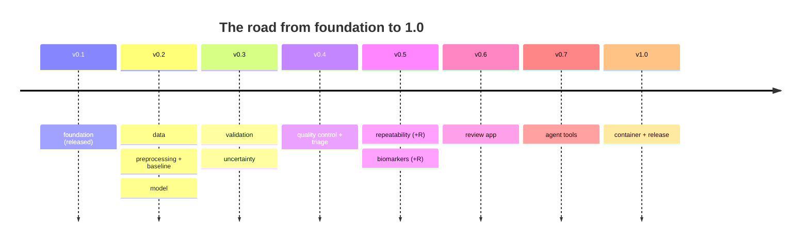

[← README](../README.md) · [Handbook](HANDBOOK.md) · [All docs in order](../README.md#the-tutorial-in-order) · [Glossary](00-glossary.md)

# 05 · Roadmap — what is planned, how, and what would trigger it

**Prerequisites:** none; [`02-architecture.md`](02-architecture.md) helps for the "approach" column.
**Learning goal:** you know exactly what SegAudit does *not* do yet, what the plan for each missing piece is, and what event would move it up or down the list. Nothing on this page is vague on purpose: every item has an approach, a trigger and an effort estimate.
**How this page relates to the others:** the [build log in the README](../README.md#build-log) is the *status table*; the [Handbook](HANDBOOK.md) is the *guided walkthrough*; this page is the *forward plan*. The product-scale evaluation (cloud, databases, payments, regulations) lives in [`06-product-and-technology-roadmap.md`](06-product-and-technology-roadmap.md) — this page stays within the pipeline itself.

**Status legend:** 🔜 planned (approach written) · 🔨 in progress · ✅ done. Effort is in focused sessions of ~2 hours.

---

## 1. The build plan (versions 0.2 → 1.0)

One phase per version step; each lands with its tutorial in `docs/04-phase-tutorials/` and a changelog entry. This is the same table as the README build log, with the *approach* spelled out.

| Ver. | Phase | Approach, in one honest paragraph | Effort |
|---|---|---|---|
| 0.2 | 1 · Data | Download the public hippocampus dataset (Medical Segmentation Decathlon Task 04, CC-BY-SA 4.0) with a resumable script; inventory every volume into a `cases` table (spacing, orientation, intensity stats) via nibabel/SimpleITK; build the synthetic phantom generator (seeded ellipsoids + noise, plus deliberate failure modes); add input QA gates that refuse malformed volumes; ship the `segaudit sql` read-only console and a `queries/` folder; document a DICOM-series→NIfTI utility with pydicom on a public sample series | 2–3 |
| 0.2 | 2 · Preprocessing + baseline | Reorient to canonical axes, resample to isotropic spacing, normalise intensity, optional denoising (Gaussian, non-local means) — each step a config switch; classical baseline segmentation (threshold + morphology, scikit-image) scored the same way the model will be | 2 |
| 0.2 | 3 · Model | Compact 3D U-Net in MONAI, CPU-first, seeded, patient-level splits recorded in a table; `quick` config trains on the phantom in minutes for CI; full run documented with wall-clock times on a laptop | 2–3 |
| 0.3 | 4 · Validation | Dice + HD95 + normalised surface distance per case; distribution plots, worst-case gallery, failure taxonomy written into `case_metrics`; bootstrap confidence intervals | 2 |
| 0.3 | 5 · Uncertainty | Test-time augmentation (flips/shifts/intensity) and Monte Carlo dropout (dropout left on at inference); per-case disagreement and entropy features; reliability diagram calibrating uncertainty against observed Dice | 2–3 |
| 0.4 | 6 · Quality control | Interpretable classifier (logistic regression / gradient boosting) predicting "Dice < threshold" from reference-free features; precision–recall, calibration, operating point chosen against the config's review budget; triage queue written to storage | 2–3 |
| 0.5 | 7 · Repeatability | Simulated re-acquisition (noise, resolution, rotation with SimpleITK rigid re-registration, intensity shift); volume re-measured per perturbation; variance decomposition and **minimum detectable difference** reported | 2–3 |
| 0.5 | 7R · R companion (optional) | Same statistics independently in R (arrow/duckdb R packages over the same Parquet tables), cross-checked against Python to tolerance; Quarto report; `docs/01b-setup-r.md` (R, RStudio, renv) | 2 |
| 0.5 | 8 · Biomarkers | Per-case volume/shape biomarkers with uncertainty bounds; join to case metadata (acquisition-derived real; clinical covariates simulated and labelled); stratified comparison incl. effect of QC-gating; one "same task, different language" box (Python vs R volume computation) | 2 |
| 0.5 | 8R · R companion (optional) | Bootstrap intervals and the stratified comparison in R, cross-checked; extends the Quarto report | 1–2 |
| 0.6 | 9 · Review app | Streamlit app over the API: triage queue, slice viewer, accept/flag writing to the review ledger, SQL tab; import-external-mask path (audit any NIfTI mask, whoever made it); click-by-click 3D Slicer guide and a Napari scripted-inspection tutorial | 3 |
| 0.7 | 10 · Agent tools | MCP server (Python SDK) exposing `segment_case`, `audit_case`, `query_ledger`, `draft_report` as read-only, schema-validated tools; report drafter calls a generative model through a provider-agnostic interface and may not emit a number absent from the tables | 2–3 |
| 1.0 | 11 · Container + release | Dockerfile (works under Docker and Podman — RHEL 8 ships Podman), CPU-only image built and smoke-tested in CI on the Linux runner; Slurm batch script for HPC; free-notebook GPU path documented; release 1.0 | 2 |

Total remaining: roughly **25–32 sessions ≈ 8–10 weekends**, matching the estimate in the [Handbook](HANDBOOK.md#the-journey-at-a-glance).

## 2. Deferred features — approach and trigger

Items that belong to the pipeline but deliberately wait. Each entry: what, planned approach, trigger, effort.

**More modalities (CT, PET, ultrasound, DXA, ophthalmic).** 🔜 The pipeline is modality-agnostic by design (any NIfTI volume + mask); the first addition would be a CT task from the same public collection (e.g. spleen), which is larger and needs the documented GPU path. *Trigger:* Phase 11 done, or a reader request with a concrete dataset. *Effort:* 2–3 sessions per modality.

**Audit an external tool's segmentations (e.g. FreeSurfer).** 🔜 A worked example feeding hippocampal masks produced by an established neuroimaging pipeline through the Phase 9 import path, so SegAudit's QC layer scores work it did not produce. This is the strongest demonstration that the audit layer is tool-independent. *Trigger:* Phase 9 import path exists. *Effort:* 1–2 sessions.

**Vendor-specific formats.** 🔜 Beyond DICOM/NIfTI, scanner vendors ship proprietary formats; approach is conversion at the edge (SimpleITK/pydicom where supported) with provenance recorded, never native support inside the pipeline. *Trigger:* a concrete dataset in such a format. *Effort:* 1 session per format.

**Foundation segmentation models.** 🔜 General-purpose medical segmenters can produce the masks; SegAudit audits them via the import path — the QC layer's features are split so shape-only auditing works on any imported mask (test-time-augmentation features need model access and are marked unavailable), with the limitation stated in the output. *Trigger:* import path (Phase 9) plus one such model chosen. *Effort:* 2 sessions.

**Richer multimodal integration.** 🔜 Beyond the Phase 8 covariate join: learned fusion of imaging features with tabular covariates. Honestly parked — the public dataset has no real clinical covariates, and simulated ones cannot justify a learned model. *Trigger:* a dataset with genuine paired clinical data. *Effort:* 3+ sessions.

**GPU and HPC at scale.** 🔜 The free-notebook GPU path and a Slurm script land in Phase 11; scaling beyond one node (array jobs over cases) is a one-page extension of the same script. *Trigger:* a dataset that does not fit a laptop. *Effort:* 1 session.

**RAG over accumulated audit reports.** 🔜 Once Phase 10 reports accumulate, retrieval over them ("what did last month's audit say about case 042?") becomes useful; evaluated properly in [`06-product-and-technology-roadmap.md`](06-product-and-technology-roadmap.md#rag--retrieval-augmented-generation). *Trigger:* >100 stored reports.

**Coded findings via clinical ontologies.** 🔜 Mapping findings to standard clinical vocabularies — evaluated in [`06`](06-product-and-technology-roadmap.md#knowledge-graphs-and-clinical-ontologies-snomed-ct-radlex). *Trigger:* a downstream system that consumes codes.

## 3. Known limitations that stay (by design)

Stated here so nobody mistakes them for oversights; the reasoning is in [About the data](../README.md#about-the-data-honesty-notes):

- Models trained here demonstrate **workflow competence, not clinical performance**; the data is a public research cohort.
- The QC score predicts **disagreement with the expert outline**, not truth.
- **Two dependency lanes** exist because PyTorch ended Intel-Mac builds; cross-lane results match to numerical tolerance, not byte-for-byte ([setup guide, troubleshooting T1](01-setup-macos.md#11-troubleshooting)).
- CPU training means a **compact model** — deliberate, so the whole project reproduces on any laptop.

## 4. How this page is maintained

When a phase lands: its row moves to ✅ in the [README build log](../README.md#build-log), the [Handbook Stage 3 table](HANDBOOK.md#stage-3--build-the-pipeline-phase-by-phase) is updated **in the same commit**, and any deferred item whose trigger fired moves into section 1 with a version target. If this page and reality disagree, that is a bug — please report it.
