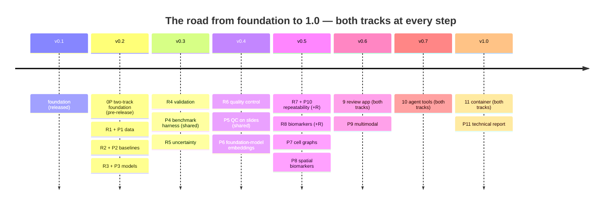

[← README](../README.md) · [Handbook](HANDBOOK.md) · [All docs in order](../README.md#the-tutorial-in-order) · [Glossary](00-glossary.md)

# 05 · Roadmap — what is planned, how, and what would trigger it

**Prerequisites:** none; [`02-architecture.md`](02-architecture.md) helps for the "approach" column.
**Learning goal:** you know exactly what SegAudit does *not* do yet on either track, what the plan for each missing piece is, in what order both tracks advance, and what event would move an item up or down the list. Nothing on this page is vague on purpose: every item has an approach, a trigger and an effort estimate.
**How this page relates to the others:** the [build log in the README](../README.md#build-log) is the *status table*; the [Handbook](HANDBOOK.md) is the *guided walkthrough*; this page is the *forward plan*. The product-scale evaluation (cloud, databases, payments, regulations) lives in [`06-product-and-technology-roadmap.md`](06-product-and-technology-roadmap.md) — this page stays within the pipeline itself.

**Status legend:** 🔜 planned (approach written) · 🔨 in progress · ✅ done. Effort is in focused sessions of ~2 hours.

---

## 1. The build plan (versions 0.2 → 1.0)

One phase per version step; each lands with its tutorial in `docs/04-phase-tutorials/` and a changelog entry. This is the same table as the README build log, with the *approach* spelled out.

| Ver. | Phase | Track | Approach, in one honest paragraph | Effort |
|---|---|---|---|---|
| 0.2 | 0P | S | ✅ Done. `track` in config/API/CLI (default radiology, so nothing broke), `schemas.py`, symmetric `radiology/` and `pathology/` packages, slide reader with two backends, synthetic H&E tile generator, CI reading a synthetic slide on all three runners | — |
| 0.2 | 1 | R | Download the public hippocampus dataset (Medical Segmentation Decathlon Task 04, CC-BY-SA 4.0) with a resumable script; inventory every volume into the `cases` table (spacing, orientation, intensity stats) via nibabel/SimpleITK; MRI phantom generator (seeded ellipsoids + noise, deliberate failure modes) mirroring the tile generator; input QA gates that refuse malformed volumes; the `segaudit sql` read-only console and a `queries/` folder; a DICOM-series→NIfTI utility with pydicom | 2–3 |
| 0.2 | P1 | P | Download scripts + licence notes for BCSS (CC0), PanNuke (CC BY-NC-SA, flagged) / NuCLS (CC0), and one CAMELYON16 slide (CC0); inventory into `slides`/`tiles` with mpp and magnification read from the file; tissue detection (Otsu on a low level) and tiling at a target mpp with tissue-fraction per tile; slide-level artefact QC (blur, folds, pen marks, background) using the generator's artefacts as the test bed; QA gates; `segaudit sql` over the slide tables; the end-to-end WSI demo with a stated ≤30-min CPU budget | 3 |
| 0.2 | 2 | R | Reorient, resample to isotropic spacing, normalise intensity, optional denoising — each a config switch; classical baseline segmentation (threshold + morphology) scored like the model will be | 2 |
| 0.2 | P2 | P | Stain deconvolution (Macenko; Vahadane-lite) and normalisation in NumPy, stain augmentation for training; classical nuclei baseline (deconvolution → threshold → watershed) and classical tissue baseline (colour + texture); both scored like the models will be | 2–3 |
| 0.2 | 3 | R | Compact 3D U-Net (MONAI), CPU-first, seeded, patient-level splits in a table; `quick` trains on the phantom in minutes | 2–3 |
| 0.2 | P3 | P | Compact U-Net with centre/distance heads (HoVer-Net / StarDist style) for nuclei instance segmentation + class head, and a tissue semantic U-Net, both on 256-px tiles on CPU; the import path exercised with one pretrained public nuclei model (licence verified in-phase); tag **v0.2.0** | 3 |
| 0.3 | 4 | R | Dice + HD95 + normalised surface distance per case; distribution plots, worst-case gallery, failure taxonomy; bootstrap CIs | 2 |
| 0.3 | P4 | S | **Benchmark harness**: one `segaudit benchmark` that scores classical, trained and imported models with the same protocol and writes a leaderboard table to storage — pathology metrics (AJI, Panoptic Quality, detection F1, per-class) added next to the radiology ones; run on both tracks before it counts | 2–3 |
| 0.3 | 5 | R | Test-time augmentation and Monte Carlo dropout; per-case disagreement/entropy features; reliability diagram; tag **v0.3.0** | 2–3 |
| 0.4 | 6 | R | Interpretable classifier predicting "Dice < threshold" from reference-free features; precision–recall, calibration, operating point against the review budget; triage queue in storage | 2–3 |
| 0.4 | P5 | S | The same classifier code path on tiles with stain-jitter TTA and shape-plausibility features (nuclear area, solidity, eccentricity distributions); tile-to-slide aggregation so a slide gets one decision; the generator's failure modes as the labelled failures | 2–3 |
| 0.4 | P6 | P | Hibou-B (Apache-2.0, non-gated) and DINOv2 / ResNet-50 fallbacks; linear probe and k-NN on tile labels; embedding distance to the training set as an OOD/QC feature compared with handcrafted features inside the QC classifier; a small self-supervised experiment on synthetic tiles if CPU budget allows, else its trigger is written here; tag **v0.4.0** | 3 |
| 0.5 | 7 / 7R | R | Simulated re-acquisition (noise, resolution, rotation + SimpleITK rigid re-registration, intensity shift); variance decomposition; **minimum detectable difference**; R twin + Quarto report + `docs/01b-setup-r.md` | 2–3 (+2) |
| 0.5 | P10 | P | Phase 7's code on slides: stain variation, simulated scanner differences, magnification change, tile-grid offset → MDD for TIL density, Ki-67 index, TSR; R twin optional | 2 |
| 0.5 | 8 / 8R | R | Volume/shape biomarkers with uncertainty bounds; join to case metadata (clinical covariates simulated, labelled); stratified comparison incl. QC-gating; R twin | 2 (+1–2) |
| 0.5 | P7 | P | Phenotypes from nuclear class, IHC positivity (DeepLIIF pairs) or mIF channels; kNN and Delaunay cell graphs; graph-level features; GCN/GraphSAGE in pure PyTorch predicting a tile label; `docs/01c-setup-pyg.md` for the optional PyTorch Geometric lane | 3 |
| 0.5 | P8 | P | Densities, neighbourhood composition, nearest-neighbour distances, Ripley's K and cross-K (SciPy KD-trees; squidpy optional lane); TIL density, Ki-67 index, tumour–stroma ratio and interaction scores into the shared biomarker table with CIs; stratified exactly like Phase 8; tag **v0.5.0** | 3 |
| 0.6 | 9 | S | Streamlit app over the API: case/slice views **and** slide/tile views, triage queue, accept/flag → ledger, SQL tab; import-external-mask path; 3D Slicer, Napari and **QuPath** guides | 3–4 |
| 0.6 | P9 | P | H&E → IHC/mIF marker positivity from morphology embeddings (DeepLIIF pairs); H&E → gene-program score per Visium spot (10x sample, CC BY 4.0); a joint embedding; failure cases shown; tag **v0.6.0** | 3 |
| 0.7 | 10 | S | MCP server exposing track-neutral tools (`segment`, `audit`, `query_ledger`, `draft_report`); grounded generative report drafter for both tracks; the generative-AI position documented (what it does, what it must never invent, how grounding is enforced); tag **v0.7.0** | 2–3 |
| 1.0 | 11 | S | Dockerfile (Docker and Podman), CPU image with both tracks, smoke-tested in CI; Slurm script; GPU path incl. foundation-model inference | 2 |
| 1.0 | P11 | P | `docs/07-technical-report/`: preprint-style report benchmarking the reference-free QC layer across both tracks with reproducible figure scripts, reference list, `CITATION.cff`, poster one-pager; tag **v1.0.0** | 3 |

Total remaining: roughly **55–66 sessions ≈ 14–17 weekends**, matching the estimate in the [Handbook](HANDBOOK.md#the-journey-at-a-glance). Every minor version advances both tracks.

## 2. Deferred features — approach and trigger

Items that belong to the pipeline but deliberately wait. Each entry: what, planned approach, trigger, effort.

**More modalities (CT, PET, ultrasound, DXA, ophthalmic).** 🔜 The pipeline is modality-agnostic by design (any NIfTI volume + mask); the first addition would be a CT task from the same public collection (e.g. spleen), which is larger and needs the documented GPU path. *Trigger:* Phase 11 done, or a reader request with a concrete dataset. *Effort:* 2–3 sessions per modality.

**Audit an external tool's segmentations (e.g. FreeSurfer).** 🔜 A worked example feeding hippocampal masks produced by an established neuroimaging pipeline through the Phase 9 import path, so SegAudit's QC layer scores work it did not produce. This is the strongest demonstration that the audit layer is tool-independent. *Trigger:* Phase 9 import path exists. *Effort:* 1–2 sessions.

**Vendor-specific formats.** 🔜 Beyond DICOM/NIfTI, scanner vendors ship proprietary formats; approach is conversion at the edge (SimpleITK/pydicom where supported) with provenance recorded, never native support inside the pipeline. *Trigger:* a concrete dataset in such a format. *Effort:* 1 session per format.

**Foundation segmentation models.** 🔜 General-purpose medical segmenters can produce the masks; SegAudit audits them via the import path — the QC layer's features are split so shape-only auditing works on any imported mask (test-time-augmentation features need model access and are marked unavailable), with the limitation stated in the output. *Trigger:* import path (Phase 9) plus one such model chosen. *Effort:* 2 sessions.

**Richer multimodal integration.** 🔜 Beyond the Phase 8 covariate join: learned fusion of imaging features with tabular covariates. Honestly parked — the public dataset has no real clinical covariates, and simulated ones cannot justify a learned model. *Trigger:* a dataset with genuine paired clinical data. *Effort:* 3+ sessions.

**GPU and HPC at scale.** 🔜 The free-notebook GPU path and a Slurm script land in Phase 11; scaling beyond one node (array jobs over cases) is a one-page extension of the same script. *Trigger:* a dataset that does not fit a laptop. *Effort:* 1 session.

**RAG over accumulated audit reports.** 🔜 Once Phase 10 reports accumulate, retrieval over them ("what did last month's audit say about case 042?") becomes useful; evaluated properly in [`06-product-and-technology-roadmap.md`](06-product-and-technology-roadmap.md#rag--retrieval-augmented-generation). *Trigger:* >100 stored reports.

**Coded findings via clinical ontologies.** 🔜 Mapping findings to standard clinical vocabularies — evaluated in [`06`](06-product-and-technology-roadmap.md#knowledge-graphs-and-clinical-ontologies-snomed-ct-radlex). *Trigger:* a downstream system that consumes codes.

**Pathology: more modalities and formats (DICOM-WSI, vendor formats, fluorescence file types).** 🔜 OpenSlide already reads the major vendor formats; DICOM-WSI and OME-TIFF fluorescence stacks need a reader lane each, evaluated in [`06`](06-product-and-technology-roadmap.md). *Trigger:* a concrete dataset in that format. *Effort:* 1–2 sessions per format.

**Audit external pathology tools (StarDist, Cellpose, HoVer-Net, QuPath exports).** 🔜 The P3 import path takes any label image; a worked example per tool shows the QC layer scoring masks it did not produce. *Trigger:* P3 done. *Effort:* 1 session per tool.

**Self-supervised pre-training at scale.** 🔜 The P6 experiment is CPU-sized; a real SSL run needs the GPU path and a larger unlabelled tile pool. *Trigger:* GPU path (Phase 11) + a use case the frozen foundation model does not cover. *Effort:* 3+ sessions.

**Generative augmentation and virtual staining.** 🔜 Evaluated in [`06`](06-product-and-technology-roadmap.md#generative-augmentation-and-virtual-staining); stain augmentation (P2) is the deterministic answer until paired data proves too scarce.

## 3. Known limitations that stay (by design)

Stated here so nobody mistakes them for oversights; the reasoning is in [About the data](../README.md#about-the-data-honesty-notes):

- Models trained here demonstrate **workflow competence, not clinical performance**; the data is public research data on both tracks, none of it from a trial or a drug-discovery programme.
- **CPU-first means tiles, not whole slides**, for training and for most inference; the one end-to-end slide demo works on a fixed tile subsample within a stated time budget, and the GPU path is documented for more.
- **Non-commercial datasets** (PanNuke; DeepLIIF assumed) are usable for a public research repository and are flagged wherever used; models trained on them inherit the flag.
- The QC score predicts **disagreement with the expert outline**, not truth.
- **Two dependency lanes** exist because PyTorch ended Intel-Mac builds; cross-lane results match to numerical tolerance, not byte-for-byte ([setup guide, troubleshooting T1](01-setup-macos.md#11-troubleshooting)).
- CPU training means a **compact model** — deliberate, so the whole project reproduces on any laptop.

## 4. How this page is maintained

When a phase lands: its row moves to ✅ in the [README build log](../README.md#build-log), the [Handbook Stage 3 table](HANDBOOK.md#stage-3--build-the-pipeline-phase-by-phase) is updated **in the same commit**, and any deferred item whose trigger fired moves into section 1 with a version target. If this page and reality disagree, that is a bug — please report it.
