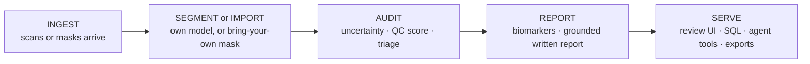

[← README](../README.md) · [Handbook](HANDBOOK.md) · [All docs in order](../README.md#the-tutorial-in-order) · [Glossary](00-glossary.md)

# 06 · Product & technology roadmap — from this repository to a real product

**Prerequisites:** none. Every term is explained here with an everyday analogy; [`02-architecture.md`](02-architecture.md) gives useful background.
**Learning goal:** you understand what it would take to turn SegAudit from a pipeline on a laptop into an industrialised, cloud-hosted, sellable product — and, just as importantly, why almost none of that belongs in the project *today*.
**How to read this page:** every technology option below is answered with the same three questions — *Is it required now? Why? What is the concrete benefit, and what is the cost?* — and ends with a **verdict** and a **trigger**. The verdicts:

| Verdict | Meaning |
|---|---|
| **Required now** | In the build plan already; the pipeline is incomplete without it |
| **Recommended later** | Clearly worth it, at a stated trigger — not before |
| **Optional** | Useful in some futures; adopt only if its trigger fires |
| **Not needed** | Adds cost without benefit for this product's shape |

The governing rule, from [`CONTRIBUTING.md`](../CONTRIBUTING.md): **justify, don't accumulate.** Every technology is a cost — install, learn, maintain, secure — before it is a benefit. A summary verdict table is at the [bottom](#summary-every-option-one-line-each).

---

## Contents

1. [The finished product, described honestly](#1-the-finished-product-described-honestly)
2. [The end-to-end product pipeline — and what already exists](#2-the-end-to-end-product-pipeline--and-what-already-exists)
3. [Product surface](#3-product-surface)
4. [Data platform](#4-data-platform)
5. [AI components](#5-ai-components)
6. [Cloud and operations](#6-cloud-and-operations)
7. [Security and the regulation of medical data](#7-security-and-the-regulation-of-medical-data)
8. [Discoverability and go-to-market](#8-discoverability-and-go-to-market)
9. [Pricing and packaging sketch](#9-pricing-and-packaging-sketch)
10. [Summary: every option, one line each](#summary-every-option-one-line-each)

---

## 1. The finished product, described honestly

Imagine a small research imaging group. Every week, scans arrive; a segmentation model (theirs, or a third-party tool) outlines structures; volumes go into study spreadsheets. Nobody has time to look at every outline, and everybody knows some are wrong.

The finished SegAudit product is a service that group points their scans (or their finished masks) at. It runs the audit — uncertainty, quality score, triage — and gives back three things: a **short review queue** ("look at these 14 of 200"), a **defensible biomarker table** (volumes with confidence intervals, QC flags, repeatability figures), and a **written report** a study lead can file. Reviewers accept or flag cases in a web page; every decision lands in a permanent ledger; other software can drive the whole thing through an agent interface.

What it is *not*: a diagnostic device. It audits measurements; it does not diagnose patients. That single sentence decides most of the regulatory section below.

## 2. The end-to-end product pipeline — and what already exists

The product runs five stages. The build plan in [`05-roadmap.md`](05-roadmap.md) constructs exactly these stages on a laptop; productisation replaces the *walls around them*, not the stages themselves — which is why the architecture rules ([`02-architecture.md`](02-architecture.md#5-the-five-design-rules)) matter so much.

| Product stage | What the MVP already has (or has planned) | Status | What productisation adds |
|---|---|---|---|
| Ingest | Download script, input QA gates, DICOM→NIfTI utility, phantom generator | 🔜 Phase 1 | Upload endpoint / watched cloud bucket; per-customer isolation |
| Segment / import | 3D U-Net; import-external-mask path | 🔜 Phases 3, 9 | Model registry; per-customer model choice |
| Audit | Uncertainty, QC classifier, triage, repeatability | 🔜 Phases 5–7 | Scheduled re-audits over new arrivals |
| Report | Biomarker table with CIs; grounded report drafter | 🔜 Phases 8, 10 | Branded PDF export; report archive with retrieval |
| Serve | CLI + SQL console; Streamlit review app; MCP tools; the `api.py` counter everything calls | ✅ api/storage today; 🔜 Phases 1, 9, 10 | Multi-user web front end; authentication; audit trail |

The honest headline: **today's MVP (v0.1.0) contributes the foundations of every stage** — the API-first core, config-driven paths, the storage interface, seeded reproducibility, cross-platform CI — and those foundations are precisely the parts that make the right-hand column *additions* rather than *rewrites*.

---

## 3. Product surface

### React (or comparable) web app

*What it is:* React is the most widely used toolkit for building interactive web pages in the browser. The Phase 9 Streamlit app is a Python script that becomes a web page automatically — fast to build, limited to look and flow like Streamlit. A React front end is a real, custom web product. *Analogy:* Streamlit is a food truck — real food, fast, but the truck decides the layout. React is fitting out your own restaurant.
*Required now?* **No.** *Why:* the reviewer today is one person (me, or a reader); Streamlit proves the workflow with a tenth of the effort, and the API-first rule means a React front end later calls the very same functions.
*Benefit:* multi-user, branded, embeddable, responsive UI; the front end a customer would accept. *Cost:* a second language and toolchain (TypeScript, Node), a build system, and a real accessibility/security surface to maintain.
*Verdict:* **Recommended later** — *trigger:* a second regular user who is not me, or the first external pilot.

### Desktop / mobile packaging and app-store distribution

*What it is:* wrapping the product as an installable desktop program or a phone app, distributed through app stores. *Analogy:* selling jars in supermarkets instead of serving at your own counter — reach, in exchange for the supermarket's rules and shelf fees.
*Required now?* **No.** *Why:* segmentation review happens at workstations, near large scans on shared storage; a browser reaches those users with zero installation.
*Benefit:* offline review; presence on managed hospital desktops. *Cost:* per-platform packaging and signing, store review processes, an update channel — a large standing cost for a niche gain.
*Verdict:* **Optional** — *trigger:* a clinic pilot that explicitly requires an installed, offline tool.

### Licensing and payments

*What it is:* the machinery of selling — licence keys or subscriptions, a payment processor (e.g. Stripe: the card-terminal-as-a-service of the internet), invoices, tax.
*Required now?* **No.** *Why:* there is nothing to sell before the pipeline is validated end to end; adding payment machinery first is building a till before the shop.
*Benefit:* revenue, obviously. *Cost:* legal entity questions, tax handling, refund/support obligations, and payment-data security duties.
*Verdict:* **Not needed** — *trigger:* the first party willing to pay for a pilot; then a subscription via a hosted processor (never handling card data ourselves), see [pricing](#9-pricing-and-packaging-sketch).

## 4. Data platform

### PostgreSQL

*What it is:* the leading open-source database *server* — many users, permissions, transactions, over the network. Today SegAudit stores tables as Parquet files queried by DuckDB in-process ([architecture, storage box](02-architecture.md#4-what-each-box-does-and-why-it-exists)). *Analogy:* DuckDB+Parquet is a superbly organised filing cabinet in your own office; PostgreSQL is the records department with a counter, staff and an access log.
*Required now?* **No.** *Why:* one user, hundreds of cases, no concurrency — the cabinet is faster to use and has zero moving parts. The `Storage` interface was designed so this swap is one new class.
*Benefit:* concurrent reviewers, row-level permissions, a proper audit trail for the ledger, backups as a discipline. *Cost:* a server to run, secure, patch and back up — forever.
*Verdict:* **Recommended later** — *trigger:* two people reviewing at once, or the hosted product.

### Databricks / Snowflake

*What they are:* rented cloud platforms for very large data — Snowflake a cloud data warehouse (a database built for analytics at fleet scale), Databricks a lakehouse platform built around Spark for huge computation. *Analogy:* container-port logistics. SegAudit's cohort is a delivery van.
*Required now?* **No.** *Why:* hundreds to thousands of cases fit in Parquet files on a disk; these platforms begin to pay at millions of rows and many concurrent analysts — and they meter money by the hour.
*Benefit:* fleet-scale audits across many studies/customers in one governed place. *Cost:* real monthly spend, vendor coupling, and a new operational skill set.
*Verdict:* **Optional** — *trigger:* >10⁴ cases under management, or a customer whose data already lives there and must not leave.

### dbt

*What it is:* a tool that turns SQL files into a tested, documented, version-controlled transformation pipeline inside a warehouse. *Analogy:* what this project's `pyproject.toml` + pytest are to Python, dbt is to warehouse SQL.
*Required now?* **No.** *Why:* SegAudit's transformations are Python over image arrays; its SQL is *queries*, not staged table-building. dbt without a warehouse is a hammer without nails.
*Benefit (later):* if PostgreSQL/warehouse serving materialises, the ledger-to-report SQL becomes tested and documented like code. *Cost:* one more toolchain and mental model.
*Verdict:* **Optional** — *trigger:* a warehouse or PostgreSQL serving layer exists *and* the SQL grows beyond a folder of queries.

### Orchestrator (Airflow / Dagster / Prefect)

*What it is:* a program that runs your pipeline steps on schedule, in order, with retries, logging and a web page showing what ran. *Analogy:* an alarm-clock-plus-checklist for pipelines: every night at 2 a.m., do step 1, then 2; if step 3 fails, retry twice, then wake a human.
*Required now?* **No.** *Why:* SegAudit runs on demand with one command; there is no schedule, no fan-out, no team. An orchestrator would orchestrate nothing.
*Benefit (later):* nightly re-audits over newly arrived scans, lineage, alerting. *Cost:* a long-running service plus its database — real operations. (If the trigger fires, Prefect or Dagster over Airflow: lighter to self-host, friendlier to a Python codebase.)
*Verdict:* **Recommended later** — *trigger:* the product must re-audit arriving data on a schedule without a human typing a command.

### Object storage (S3-compatible)

*What it is:* cloud storage for files at any scale, addressed by name, rented by the gigabyte — Amazon S3 and its many compatible implementations. *Analogy:* an infinitely large left-luggage office: hand in a bag under a label, retrieve it by label from anywhere.
*Required now?* **No.** *Why:* scans and tables live on local disk behind the config's paths and the `Storage` interface.
*Benefit (later):* the hosted product's scans and outputs live somewhere durable, access-controlled and shared; the `Storage` interface and the config's path indirection make this a contained change. *Cost:* cloud account, credentials to protect, egress fees.
*Verdict:* **Recommended later** — *trigger:* the first cloud deployment.

### Data and model versioning (DVC / MLflow)

*What they are:* DVC tracks large data files alongside Git (Git for code, DVC pointers for data); MLflow records experiments — parameters, metrics, model files — and can act as a model registry. *Analogy:* DVC is a cloakroom ticket kept in your notebook; MLflow is a lab notebook that fills itself in per experiment.
*Required now?* **No.** *Why:* the dataset is a versioned public download (regenerable), the phantom is seeded, runs are recorded in the run table with their config, and Git tags pin code+pins per release. That already reproduces v0.x results. There is exactly one model.
*Benefit (later):* comparing many trained models honestly; a registry saying which model version served which customer. *Cost:* another service (MLflow) or another workflow layer (DVC) to keep truthful.
*Verdict:* **Recommended later** — *trigger:* the second trained model worth comparing to the first (realistically Phase 3–5 experimentation, or the GPU-scale work).

## 5. AI components

### Generative-model tooling (provider-agnostic client)

*What it is:* the small piece of code through which Phase 10's report drafter talks to a text-generating model, written against a neutral interface so any provider can sit behind it. *Analogy:* a wall socket, not an appliance welded to the wall.
*Required now?* **Yes — Phase 10.** *Why:* the drafter that turns computed tables into a readable quality report is part of the pipeline's stated scope, and grounding rules ("no number that is not in the tables") are core design, not decoration.
*Benefit:* reports a study lead can file, generated in seconds, provably tied to the numbers. *Cost:* an external dependency with per-use cost and a key to protect (kept in `.env`, which [`.gitignore`](../.gitignore) and the [safety script](../scripts/check_public_safe.py) both refuse to publish).
*Verdict:* **Required now** (lands with Phase 10).

### RAG — retrieval-augmented generation

*What it is:* before a generative model answers, fetch the relevant documents and hand them over as context, so the answer cites real material instead of guessing. *Analogy:* an open-book exam — the student may only quote from the pages placed on the desk.
*Required now?* **No.** *Why:* there is nothing to retrieve yet; the corpus (audit reports, methodology pages) starts accumulating from Phase 10.
*Benefit (later):* "why was case 042 flagged in March?" answered from the actual March report; searchable institutional memory. *Cost:* an index to build and refresh, and a new failure mode (retrieving the wrong page) to test.
*Verdict:* **Optional** — *trigger:* >100 stored reports, or a pilot user asking historical questions.

### MCP — Model Context Protocol server and clients

*What it is:* an open standard through which agent software discovers and calls a program's tools with validated inputs and outputs — a standard plug. *Analogy:* the USB port on the project: any agent with the right cable can use `audit_case` without bespoke wiring.
*Required now?* **Yes — Phase 10.** *Why:* exposing the pipeline as agent-callable tools is a stated goal, and the API-first rule makes it nearly free: the server is `api.py`'s functions with schemas attached.
*Benefit:* other tools, assistants and scripts can drive real audits; the product gains an integration surface without a bespoke SDK. *Cost:* schema discipline and read-only guarantees to test.
*Verdict:* **Required now** (lands with Phase 10).

### Knowledge graphs and clinical ontologies (SNOMED CT, RadLex)

*What they are:* an *ontology* is an agreed vocabulary of concepts and their relationships — *a family tree for ideas*, where "hippocampus" has one official identity, parents ("brain structure") and relations. SNOMED CT is the big clinical one; RadLex the radiology-specific one. A *knowledge graph* stores your findings as nodes and edges using such vocabularies, so software (not just people) can reason over them.
*Required now?* **No.** *Why:* SegAudit's findings are numeric tables about one structure; a graph over five concepts is ceremony. Interoperability matters only when another clinical system consumes the output.
*Benefit (later):* findings coded so hospital systems ingest them without translation ("volume of SNOMED-coded structure X, flagged low-confidence"). *Cost:* licensing/affiliate terms for SNOMED CT in some countries, mapping maintenance, and graph infrastructure.
*Verdict:* **Optional** — *trigger:* a clinical partner whose systems require coded findings.

## 6. Cloud and operations

### Containers (Docker / Podman)

*What it is:* a sealed package holding the exact operating-system layer, Python and packages, so the pipeline runs identically on any machine — see the [glossary](00-glossary.md#13-containers-hardware-and-platforms). *Analogy:* a shipping container: contents indifferent to which ship carries them.
*Required now?* **Yes — Phase 11.** *Why:* it is the honest end of the reproducibility story ([the lock files](../locks/README.md) freeze packages; the container freezes everything under them), the deployment unit every later option consumes, and RHEL-friendly (Podman-compatible).
*Benefit:* "runs anywhere" becomes literal; the hosted product deploys the same artefact CI tested. *Cost:* an image to keep patched; build minutes.
*Verdict:* **Required now** (lands with Phase 11).

### Kubernetes or serverless

*What they are:* Kubernetes runs and supervises *fleets* of containers across many machines (restart, scale, roll out). Serverless (functions/containers-on-demand) runs your code only when called, billed per use. *Analogy:* Kubernetes is a harbour master for hundreds of containers; one container on one machine needs a parking space, not a harbour master.
*Required now?* **No.** *Why:* one container serves the single-team product; Kubernetes' operational weight (cluster upkeep, networking, upgrades) dwarfs the workload.
*Benefit (later):* elastic multi-customer hosting; zero-idle cost (serverless) for spiky audit jobs. *Cost:* the steepest operations learning curve on this page (Kubernetes) or cold-start/vendor limits (serverless).
*Verdict:* **Optional** — *trigger:* hosted product with multiple concurrent customers; prefer a managed serverless container service first, Kubernetes only at clear multi-service scale.

### CI/CD

*What it is:* CI (continuous integration) — every push is installed and tested on fresh machines; CD (continuous delivery) — a green build is automatically packaged and shipped. *Analogy:* CI is the driving test on three cars per change ([glossary](00-glossary.md#10-testing-quality-and-automation)); CD is the dealership delivering the car once it passes.
*Required now?* **Yes — and already running.** [`.github/workflows/ci.yml`](../.github/workflows/ci.yml) tests Windows, macOS and Linux on every push; Phase 11 extends it to build and smoke-test the container (that is the "CD" that matters at this scale).
*Benefit:* confidence per commit; the README badge is proof, not a claim. *Cost:* runner minutes; occasional flaky-environment debugging.
*Verdict:* **Required now** (in place since Phase 0).

### Monitoring

*What it is:* a service watching the running product — is it up, how slow, what failed — and alerting a human. *Analogy:* the smoke alarm and the dial gauges for software.
*Required now?* **No.** *Why:* there is no long-running service to watch; a pipeline run's "monitoring" is its exit code, its run-table row and CI.
*Benefit (later):* knowing the hosted product broke before the customer emails; drift alarms on the QC feature distribution (the statistical groundwork for which Phase 6 lays anyway). *Cost:* another service, alert fatigue to manage.
*Verdict:* **Recommended later** — *trigger:* first hosted deployment.

### Cost model (of running the product)

*What it is:* an honest estimate of what serving the product costs, so a price can exist. Rough, deliberately conservative orders of magnitude at small scale: a CPU cloud VM able to run audits: **~$30–80/month**; object storage: **~$0.02/GB-month** (a 200-case MRI study of this kind: well under a gigabyte of tables, a few GB with scans); generative-model report drafting: **cents per report** at current per-token prices; managed PostgreSQL: **~$15–50/month**. Total for a one-team hosted pilot: **on the order of $100/month** — which is what makes the [pricing sketch](#9-pricing-and-packaging-sketch) plausible. GPU inference, if ever needed, changes this materially (**$1–4/hour** while running) and is the strongest argument for keeping the CPU-first design.
*Verdict:* not a technology to adopt but a document to maintain — it lives here and is updated when the first cloud bill exists.

## 7. Security and the regulation of medical data

*Why this section decides everything else:* today SegAudit processes **public, de-identified research data**, so none of the regimes below constrain it. The moment any identifiable patient data touches the product, all of them do. The trigger for this entire section is therefore a single event: **the first identifiable (or re-identifiable) scan.**

**GDPR** (EU/EEA + UK equivalent): the law governing personal data — and health data is its most protected category. Consequences for a hosted product: a lawful basis for processing, EU data residency choices, deletion rights, breach notification, a processing agreement with every customer. *Analogy:* handling registered mail with legal receipts, not postcards.

**HIPAA** (US): the health-data law for US providers and their vendors; a product serving a US clinic becomes a "business associate" with contractual security duties (signed BAA, access controls, audit logs, encryption at rest and in transit).

**Software as a medical device (SaMD):** if software's output is *intended for* diagnosis or treatment decisions, it is regulated as a medical device (EU MDR, FDA). SegAudit's stated intent — auditing measurement quality for research workflows — sits outside that, **and the wording of every report and page is kept deliberately on that side of the line.** Crossing it (marketing the QC score as clinical decision support) would mean a quality-management system, clinical evaluation and certification: a company-scale undertaking, flagged honestly as such.

*Engineering consequences already visible today, on purpose:* no secrets in the repo (enforced by [`scripts/check_public_safe.py`](../scripts/check_public_safe.py)); data never committed ([`.gitignore`](../.gitignore), [`data/README.md`](../data/README.md)); provenance and append-only ledgers ([architecture](02-architecture.md#4-what-each-box-does-and-why-it-exists)); one-way data flow. These habits are the cheap 80% of what the regimes above demand.
*Verdict:* **documented duty, not a tool** — *trigger:* any identifiable data, at which point this section becomes a work plan before that data is accepted.

## 8. Discoverability and go-to-market

Three acronyms, one goal: being found by the people (and machines) who look.

**SEO — search-engine optimisation.** Structuring a site so classic search engines rank it: clear titles, one topic per page, fast pages, honest inbound links. *Analogy:* a clear shop sign on the street the customers already walk down.
**AEO — answer-engine optimisation.** Structuring content so question-answering surfaces can quote it: pages that literally answer one question, glossary-style definitions, FAQ blocks with schema markup. *Analogy:* giving the librarian a card catalogue of your answers.
**GEO — generative-engine optimisation.** Making material citable by generative systems that synthesise answers: canonical definitions, stable URLs, quotable single-sentence claims, licence clarity. *Analogy:* writing the paragraph you hope the encyclopaedia will lift, and signing it.

*Required now?* **No** — there is no product site. *Honest observation:* this repository's documentation style (one concept per section, plain-language definitions, stable headings) is already AEO/GEO-shaped by accident of its tutorial mission, so the later cost is mostly a product site, not a rewrite.
*Benefit:* qualified readers arriving free. *Cost:* a site to maintain; the discipline of canonical pages.
*Verdict:* **Optional** — *trigger:* a product site exists.

## 9. Pricing and packaging sketch

A sketch, not a plan — its purpose is to prove the shape of a viable offer exists at the [cost model's](#cost-model-of-running-the-product) numbers.

| Tier | Who it is for | What they get | Sketch price |
|---|---|---|---|
| **Open source** | Anyone | This repository, forever, MIT-licensed; run it yourself | Free |
| **Hosted team** | One research group | Hosted audits, review UI with accounts, report archive, support | ~$200–500 / month |
| **Site** | Institution / core facility | Multiple teams, PostgreSQL ledger with audit trail, SSO, data-processing agreement | ~$1–2k / month |
| **Integration** | Vendors / platforms | MCP/API access embedded in their product, coded findings if built | Per agreement |

Two honest notes: the open-source tier is not a loss-leader trick — it is the credibility on which the others rest; and no paid tier is offered before the [regulatory section's](#7-security-and-the-regulation-of-medical-data) duties for the target customer's data are actually met.

## Summary: every option, one line each

| Option | Verdict | Trigger |
|---|---|---|
| React web front end | Recommended later | Second regular user / first pilot |
| Desktop / mobile packaging, app stores | Optional | Pilot requiring installed offline tool |
| Licensing & payments | Not needed | First paying pilot |
| PostgreSQL | Recommended later | Concurrent reviewers or hosting |
| Databricks / Snowflake | Optional | >10⁴ cases or data-resident customer |
| dbt | Optional | Warehouse serving layer exists + SQL grows |
| Orchestrator (Prefect / Dagster / Airflow) | Recommended later | Scheduled re-audits over arriving data |
| Object storage (S3-compatible) | Recommended later | First cloud deployment |
| DVC / MLflow | Recommended later | Second model worth comparing |
| Generative-model client (grounded drafter) | **Required now** | Phase 10 |
| RAG over reports | Optional | >100 stored reports |
| MCP server | **Required now** | Phase 10 |
| Knowledge graphs / SNOMED CT / RadLex | Optional | Partner requiring coded findings |
| Containers (Docker / Podman) | **Required now** | Phase 11 |
| Kubernetes / serverless | Optional | Multi-customer hosting |
| CI/CD | **Required now** | In place since Phase 0 |
| Monitoring | Recommended later | First hosted deployment |
| Cost model | Living document (this page) | First cloud bill |
| GDPR / HIPAA / SaMD duties | Documented duty | Any identifiable data |
| SEO / AEO / GEO | Optional | Product site exists |
| Pricing & packaging | Sketch (this page) | First pilot conversation |

Maintained like everything else: a fired trigger changes a verdict **in the same commit** as the change it justifies, and the [Handbook](HANDBOOK.md#stage-5--from-pipeline-to-product) links here as Stage 5.
