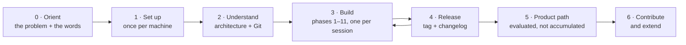

[← README](../README.md) · **Handbook** · [Glossary](00-glossary.md)

# The SegAudit Handbook — one document from day 0 to finished product

**Who this is for:** anyone opening this repository for the first time — and anyone returning after a break. This is the *only* document you need to keep open; every other document is linked from here, at the moment you need it, with a sentence on why.
**What it is:** a living, ordered walkthrough of the whole journey: learn the ideas → set up a machine → understand the design → build the pipeline phase by phase, on **both tracks** (scans and slides) → release → grow it into a product. It is updated **in the same commit** as any change it describes, so it is never out of date. If it ever disagrees with reality, that is a bug — please report it.
**What it is not:** a copy of the other documents. Details live in the specialised pages; this page tells you which one to read, when, and why.

**Status legend used throughout:** ✅ done and verified · 🔨 in progress · 🔜 planned (approach written, not built).

---

## The journey at a glance

| Stage | What you get out of it | Time | Status |
|---|---|---|---|
| [0. Orient](#stage-0--orient) | You know what SegAudit is, why it matters, and the words to talk about it | 30–45 min | ✅ |
| [1. Set up your machine](#stage-1--set-up-your-machine) | Every tool installed, once, with proof it works | ~45 min | ✅ |
| [2. Understand the design](#stage-2--understand-the-design) | You can explain the architecture and use Git confidently | 1–2 h | ✅ |
| [3. Build the pipeline, phase by phase](#stage-3--build-the-pipeline-phase-by-phase) | The working system on both tracks, built and understood step by step | ~14–17 weekends total | 🔨 Phases 0, 0P and 1 ✅; the rest 🔜 |
| [4. Releases](#stage-4--releases) | Versioned, tagged, changelogged milestones | minutes per release | ✅ v0.1.0; v0.2.0-alpha.1 pre-release |
| [5. From pipeline to product](#stage-5--from-pipeline-to-product) | The evaluated path to a hosted, usable product | reading: 1 h | ✅ both documents live |
| [6. Contribute and extend](#stage-6--contribute-and-extend) | You can improve SegAudit and keep its promises intact | ongoing | ✅ rules written |

If you only have **10 minutes**: read the README top section and [What is a segmentation?](../README.md#what-is-a-segmentation-start-here). **One hour**: add Stage 0 in full. **One day**: through Stage 2, ending with the hands-on exercises. After that, Stage 3 is one phase per session.

---

## Stage 0 · Orient

**Goal:** understand the problem and the vocabulary before touching a computer.
**Why this comes first:** every later page uses the same small set of terms (voxel, mask, Dice, uncertainty…). Twenty minutes here removes a hundred small confusions later.

1. Read the README from the top through [The problem this project tackles](../README.md#the-problem-this-project-tackles). *Why:* it states, in plain language, the one question the whole project answers — *which automatic outlines can be trusted, without the right answer in hand* — and why averages hide failures.
2. Skim [`00-glossary.md`](00-glossary.md) — don't memorise it; learn where things are. Keep it open in a second tab from now on. *Why:* the project's promise is that no page uses a word this file doesn't explain.
3. Read [Two tracks, one core](../README.md#two-tracks-one-core) in the README. *Why:* SegAudit audits two very different kinds of picture — 3D scans and 2D slides — with one shared method, and every later page assumes you know which parts are shared and which are track-specific.
4. If slides are new to you, read [section 15 of the glossary](00-glossary.md#15-slides-and-stains-track-p) — whole-slide image, tile, microns per pixel, H&E, nucleus, Panoptic Quality — the pathology twins of voxel, spacing and Dice. If scans are new to you, sections 1–4 are the mirror image.
5. Read [About the data (honesty notes)](../README.md#about-the-data-honesty-notes). *Why:* knowing what this project does **not** claim (clinical performance, real trial or drug-discovery data) is part of understanding it.

**You are done when** you can tell a friend, in your own words, what a segmentation is on a scan *and* on a slide, and why "91% average accuracy" is not a safe thing to act on either way.

## Stage 1 · Set up your machine

**Goal:** a fully working environment, installed once, with the same proof of success the automated tests use.
**Why one-time setup is worth 45 careful minutes:** everything afterwards — every phase, every fix, every rerun — is a short repeatable loop on top of this foundation. Rushed setup is the single biggest source of "it doesn't work on my machine".

Pick the guide for your operating system and follow it top to bottom — each explains every tool (what it is, why we use it), shows every command **with its expected output**, and ends with a checkpoint:

- [`01-setup-windows.md`](01-setup-windows.md) — PowerShell, from a blank PC.
- [`01-setup-macos.md`](01-setup-macos.md) — Terminal, from a blank Mac. Intel Macs are fully supported; the guide explains the one consequence (an older PyTorch lane) honestly.
- [`01-setup-rhel8.md`](01-setup-rhel8.md) — bash, from a fresh VM, including the no-`sudo` path.

Each guide's section 8e covers the slide reader that Track P needs (OpenSlide as a pip wheel, tiffslide as the pure-Python fallback) — no separate install, but worth knowing why there are two.

Optional, arrives with Phase 7: `01b-setup-r.md` — R, RStudio and `renv` for the R companion (🔜).

**Exact environment rebuilds (lock files).** `requirements.txt` pins the packages we name; a *lock file* additionally pins everything they pull in. After a successful setup you can record your machine's exact environment with `python scripts/freeze_lock.py` — see [`../locks/README.md`](../locks/README.md) for what locks are for and when to use one instead of the requirements files.

**You are done when** `segaudit check-env` ends with `All required packages import. You are ready.`, `pytest` says `103 passed`, and `ruff check .` says `All checks passed!` — the checkpoint at the bottom of your guide.

## Stage 2 · Understand the design

**Goal:** know how the pieces fit *before* building them, and be fluent in the Git rhythm every phase ends with.
**Why design before building:** each phase tutorial says "add this to the analysis engine" or "this goes through the storage interface". Those sentences only carry meaning once the map is in your head.

1. [`02-architecture.md`](02-architecture.md) — the kitchen/dining-room/pantry mental model, *two delivery doors and one kitchen* for the tracks, the full diagram, what every box does and **why it exists**, and the six design rules (one-way data flow, API-first, config-driven, storage interface, seeded randomness, shared core outside both tracks) with what each buys. Do the hands-on section 8: you will write a real table, query it with multi-line SQL, and read a synthetic slide through two readers in ten minutes.
2. [`03-git-workflow.md`](03-git-workflow.md) — what Git is, the three-branch model (`master`/`beta`/`develop`), the three checks before every commit, and the per-phase push sequence explained line by line, plus every common "it went wrong" case. *Why now:* Stage 3 ends every session with exactly this sequence; it should be boring by then.

**You are done when** you can name the boxes of the diagram from memory, say which are shared and which are track-specific, and explain what `develop:beta` means in the push line.

## Stage 3 · Build the pipeline, phase by phase

**Goal:** the working system — data in, audited biomarkers and a review queue out — built by you, one understood step at a time.
**How each phase works, every time:** open its tutorial → read *why this phase exists* → follow the numbered steps, comparing your output with the expected output printed there → pass the checkpoint → run the three checks → commit and push with the standard sequence (printed at the end of every tutorial). Each phase is sized for one session (1.5–3 h); tutorials mark a natural mid-way stopping point.

Two tracks, interleaved: R phases (scans) keep their numbers, P phases (slides) are new, S phases are shared and count only when demonstrated on both. Build in this order; each release tag (right column) is cut when every phase above it is ✅.

| Ver. | Phase | Track | One line: what and why | Tutorial | Status |
|---|---|---|---|---|---|
| 0.1.0 | 0 | S | Foundations before features: package, config, storage+SQL, CLI, tests, CI, safety guard | [`04-phase-tutorials/phase-00-skeleton.md`](04-phase-tutorials/phase-00-skeleton.md) | ✅ |
| 0.2 | 0P | S | One core, two doors: `track` setting, table schemas, `radiology/` + `pathology/`, slide reader with two backends, synthetic H&E tiles | [`04-phase-tutorials/phase-0p-two-track-foundation.md`](04-phase-tutorials/phase-0p-two-track-foundation.md) | ✅ v0.2.0-alpha.1 |
| 0.2 | 1 | R | Real scans in: MSD download + inventory, MRI phantom, NIfTI/DICOM I/O with geometry, QA gates, `segaudit sql` | [`04-phase-tutorials/phase-01-data.md`](04-phase-tutorials/phase-01-data.md) | ✅ |
| 0.2 | P1 | P | Real slides in: public datasets + licences, WSI/tile I/O with mpp, tissue detection + tiling, artefact QC, QA gates, SQL over slide tables | `phase-p1-data.md` | 🔜 |
| 0.2 | 2 | R | Make scans comparable (reorient, resample, normalise, denoise); classical baseline | `phase-02-preprocessing-baseline.md` | 🔜 |
| 0.2 | P2 | P | Make slides comparable (stain deconvolution, normalisation, augmentation); classical nuclei + tissue baselines | `phase-p2-stain-baselines.md` | 🔜 |
| 0.2 | 3 | R | Train the 3D U-Net on CPU, seeded, patient-level splits | `phase-03-model.md` | 🔜 |
| 0.2 | P3 | P | Train nuclei instance/detection and tissue models on tiles; import a pretrained public model | `phase-p3-models.md` | 🔜 → **v0.2.0** |
| 0.3 | 4 | R | Score properly: Dice, HD95, NSD per case; failure taxonomy | `phase-04-validation.md` | 🔜 |
| 0.3 | P4 | S | **Benchmark harness** for both tracks + AJI, PQ, detection F1 | `phase-p4-validation-benchmark.md` | 🔜 |
| 0.3 | 5 | R | Measure the model's self-doubt: TTA + MC dropout, calibrated | `phase-05-uncertainty.md` | 🔜 → **v0.3.0** |
| 0.4 | 6 | R | **The heart:** reference-free QC score → triage with a stated operating point | `phase-06-quality-control.md` | 🔜 |
| 0.4 | P5 | S | The heart, second demonstration: same code path on slides; tile → slide decision | `phase-p5-quality-control.md` | 🔜 |
| 0.4 | P6 | P | Foundation-model embeddings, linear probe / k-NN, embedding distance as a QC signal | `phase-p6-representation.md` | 🔜 → **v0.4.0** |
| 0.5 | 7 / 7R | R | Would the volume survive a re-scan? Perturbations, registration, MDD (+ R companion) | `phase-07-repeatability.md` | 🔜 |
| 0.5 | P10 | P | Would the TIL density survive a re-stain? Stain, scanner, magnification, grid → MDD | `phase-p10-repeatability.md` | 🔜 |
| 0.5 | 8 / 8R | R | Biomarker table with CIs, covariate join, stratification (+ R companion) | `phase-08-biomarkers.md` | 🔜 |
| 0.5 | P7 | P | Phenotype cells; cell graphs; pure-PyTorch message passing (+ PyG lane) | `phase-p7-cell-graphs.md` | 🔜 |
| 0.5 | P8 | P | Spatial statistics; TIL density, Ki-67, TSR, interaction scores into the shared table | `phase-p8-spatial-biomarkers.md` | 🔜 → **v0.5.0** |
| 0.6 | 9 | S | A door for humans: review app with slice and slide views, ledger, import path; 3D Slicer, Napari, QuPath guides | `phase-09-review-app.md` | 🔜 |
| 0.6 | P9 | P | Multimodal: H&E ↔ IHC/mIF, H&E ↔ Visium, joint embedding, failure cases | `phase-p9-multimodal.md` | 🔜 → **v0.6.0** |
| 0.7 | 10 | S | A door for programs: MCP tools, track-neutral; grounded report drafter for both | `phase-10-agent-tools.md` | 🔜 → **v0.7.0** |
| 1.0 | 11 | S | Seal and ship: container for both tracks, HPC and GPU paths | `phase-11-container-release.md` | 🔜 |
| 1.0 | P11 | P | Technical report benchmarking the QC layer across tracks; `CITATION.cff`; poster | `phase-p11-technical-report.md` | 🔜 → **v1.0.0** |

**Returning after a break?** Read this table's status column, open the first 🔜 tutorial, and its *Prerequisites* line tells you if anything needs refreshing. Your local state is always recoverable: `git switch develop && git pull --ff-only origin develop`, then `segaudit check-env`.

## Stage 4 · Releases

**Goal:** every finished phase becomes a named, permanent, documented version anyone can install and cite.
**Why:** "the version on my laptop last Tuesday" is not something a reader can reproduce; `v0.3.0` is.

- The release procedure (changelog → version bump in two files → checks → tag → push with `--tags`) is in [`../CONTRIBUTING.md`](../CONTRIBUTING.md#5-release-flow), with the same steps summarised in [`03-git-workflow.md`](03-git-workflow.md#6-releases-and-tags).
- What changed in every version: [`../CHANGELOG.md`](../CHANGELOG.md).
- Releases so far: **v0.1.0 (foundation)** — 2026-09-02; **v0.2.0-alpha.1 (two-track foundation, pre-release)** — 2026-09-06. See the [changelog](../CHANGELOG.md). ✅

## Stage 5 · From pipeline to product

**Goal:** understand — before building any of it — what it would take to turn SegAudit into an industrialised, hosted, usable product, and in what order.
**Why a written evaluation instead of just adding tools:** every technology is a cost (setup, maintenance, complexity). The rule of this repository is *justify, don't accumulate*: each option gets a verdict — Required now / Recommended later / Optional / Not needed — **and the trigger that would change it**.

- [`05-roadmap.md`](05-roadmap.md) — the near roadmap: the interleaved two-track build plan with each phase's approach spelled out, plus every deferred feature with its planned approach, trigger and effort. ✅
- [`06-product-and-technology-roadmap.md`](06-product-and-technology-roadmap.md) — the product evaluation: web front end, data platform, AI components, cloud and operations, regulatory constraints of medical data, discoverability, pricing — every term explained for a newcomer with an everyday analogy, every option given a verdict and a trigger — for volumes and, since the two-track foundation, for slides (WSI storage, DICOM-WSI, OMERO, deep-zoom viewer, GPU inference, virtual staining, image–text models, cell and tissue ontologies, spatial-omics platforms) — plus the two end-to-end product pipelines and which pieces of today's foundations already form part of each. ✅

## Stage 6 · Contribute and extend

**Goal:** change SegAudit — fix, improve, add — without breaking its promises.

- [`../CONTRIBUTING.md`](../CONTRIBUTING.md) — the branch model, the day-to-day loop, code norms (config-driven, API-first, storage through the interface, seeded, tested, linted) and documentation norms (prerequisites, learning goal, expected output, checkpoint, glossary rule).
- The six design rules you must not break are in [`02-architecture.md`](02-architecture.md#5-the-six-design-rules), each with what it buys — including the two-track rule: shared code lives once, outside both tracks, and is shown on both.
- Found a confusing sentence? That is a documentation bug and a welcome contribution by itself.

---

## The rules that keep this handbook true

1. **Same-commit updates.** Any change that alters a status, adds a document, or changes a step updates this page in the *same commit*. The pre-push habit is: three checks, then "does the Handbook still tell the truth?"
2. **Statuses are earned.** ✅ means the checkpoint was actually run and its output matched — on this project, on a real machine.
3. **No duplication.** This page links; it does not copy. If an explanation is needed, it belongs in the specialised page, and this page points at it.
4. **One entry door.** The README stays the shop window (what and why); this Handbook is the guided tour (how, in what order). Every other document assumes you arrived from here.
