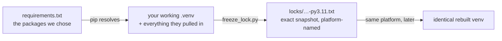

# locks/ — exact environment records, one per platform

## What lives here

Lock files: complete, exact snapshots of a working environment — every
package, including the ones our packages pulled in themselves — named by the
platform and Python that produced them:

```
requirements-lock-macos-x86_64-py3.11.txt
requirements-lock-windows-amd64-py3.11.txt
requirements-lock-linux-x86_64-py3.11.txt
```

Each file's header records when, on what, and how to rebuild from it.



## Lock file vs requirements.txt — when to use which

| | `requirements.txt` (+ `requirements-torch-cpu.txt`) | a file in `locks/` |
|---|---|---|
| Pins | the packages we chose (direct dependencies) | **everything** actually installed, including transitive packages |
| Valid on | every supported platform (environment markers pick the lane) | only the platform and Python minor version in its name |
| Kept current by | hand, deliberately, with CI verifying on all three OSes | regeneration after a verified setup |
| Use it when | setting up normally (the setup guides) — **this is the default** | you need to rebuild an environment *identical* to a recorded one: reproducing an old result exactly, debugging "works for you, not for me", or archiving the environment behind a release |

Everyday version: `requirements.txt` is the shopping list with part numbers
for the items you care about; a lock file is the till receipt of one actual
shopping trip — every item, exact, that day, that shop.

## Generate one (after a setup whose checkpoint passed)

```bash
python scripts/freeze_lock.py
```

Expected output: `Wrote locks/requirements-lock-<os>-<machine>-py3.11.txt`.
The script refuses to run outside a virtual environment, so it can never
photograph the wrong toolbox. Commit the file with the normal push sequence
if others should be able to rebuild from it.

## Rebuild from one (same platform, same Python minor version)

```bash
python3.11 -m venv .venv-exact          # Windows: py -3.11 -m venv .venv-exact
source .venv-exact/bin/activate         # Windows: .\.venv-exact\Scripts\Activate.ps1
python -m pip install --upgrade pip
python -m pip install -r locks/requirements-lock-<os>-<machine>-py3.11.txt
python -m pip install -e . --no-deps
segaudit check-env
```

The lock's first line points pip at the PyTorch CPU index as well, so torch
resolves in the same step.

## After a successful rebuild: verify, then clean up

The rebuilt environment is a *drill*, not a second workshop. Once
`segaudit check-env` in it reports the same versions as the lock file, the
drill has proven its point — the environment is rebuildable — and keeping two
environments around only invites confusion about which one you are in. So:

```bash
segaudit check-env          # versions must match the lock's contents
deactivate                  # leave the drill environment
rm -rf .venv-exact          # remove it completely   (Windows: Remove-Item -Recurse -Force .venv-exact)
source .venv/bin/activate   # back to the real one   (Windows: .\.venv\Scripts\Activate.ps1)
segaudit check-env          # confirm you are back: "You are ready."
```

`.gitignore` ignores any folder matching `.venv*`, so a forgotten drill
environment can never be committed — but do delete it anyway; disk space and
clarity are both worth having.

## Honesty notes

- A lock from one platform must not be installed on another; the file name
  and header exist to prevent exactly that mistake.
- Locks are snapshots, not maintenance: when `requirements.txt` changes,
  regenerate the lock on each platform after the setup checkpoint passes.
- This folder may legitimately contain fewer than three files: a lock exists
  only for platforms someone has actually set up and frozen.
